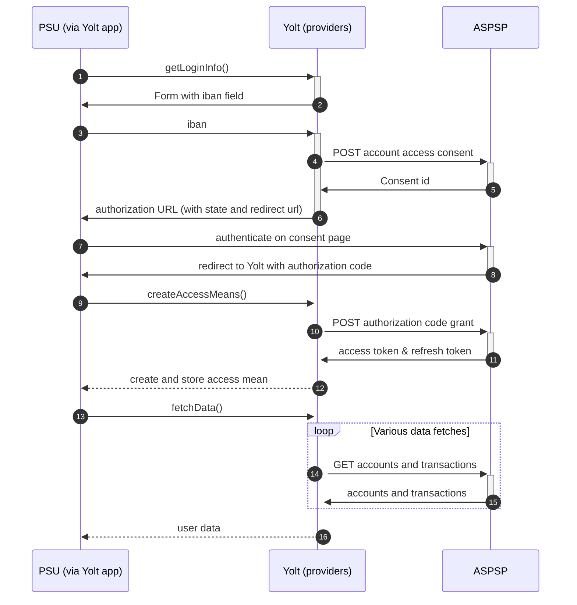

## Abanca (AIS)
[Current open problems on our end][1]

ABANCA is a credit institution under the supervision of the Bank of Spain

## BIP overview 

|                                       |                                                                                                    |
|---------------------------------------|----------------------------------------------------------------------------------------------------|
| **Country of origin**                 | Spain                                                                                              | 
| **Site Id**                           | 9089bf43-174f-48c8-b50f-674a502f4db5                                                               |                                                                                                                                                    |
| **Contact**                           | E-mail: openbanking@abanca.com   Primary contact person: N/A   Ticketing system: N/A        |
| **Developer Portal**                  | https://openbanking.abanca.com/developer/#/panel-control/referencia-api                            | 
| **Account SubTypes**                  | Current, Credit, Savings. But we are not able to distinguish them so all will be marked as current |
| **IP Whitelisting**                   | No                                                                                                 |
| **AIS Standard version**              | V2                                                                                                 |
| **Auto-onboarding**                   | No                                                                                                 |
| **Requires PSU IP address**           | No                                                                                                 |
| **Type of certificate**               | eIDAS                                                                                              |
| **Signing algorithms used**           |                                                                                                    |
| **Mutual TLS Authentication Support** |                                                                                                    |
| **Repository**                        | https://git.yolt.io/providers/bespoke-abanca                                                       |

## Links - sandbox

|                       |                                                 |
|-----------------------|-------------------------------------------------|
| **Base URL**          | https://api.abanca.com/sandbox/v2               | 
| **Authorization URL** | https://api.abanca.com/oauth/{clientId}/Sandbox | 
| **Token Endpoint**    | https://api.abanca.com/oauth2/token             | 

## Links - production 

|                       |                                                |
|-----------------------|------------------------------------------------|
| **Base URL**          | https://api.abanca.com/v2/psd2                 |
| **Authorization URL** | https://api.abanca.com/oauth/{clientId}/Abanca |
| **Token Endpoint**    | https://api.abanca.com/oauth2/token            | 

## Client configuration overview

|                               |                                 |
|-------------------------------|---------------------------------|
| **Authentication mean name**  | Authentication mean description |

## Registration details

Registration is manual process. We need to register organisation on our account in developer portal and add certificates there.

## Multiple Registration

Multiple registrations are possible via developer portal account

## Connection Overview

Describe bank flow. There should be information about the flow in each of our interface method. Describe supported 
transaction types, endpoints, token validity etc. Pay attention for those places where logic is specific and doesn't
look like any other provider.

Simplified sequence diagram:

   
## Sandbox overview

If sandbox was used, you have to describe here information about it. You can also explain why we skipped sandbox during
implementation of provider.

## Consent validity rules

Consent testing is turned on with empty validity rules - consent page is build with javascript that is not supported by consent testing.

## User Site deletion

There's `onUserSiteDelete` method implemented by this provider, however, only in a best effort manner.

## Business and technical decisions

Place here all business decisions which were made in this provider. Pay attention for mappings and error handling.

## External links
* [Current open problems on our end][1]

[1]: <https://yolt.atlassian.net/issues/?jql=project%20%3D%20%22C4PO%22%20AND%20component%20%3D%20ABANCA%20AND%20status%20!%3D%20Done%20AND%20Resolution%20%3D%20Unresolved%20ORDER%20BY%20status>