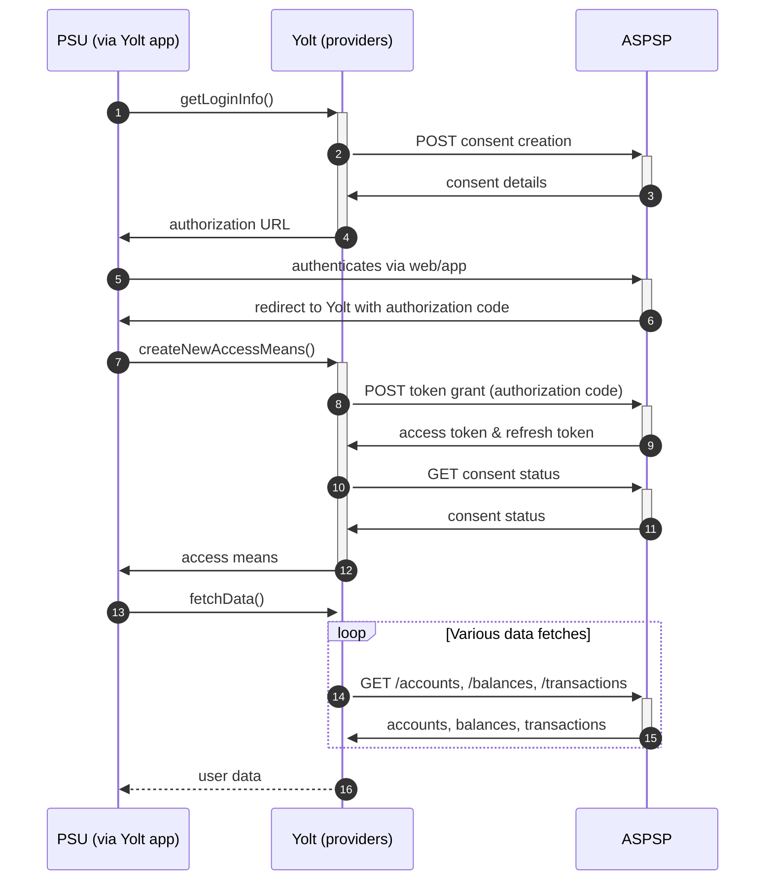

## Banca Transilvania (AIS)
[Current open problems on our end][1]

Banca Transilvania S.A. is a banking institution with headquarters in Cluj-Napoca, Romania. The bank was founded in 1993 
in Cluj-Napoca by a local business people group, with a capital of 2 billion RON, of which 79% was Romanian and 21% foreign.
In 2014, Banca Transilvania celebrates 20 years since it became operational, with the opening of Cluj branch.

## BIP overview 
[Main reference BIP][2]

|                                       |                                                           |
|---------------------------------------|-----------------------------------------------------------|
| **Country of origin**                 | Romania                                                   | 
| **Site Id**                           | 19d89e99-a797-45ba-a331-d886ee1a086d                      |
| **Standard**                          | [Berlin Group Standard][3]                                |
| **Contact**                           | Email: BTApis@btrl.ro                                     |
| **Developer portal**                  |                                                           |
| **Account SubTypes**                  | CURRENT_ACCOUNT                                           |
| **IP Whitelisting**                   | No                                                        |
| **AIS Standard version**              | 1.0.2                                                     |
| **Auto-onboarding**                   | Supported                                                 |
| **Requires PSU IP address**           | Yes                                                       |
| **Type of Certificate**               |                                                           |
| **Signing algorithms used**           | No                                                        |
| **Mutual TLS Authentication Support** | Yes                                                       |
| **Repository**                        | https://git.yolt.io/providers/bespoke-banca-transilvania  |

## Links Sandbox & Production
|                                       |                                                            |
|---------------------------------------|------------------------------------------------------------|
| **Base URL**                          | **Sandbox & Production** - https://api.apistorebt.ro/bt/sb |

## Client configuration overview
|                           |                                                                               |
|---------------------------|-------------------------------------------------------------------------------|
| **Client name**           | The client name                                                               |
| **Client company name**   | The TPP name                                                                  |
| **Client website uri**    | The TPP website uri                                                           |
| **Client contact**        | The TPP contact                                                               |
| **Client email**          | The TPP contact email                                                         |
| **Client phone**          | The TPP contact phone number                                                  |
| **Client id**             | The client identifier that is returned during registration process            |
| **Client secret**         | The secret that is returned with set of client id during registration process |
| **Transport key id**      | Eidas transport key id                                                        |
| **Transport certificate** | Eidas transport certificate (QWAC)                                            |

### Registration details
This bank requires Dynamic Client Registration.
All details are explained here: [BT Production Integration Documentation][4]. During registration process we are using 
**hardcoded redirect uris**:
* https://www.yolt.com/callback
* https://client-redirect.yts.yolt.io
* https://www.yolt.com/callback/payment

### Certificate rotation
Bank provides Dynamic Client Registration with no restrictions to the number of generated client credentials.
It means that we can generate one set of credentials for each certificate.

## Connection Overview
The swagger can be downloaded from here: [BT - BG PSD2 AISP PRODUCTION API.yaml][5] (corrupted one).
The connection requires MTLS with QWAC eIDAS certificate but also authorization step requires OAuth2 Protocol with Proof Key for Code Exchange (PKCE) [RFC 7636][6].
According to the documentation [BT AIS Production][7] (features):
* Pagination is supported for fetching transactions
* The login url has single redirect
* Consent page is valid for 90 days
* Transactions are available to be fetched only for 90 days
* Access token is valid for 3600 seconds
* Refresh flow is supported

### Simplified sequence diagram:

## User Site deletion
This provider does NOT implement `onUserSiteDelete` method.

## Business and technical decisions
Testing process confirmed that bank supports only `booked` transactions, so proper parameter has to be sent to the bank. 
What is more we found that dates returned by the bank are different that it was described in documentation.

Due to the fact that bank allows only for 4 requests per day, BackPressure mechanism was implemented and to reduce number
of calls we decided to get balances during the call for accounts. It can be done thanks to `withBalance` parameter. 
Banca Transilvania support only `expected` balance type, but one including credit limit and second one without such information.
Due to the fact that our internal model can't store information about that we decided with Leon that only value without
credit limit should be mapped for both current and available balances.

We also expect that for transaction description, which is required, value from `details` should be used. In case when it
is not present it is replaced by value from `remittanceInformationUnstructured`.

## Sandbox overview
The sandbox environment looks similar to production environment. According to documentation it do not require any certificate.

## External links
* [Current open problems on our end][1]
* [Main reference BIP][2]
* [Berlin Group Standard][3]
* [BT Production Integration Documentation][4]
* [RFC 7636][6]
* [Developer portal][8]
 
[1]: <https://yolt.atlassian.net/issues/?jql=project%20%3D%20%22C4PO%22%20AND%20component%20%3D%20%22Banca%20Transilvania%22%20AND%20status%20!%3D%20Done%20AND%20Resolution%20%3D%20Unresolved%20ORDER%20BY%20status>
[2]: 
[3]: <https://www.berlin-group.org/>
[4]: https://apistorebt.ro/bt/sb/sites/bt.sb.apistorebt.ro/themes/bt_psd2_theme/docs/How%20it%20Works_pr.pdf
[5]: <https://apistorebt.ro/bt/sb/ibm_apim/swaggerjson/YnQtYmctcHNkMi1haXNwLXByb2R1Y3Rpb24tYXBpOjEuMC4y>
[6]: <https://tools.ietf.org/html/rfc7636>
[7]: <https://apistorebt.ro/bt/sb/accounts>
[8]: <https://apistorebt.ro/bt/sb/api-products>
