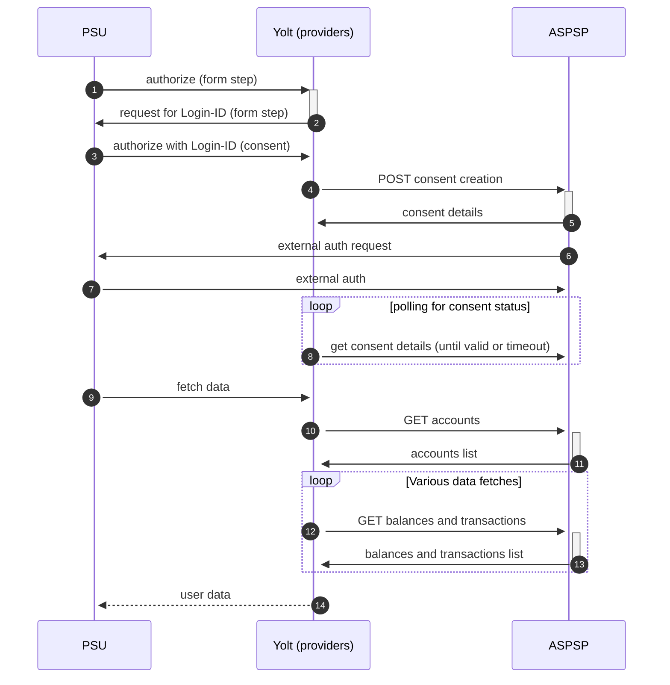

# BRD

[Current open problems on our end][1]

## BIP overview

|                                       |                                                                  |
|---------------------------------------|------------------------------------------------------------------|
| **Country of origin**                 | Romania                                                          | 
| **Site Id**                           | a4c3dd27-62e2-4fa8-9996-309708964c44                             |
| **Standard**                          | Not mentioned but looks similar to some Berlin-Group's banks     |
| **Contact**                           | Emails: api@brd.ro, daniel.amarandei@brd.ro, mbtib_alerts@brd.ro |
| **Developer Portal**                  | https://www.devbrd.ro/brd/apicatalog/                            |                                                                                                         |
| **Account types**                     | CURRENT_ACCOUNT                                                  |
| **IP Whitelisting**                   | No                                                               |
| **AIS Standard version**              | 1.0.6                                                            |
| **Mutual TLS Authentication Support** | Yes                                                              |
| **Auto-onboarding**                   | Unsupported                                                      |
| **Requires PSU IP address**           | Yes                                                              |
| **Type of certificate**               | eIDAS QWAC                                                       |
| **Signing algorithms used**           | No signing at all                                                |
| **Login-ID format**                   | LoginID of the client, used in MyBRD applications                |
| **Supported Flow**                    | Decoupled                                                        |
| **Repository**                        | https://git.yolt.io/providers/bespoke-brd                        |

## Links - production

Example fields (for each bank fields might be different)

|                            |                                                                                        |
|----------------------------|----------------------------------------------------------------------------------------|
| **Base URL**               | https://api.devbrd.ro/brd-api-connect-prod-organization/apicatalog/brd-psd2-aisp-prod/ | 
| **Authorization Endpoint** | Does not exist                                                                         |
| **Token endpoint**         | Does not exist                                                                         |

## Client configuration overview

|   |   |
|---|---|
| **Transport key id**  |  Eidas transport key id |
| **Transport certificate** | Eidas transport certificate (QWAC) |

### Registration details

This bank does not support Dynamic Client Registration nor portal registration. eIDAS QWAC is enough.

### Certificate rotation

Bank is qualifying TPP based on registration number that is present in eIDAS certificate. It means that we can swap
eIDAS certificates with the same registration number without any side effects.

## Connection Overview

eIDAS QWAC certificate is required for communication purpose. Additionally, bank's API does not require to use signature
in the requests.

To obtain access to the consent page, it is necessary to provide such data as: Login-ID

The bank's API does not have an OAuth2 flow implementation. The authentication is based on the consent ID and cannot be
refreshed. The PSU's consent is "linked" to TPP.

## Consent validity rules 
BRD AIS uses dynamic flow, thus we are unable to determine consent validity rules for AIS.

### Simplified sequence diagram:

## User Site deletion

This provider implements `onUserSiteDelete` method, but it was decided that we do NOT want to store Login-ID of a user,
so there's a chance this call will fail.

## Business and technical decisions

## Sandbox overview

Sandbox integration has been omitted.

## External links

* [Current open problems on our end][1]

[1]: <https://yolt.atlassian.net/issues/?jql=project%20%3D%20%22C4PO%22%20AND%20component%20%3D%20BRD%20AND%20status%20!%3D%20Done%20AND%20Resolution%20%3D%20Unresolved%20ORDER%20BY%20status>
