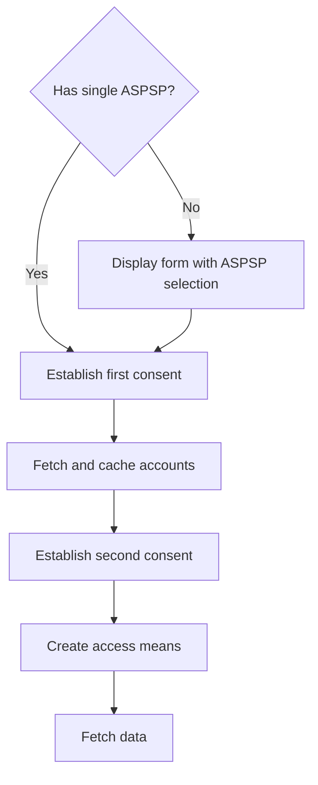
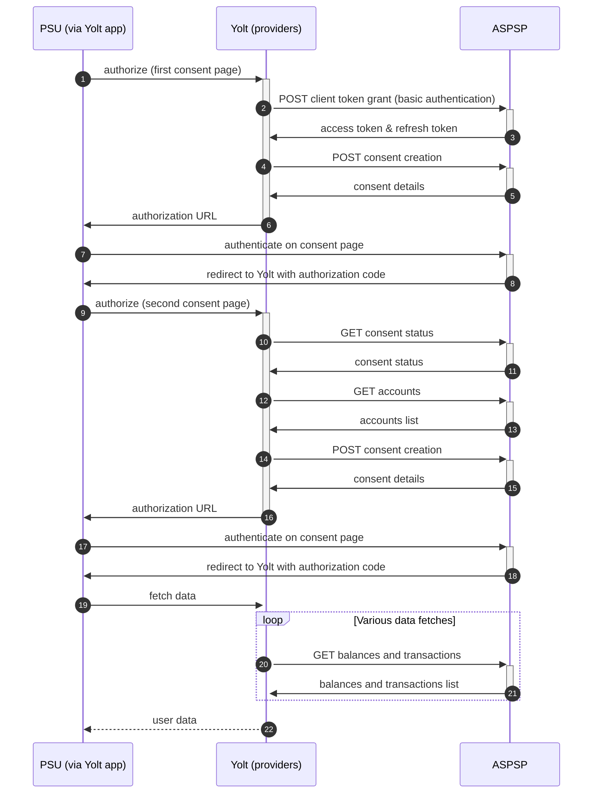

## Banca Widiba (AIS)
[Current open problems on our end][1]

|                                       |                                                |
|---------------------------------------|------------------------------------------------|
| **Country of origin**                 | Italy                                          | 
| **Site Id**                           | 92638f41-2fba-4be1-b64e-a41a6f951f6d           |
| **Standard**                          | [Berlin Group Standard][2]                     |
| **Contact**                           | Email: cbiglobe@cbi-org.eu                     |
| **Developer Portal**                  | https://cbiglobeopenbankingapiportal.nexi.it/  | 
| **Account SubTypes**                  | CURRENT_ACCOUNT                                |
| **IP Whitelisting**                   | No                                             |
| **AIS Standard version**              | 1.1                                            |
| **Auto-onboarding**                   | No                                             |
| **Requires PSU IP address**           | Yes                                            |
| **Type of certificate**               | eIDAS                                          |
| **Signing algorithms used**           | rsa-sha512                                     |
| **Mutual TLS Authentication Support** | Yes                                            |
| **Repository**                        | https://git.yolt.io/providers/bespoke-cbiglobe |

## ASPSP list
| Code    | Name                   |
|---------|------------------------|
| 03442   | **Banca WIDIBA Spa**   |

## Links - production 
|                    |                            |
|--------------------|----------------------------|
| **Login domains**  | www.widiba.it              |
| **Base URL**       | https://openbanking.mps.it |

## Client configuration overview
|                           |                                                                               |
|---------------------------|-------------------------------------------------------------------------------|
| **Transport key id**      | eIDAS transport key id                                                        |
| **Transport certificate** | eIDAS transport certificate (QWAC)                                            |
| **Signing key id**        | eIDAS signing key id                                                          |
| **Signing certificate**   | eIDAS signing certificate (QSEAL)                                             |
| **Client id**             | The client identifier that is returned during registration process            |
| **Client secret**         | The secret that is returned with set of client id during registration process |

### Registration details
This bank only supports manual registration which takes place through the [CBI Globe Portal][3].
Registration gives access to all banks from the CBI Globe group.
You can only register once for a specific email address.
During registration, the eIDAS transport certificate must be uploaded. 
After registration, credentials such as **client id** and **client secret** will be displayed on the portal.

### Certificate rotation
CBI Globe gives possibility to update the QWAC eIDAS certificate on their portal.
After updating certificate, the credentials does not change (client id and client secret).

## Connection Overview
The swagger can be downloaded from here: [Technical Documents][4] (corrupted one).
The connection requires mutual TLS with QWAC eIDAS certificate.
The signature of the request is required and it based on [Cavage HTTP Signatures][6].

### Simplified flow chart

### Simplified sequence diagram

### Consent Validation Rules

Consent validity rules are set to EMPTY_RULES_SET. We either get consent page (mostly javascript), or we get error status.

## User Site deletion
This provider does NOT implement `onUserSiteDelete` method. 

## Business and technical decisions
* 29.09.2020 This is a part of Monte Banca Monte dei Paschi so it could be added using dynamic flow for Banca Monte dei Paschi. Leon Muis decided to bank will be add as separate provider.

* The same like in Banca Monte dei Paschi. In the case of mapping balances, a business decision was made to filter the balances against the assigned currency to the account 
and if there is one balance then it should be used to map both the **AvailableBalance** and **CurrentBalance** fields. 
Otherwise, the selection of the balance is to be determined by its type in accordance with the following priority
(The first element has the highest priority):
  * for **AvailableBalance**: EXPECTED, INTERIM_AVAILABLE, AVAILABLE, FORWARD_AVAILABLE, AUTHORISED
  * for **CurrentBalance**: INTERIM_BOOKED, CLOSING_BOOKED, OPENING_BOOKED, EXPECTED
  
* The same like in Banca Monte dei Paschi. Due to flow which requires to pass two consent pages to fetch all data, the implementation of the API getting cards has been abandoned. 
That's because it would force to pass four consents pages to go through to get all the data (**CurrentAccounts** and **CardAccounts**). 

* 04.08.2022 We have found possibility to get more than only last 89 days of transactions, but it will require probably 
additional consent. As bank is not used for now, and we don't know clients preferences, we decided with PO not to do this.
Everything was described in comment https://yolt.atlassian.net/browse/C4PO-10544?focusedCommentId=94853.

## Sandbox overview
Sandbox is completely different from the production environment in terms of communication, data transfer and overall flow. 
Therefore, its use is not recommended.

## External links
* [Current open problems on our end][1]
* [Berlin Group Standard][2]
* [CBI Globe Portal][3]
* [CBI Globe Technical Documents][4]
* [CBI Globe Account Information Services][5]
* [Cavage HTTP Signatures][6]
 
[1]: <https://yolt.atlassian.net/issues/?jql=project%20%3D%20%22C4PO%22%20AND%20component%20%3D%20%22Banca%20Widiba%22%20AND%20status%20!%3D%20Done%20AND%20Resolution%20%3D%20Unresolved%20ORDER%20BY%20status>
[2]: <https://www.berlin-group.org/>
[3]: <https://cbiglobeopenbankingapiportal.nexi.it/en/cbi-globe/overview>
[4]: <https://cbiglobeopenbankingapiportal.nexi.it/en/technical-documents>
[5]: <https://cbiglobeopenbankingapiportal.nexi.it/en/api/accountInformationServices/2.3.2/accounts/get>
[6]: <https://tools.ietf.org/html/draft-cavage-http-signatures-10>
