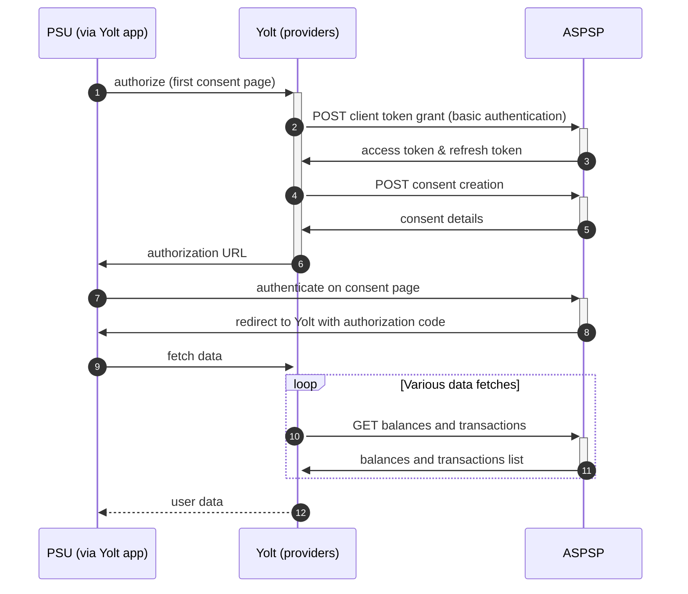

## Nexi (AIS)

[Current open problems on our end][1]

Nexi S.p.A. formerly known as Istituto Centrale delle Banche Popolari Italiane S.p.A. (ICBPI) is an Italian bank that
specialises in payment systems such as Nexi Payments (formerly known as CartaSi). The bank was specialised as a central
institution of Italian Popular Bank.

## BIP overview

|                                        |                                                                                                   |
|----------------------------------------|---------------------------------------------------------------------------------------------------|
| **Country of origin**                  | Italy                                                                                             | 
| **Site Id**                            | be1de011-9d85-44d3-87cf-a0095b9c9c71                                                              |
| **Standard**                           | [Standard][2]                                                                                     |
| **Contact**                            | E-mail: cbiglobe@cbi-org.eu   Ticketing system: https://cbiglobeopenbankingapiportal.nexi.it/ |
| **Developer Portal**                   | https://cbiglobeopenbankingapiportal.nexi.it/                                                     | 
| **Account SubTypes**                   | Credit Cards                                                                                      |
| **IP Whitelisting**                    | No                                                                                                |
| **AIS Standard version**               | 2.3.2                                                                                             |
| ** Auto-onboarding**                   | No                                                                                                |
| **Requires PSU IP address**            | Yes                                                                                               |
| **Type of certificate**                | eIDAS                                                                                             |
| **Signing algorithms used**            | RS256                                                                                             |
| **Mutual TLS Authentication Support**  | Yes                                                                                               |
| ** Repository**                        | https://git.yolt.io/providers/bespoke-cbiglobe                                                    |

## Links - sandbox

|                       |                                                                                                |
|-----------------------|------------------------------------------------------------------------------------------------|
| **BaseURL**           | https://cbiglobeopenbankingapigateway.nexi.it/sbx/platform/enabler/psd2orchestrator/ais/2.3.2/ |
| **Authorization URL** | -                                                                                              | 
| **Token Endpoint**    | -                                                                                              |  

## Links - production

|                           |                                                                                     |
|---------------------------|-------------------------------------------------------------------------------------|
| **Base URL**              | https://cbiglobeopenbankingapigateway.nexi.it/platform/enabler/psd2orchestrator/ais |
| **Authorization URL**     | TBA                                                                                 | 
| **Token Endpoint**        | https://cbiglobeopenbankingapigateway.nexi.it/auth/oauth/v2/token                   |  
| **Registration Endpoint** | -                                                                                   |  

## Client configuration overview

|                           |                                                                               |
|---------------------------|-------------------------------------------------------------------------------|
| **Transport key id**      | eIDAS transport key id                                                        |
| **Transport certificate** | eIDAS transport certificate (QWAC)                                            |
| **Signing key id**        | eIDAS signing key id                                                          |
| **Signing certificate**   | eIDAS signing certificate (QSEAL)                                             |
| **Client id**             | The client identifier that is returned during registration process            |
| **Client secret**         | The secret that is returned with set of client id during registration process |

## Registration details

This bank only supports manual registration which takes place through the [CBI Globe Portal][4]. Registration gives
access to all banks from the CBI Globe group.

## Multiple Registration

You can only register once for a specific email address. During registration, the eIDAS transport certificate must be
uploaded. After registration, credentials such as **client id** and **client secret** will be displayed on the portal.

## Connection Overview

Simplified sequence diagram:

## Sandbox overview

Sandbox has not been used

## Consent validity rules

TBA when we get a working consent page

## User Site deletion

This provider does NOT implement `onUserSiteDelete` method.

## Business and technical decisions

* 04.08.2022 We have found possibility to get more than only last 89 days of transactions, but it will require probably
  additional consent. As bank is not used for now, and we don't know clients preferences, we decided with PO not to do this.
  Everything was described in comment https://yolt.atlassian.net/browse/C4PO-10544?focusedCommentId=94853.

## External links

* [Current open problems on our end][1]
* [Standard][2]

[1]: <https://yolt.atlassian.net/issues/?jql=project%20%3D%20%22C4PO%22%20AND%20component%20%3D%20NEXI%20AND%20status%20!%3D%20Done%20AND%20Resolution%20%3D%20Unresolved%20ORDER%20BY%20status>

[2]: <https://www.berlin-group.org/>