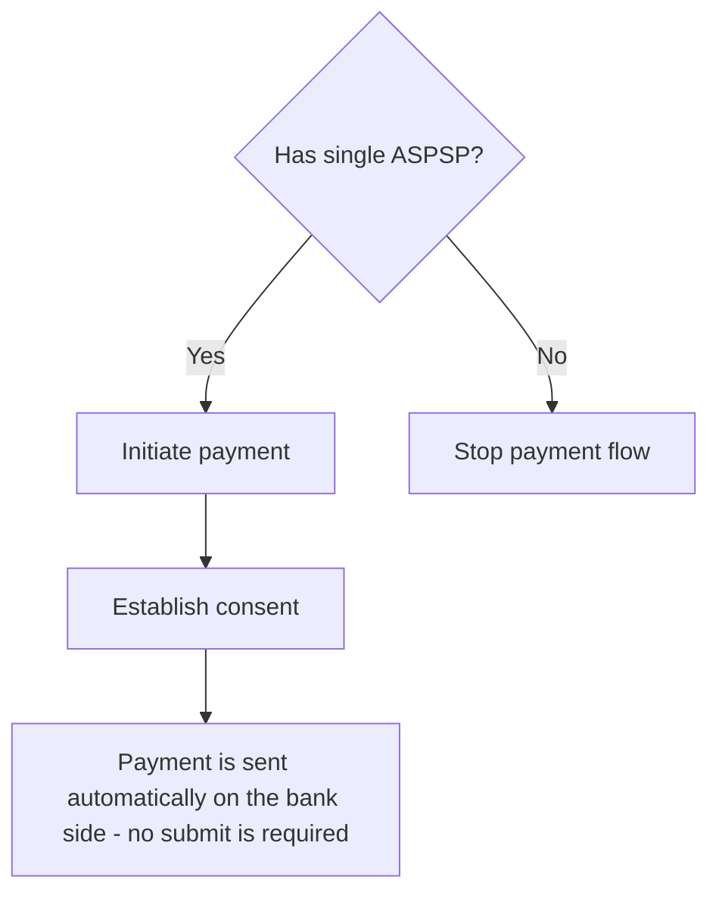
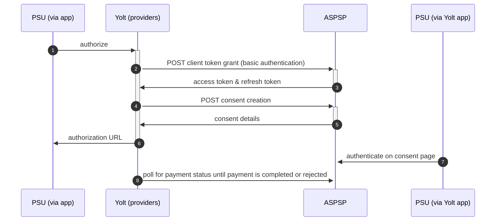

## Poste Italiane (PIS)
[Current open problems on our end][1]

## BIP overview 
[Main reference BIP][2]

|                                       |                                                |
|---------------------------------------|------------------------------------------------|
| **Country of origin**                 | Italy                                          | 
| **Site Id**                           | 3b9c876d-1d62-4a5b-9046-163757129238           |
| **Standard**                          | [Berlin Group Standard][3]                     |
| **Contact**                           | Email: cbiglobe@cbi-org.eu                     |
| **Developer Portal**                  | https://cbiglobeopenbankingapiportal.nexi.it/  |
| **IP Whitelisting**                   | No                                             |
| **PIS Standard version**              | 1.1                                            |
| **Requires PSU IP address**           | Yes                                            |
| **Type of certificate**               | eIDAS                                          |
| **Signing algorithms used**           | rsa-sha512                                     |
| **Mutual TLS Authentication Support** | Yes                                            |
| **Repository**                        | https://git.yolt.io/providers/bespoke-cbiglobe |

## ASPSP list
| Code  | Name                                    |
|-------|-----------------------------------------|
| 07601 | **Poste Italiane S.p.A. - Banco Posta** |

## Links - production
|                  |                                               |
|------------------|-----------------------------------------------|
| **login domain** | [securelogin.poste.it](securelogin.poste.it)  |
| **Base URL**     | https://cbiglobeopenbankingapigateway.nexi.it |

## Client configuration overview
|                           |                                                                               |
|---------------------------|-------------------------------------------------------------------------------|
| **Transport key id**      | eIDAS transport key id                                                        |
| **Transport certificate** | eIDAS transport certificate (QWAC)                                            |
| **Signing key id**        | eIDAS signing key id                                                          |
| **Signing certificate**   | eIDAS signing certificate (QSEAL)                                             |
| **Client id**             | The client identifier that is returned during registration process            |
| **Client secret**         | The secret that is returned with set of client id during registration process |

### Registration details
Registration from AIS is used

### Certificate rotation
Refer AIS ReadMe

## Connection Overview
General information is placed here [CBI Globe Portal][4] and [CBI Globe Technical Documents][5]
More specific information you can find under [CBI Globe PIS swagger][6] and [CBI Globe additional implementation annex][8]
The connection requires mutual TLS with QWAC eIDAS certificate.
The signature of the request is required and it based on [Cavage HTTP Signatures][7]

**Consent validity rules**

Consent validity rules has been implemented for Poste Italiane PIS.

### Simplified flow chart

### Simplified sequence diagram

Additionally you can check wiki page [CBI Globe wiki][8] which shows CBI-Globe flows.

## Business and technical decisions
In relation to the Intesa Sanpaolo PIS the payment status mapping is narrowed [CBI Globe additional implementation annex][9]
They (banks) look like overlapping sets but we don't have full certainty that some of not mentioned code in Poste spec (but existing in Intesa)
is mapped in the sam way. Therefore mapper is overridden. More information about status coding here [CBI Globe codes_and_statuses description][10]

**2022-07-07** - As part of ticket https://yolt.atlassian.net/browse/C4PO-9571 we decided to map custom CBI Globe payment statuses
and leave possibility to choose debtor account on consent page. As a consequence we accept the risk that some flows regarding
that process won't be supported by us. We will check how bank behaves on testing process, then we will have to decide to
leave implementation as it is right now or to make debtor data as mandatory and simplify the flow.

## Sandbox overview
Not used in implementation phase.

**Payment Flow Additional Information**

|                                                                                                        |                              |
|--------------------------------------------------------------------------------------------------------|------------------------------|
| **When exactly is the payment executed ( executed-on-submit/executed-on-consent)?**                    | execute-on-consent           |
| **it is possible to initiate a payment having no debtor account**                                      | NO                           |
| **At which payment status we can be sure that the money was transferred from the debtor to creditor?** | AcceptedSettlementCompleted  |

## External links
* [Current open problems on our end][1]
* [Main reference BIP][2]
* [Berlin Group Standard][3]
* [CBI Globe Portal][4]
* [CBI Globe Technical Documents][5]
* [CBI Globe PIS swagger][6]
* [Cavage HTTP Signatures][7]
* [CBI Globe wiki][8]
* [CBI Globe additional implementation annex][9]
* [CBI Globe codes_and_statuses description][10]
 
[1]: <https://yolt.atlassian.net/issues/?jql=project%20%3D%20%22C4PO%22%20AND%20component%20%3D%20%22Poste%20Italiane%22%20AND%20status%20!%3D%20Done%20AND%20Resolution%20%3D%20Unresolved%20ORDER%20BY%20status>
[2]: <https://yolt.atlassian.net/wiki/spaces/LOV/pages/3903639/BIP+Poste+Italiane+CBI+GLOBE>
[3]: <https://www.berlin-group.org/>
[4]: <https://cbiglobeopenbankingapiportal.nexi.it/en/cbi-globe/overview>
[5]: <https://cbiglobeopenbankingapiportal.nexi.it/en/technical-documents>
[6]: <https://cbiglobeopenbankingapiportal.nexi.it/en/api/paymentInitiationServices/2.3.2/paymentspayment-product/post>
[7]: <https://tools.ietf.org/html/draft-cavage-http-signatures-10>
[8]: <https://www.cbiglobe.com/Wiki/index.php/4._Payments_flow>
[9]: <https://cbiglobeopenbankingapiportal.nexi.it/en/technical-documents/download/IA_Annex>
[10]: <https://cbiglobeopenbankingapiportal.nexi.it/en/tables-and-coding/complex-data-types-and-code-lists>
