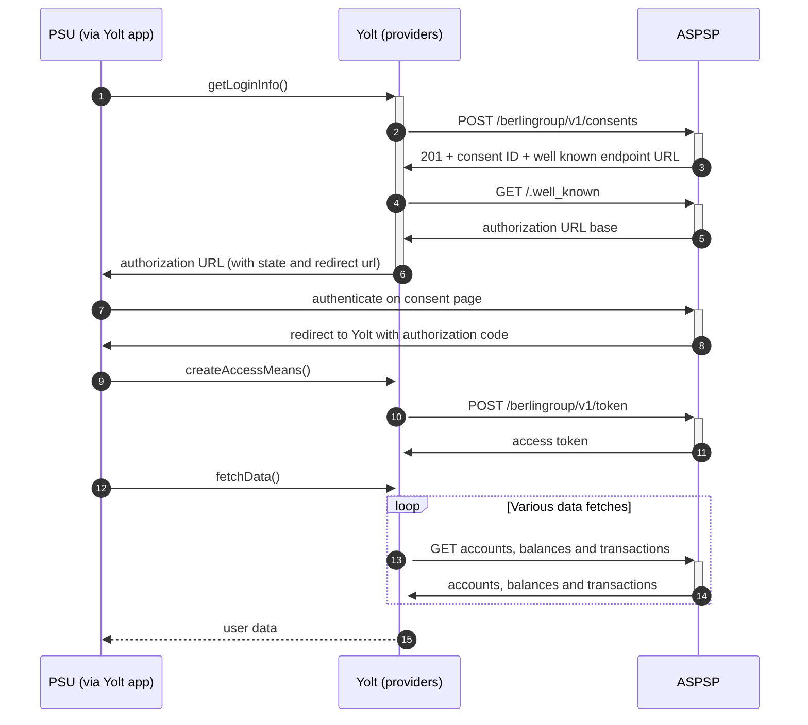

## Commerzbank AG (AIS)
[Current open problems on our end][1]

Commerzbank AG is a major German bank operating as a universal bank, headquartered in Frankfurt am Main. In the 2019 financial year, the bank was the second largest in Germany by the total value of its balance sheet. Founded in 1870 in Hamburg, the bank is today present in more than 50 countries around the world and provides almost a third of Germany's trade finance. In 2017, it handled 13 million customers in Germany and 5 million customers in Central and Eastern Europe. Commerzbank is a member of the Cash Group. 15% of the shares are owned by the Federal Republic of Germany and 85% are in free float.

## BIP overview 

|                                       |                                                   |
|---------------------------------------|---------------------------------------------------|
| **Country of origin**                 | Germany                                           | 
| **Site Id**                           | a8d42732-2028-411d-bc1e-4980e23dbdb6              |
| **Standard**                          | [NextGenPSD2 v1.3][2]                             |
| **Contact**                           | E-mail: psd2support@commerzbank.com               |
| **Developer Portal**                  | https://psd2.developer.commerzbank.com/           | 
| **Account SubTypes**                  | Payment Accounts, Retail and Business             |
| **IP Whitelisting**                   | NO                                                |
| **AIS Standard version**              | 1.0.0                                             |
| **Auto-onboarding**                   | No                                                |
| **Requires PSU IP address**           | Yes                                               |
| **Type of certificate**               | eIDAS                                             |
| **Signing algorithms used**           | none                                              |
| **Mutual TLS Authentication Support** | Yes                                               |
| **Repository**                        | https://git.yolt.io/providers/bespoke-commerzbank |

## Links - sandbox

|                       |                                                               |
|-----------------------|---------------------------------------------------------------|
| **Base URL**          | https://psd2.api-sandbox.commerzbank.com                      |
| **Authorization URL** | https://psd2.redirect-sandbox.commerzbank.com                 | 
| **Token Endpoint**    | https://psd2.api-sandbox.commerzbank.com/berlingroup/v1/token |  

## Links - production 

|                           |                                                       |
|---------------------------|-------------------------------------------------------|
| **Base URL**              | https://psd2.api.commerzbank.com                      |
| **Authorization URL**     | https://psd2.redirect.commerzbank.com                 | 
| **Token Endpoint**        | https://psd2.api.commerzbank.com/berlingroup/v1/token |  
| **Registration Endpoint** | NONE                                                  |  

## Client configuration overview

|                              |                                 |
|------------------------------|---------------------------------|
| **Authentication mean name** | Authentication mean description |
| **Transport certificate**    | Eidas transport certificate     |
| **Transport key id**         | Eidas transport key id          |      

## Registration details

There is no registration. During the first connection setup, the TPP will be automatically onboarded and registered (enrolled) in the bank database. However, for security purpose, the bank requires the client certificate to be presented within each request.

## Multiple Registration

There is no registration

## Connection Overview

The bank uses OAUTH SCA Berlin Group flow. 

Simplified sequence diagram:

   
## Sandbox overview

Sandbox is very similar to production. It requires eidas certificates or eidas test certificates to establish the conneciton.

## Consent validity rules

Consent testing: **ON** \
Consent validity rules used:
>EMPTY_RULES_SET

Reason: login site is built on javascript which CT is not supporting.

## User Site deletion

NOT IMPLEMENTED

## Business and technical decisions

## External links
* [Current open problems on our end][1]
* [NextGenPSD2 v1.3][2]

[1]: <https://yolt.atlassian.net/issues/?jql=project%20%3D%20%22C4PO%22%20AND%20component%20%3D%20COMMERZBANK%20AND%20status%20!%3D%20Done%20AND%20Resolution%20%3D%20Unresolved%20ORDER%20BY%20status>
[2]: <https://www.berlin-group.org/nextgenpsd2-downloads>