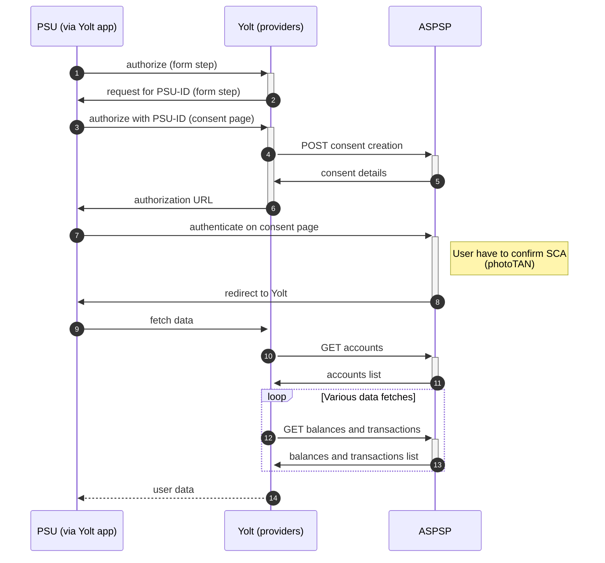

## Deutsche Bank (AIS)
[Current open problems on our end][1]

## BIP overview 
[Main reference BIP][2]

|                                       |                                                                                                                |
|---------------------------------------|----------------------------------------------------------------------------------------------------------------|
| **Country of origin**                 | Germany                                                                                                        | 
| **Site Id**                           | c03a70a4-34f7-4f9d-a3aa-d66631f37398                                                                           |
| **Standard**                          | [Berlin Group Standard][3]                                                                                     |
| **Form of Contact**                   | Email - xs2a.api@db.com                                                                                        |
| **Base URL**                          | **Sandbox & Production** - https://xs2a.db.com/                                                                |
| **Signing algorithms used**           | No                                                                                                             |
| **Mutual TLS Authentication Support** | Yes                                                                                                            |
| **IP Whitelisting**                   | No                                                                                                             |
| **Auto-onboarding**                   | Unsupported                                                                                                    |
| **AIS Standard version**              | 1.3                                                                                                            |
| **PISP Standard version**             | 1.3 (not implemented in providers)                                                                             |
| **Account types**                     | CURRENT_ACCOUNT                                                                                                |
| **Requires PSU IP address**           | Yes                                                                                                            |
| **PSU-ID format**                     | FKDN number consisting of 3 digits of the branch and 7 digits of the user's bank account (not the sub-account) |
| **PSU-ID-Type**                       | DE_ONLB_DB                                                                                                     |
| **Business Entity**                   | DB                                                                                                             |
| **Consent Type**                      | Driven                                                                                                         |
| **Supported Flow**                    | Decoupled                                                                                                      |
| **Repository**                        | https://git.yolt.io/providers/bespoke-deutsche-bank                                                            |

## Client configuration overview
|                           |                                     |
|---------------------------|-------------------------------------|
| **Transport key id**      | Eidas transport key id              |
| **Transport certificate** | Eidas transport certificate (QWAC)  |

### Registration details
This bank do not support Dynamic Client Registration.

### Certificate rotation
Bank is qualifying TPP based on registration number that is present in eIDAS certificate.
It means that we can swap eIDAS certificates with the same registration number without any side effects.

## Connection Overview
Mutual TLS is not required to establish a connection with the bank, but it is necessary to get access to bank's API. 
Based on that QWAC eIDAS certificate is required for communication purpose. 
Additionally, bank's API do not require to use signature in the requests.

To obtain access to the consent page, it is necessary to provide such data as: PSU-ID and PSU-ID-Type. 
PSU-ID is a user identifier whose format is individual for a given bank. 
PSU-ID-Type is a fixed value that is defined for each bank in the group.

This bank uses "Driven" consent type which means that we can use the decoupled flow which is based on redirects.
This means that the bank provides authentication support based on user credentials as well as two-factor authentication better known as Strong Customer Authentication (SCA).
The user has the option to select the SCA type through the BestSign application, however consent page enforces the use of a photoTAN type which supports push notifications.

The bank's API does not have an OAuth2 flow implementation. 
The authentication is based on the consent ID and cannot be refreshed.

**Consent validity rules**
Deutsche Bank AIS uses dynamic flow, thus we are unable to determine consent validity rules for AIS.

### Simplified sequence diagram:

## User Site deletion
This provider does NOT implement `onUserSiteDelete` method. 

## Business and technical decisions
* The bank does not return the account name, therefore a business decision was made to give a default name consisting of the bank name and account type. 
For example: **Deutsche Bank Current Account**.

* The bank supports two types of balances, **interimAvailable** and **closingBooked**. 
We have decided to map both **availableBalance** and **bookedBalance** fields with the same value in case only one field from the bank is returned. 
If both account types are returned, we map **interimAvailable** as **availableBalance** and **closingBooked** as **bookedBalance**.

* The bank doesn't send **bookingDate** and **valueDate** fields for _pending_ transactions. Due to the fact that **dateTime**
field is required in our model we have to get information about transaction date from **transactionId**.
In this bank transaction ids have following formats, so proper logic for this was implemented:

|             | Booking                                     | Pending                                                                    |
|-------------|---------------------------------------------|----------------------------------------------------------------------------|
| **Format**  | 000001-TRADE_KEY + PRODUCT + TRANSACTION_NO | 000001- BRANCH_NO_MAIN + BUSI_CONT_MAIN_KEY + AUTHORIZATION_ID + ENTRY_ TS |
| **Example** | 000001-C760D89F93398EF4490138B5FT0037224    | 000001-330DA1CD87C588578AD4906D5C1E11127151742020-11-12 12:05:17.4263780   |

We also received information that those formats are only suggestions. This is their internal field, so we should not
relay on its value. We found example that following value was returned _000001-714881591_. It means that we don't have
any information about transaction data. Leon made a decision to use actual fetching data time instead. This was consulted
with _accounts-and-transactions owners.

## Sandbox overview
No such information. Sandbox integration has been omitted.

**Payment Flow Additional Information**

|                                                                                                         |                                                                                                         |
|---------------------------------------------------------------------------------------------------------|---------------------------------------------------------------------------------------------------------|
| **When exactly is the payment executed ( executed-on-submit/executed-on-consent)?**                     | no oAuth/after final status payment                                                                     |
| **it is possible to initiate a payment having no debtor account**                                       | NO                                                                                                      |
| **At which payment status we can be sure that the money was transferred from the debtor to creditor?**  | No, once the payment is successfully initiated, payment may still not be credited in creditor account.  |

## External links
* [Current open problems on our end][1]
* [Main reference BIP][2]
* [Berlin Group Standard][3]
 
[1]: <https://yolt.atlassian.net/issues/?jql=project%20%3D%20%22C4PO%22%20AND%20component%20%3D%20%22Deutsche%20Bank%22%20AND%20status%20!%3D%20Done%20AND%20Resolution%20%3D%20Unresolved%20ORDER%20BY%20status>
[2]: <https://yolt.atlassian.net/wiki/spaces/LOV/pages/3899695/BIP+Deutsche+Bank+and+Postbank>
[3]: <https://www.berlin-group.org/>
