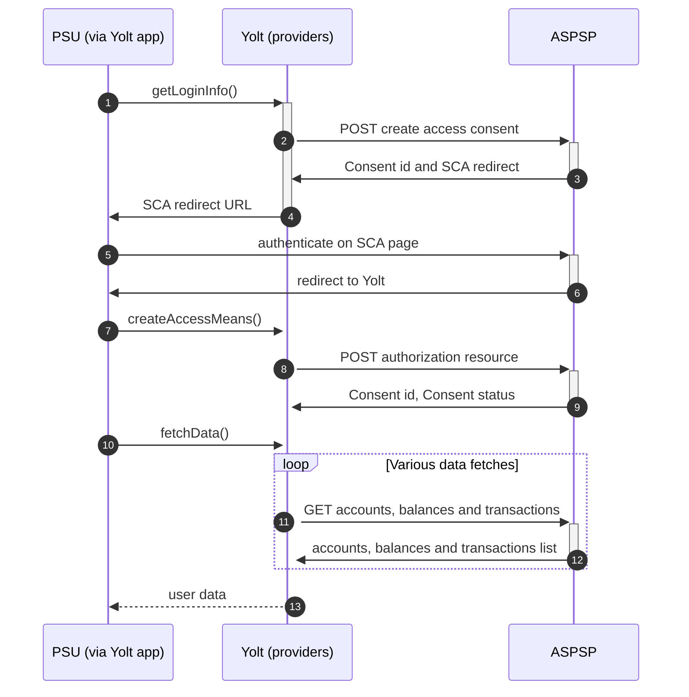

## Banca Sella (AIS)

[Current open problems on our end][1]

Banca Sella Holding S.p.A. is an Italian holding company for the Banca Sella Group (Italian: Gruppo Banca Sella). The main company of the group was Banca Sella S.p.A., an Italian bank based in Biella, Piedmont.

## BIP overview

|                                       |                                                                      |
|---------------------------------------|----------------------------------------------------------------------|
| **Country of origin**                 | Italy                                                                | 
| **Site Id**                           | e184dd3f-cd11-4ffc-945a-b178dc986bda                                 |
| **Standard**                          | [Berlin Standard][2]                                                 |
| **Contact**                           | Ticketing system: https://fabrick-platform.atlassian.net/servicedesk |
| **Developer Portal**                  | https://www.fabrick.com/psd2/gateway/tpp-portal                      | 
| **Account SubTypes**                  | Current, Credit                                                      |
| **IP Whitelisting**                   | No                                                                   |
| **AIS Standard version**              | 1.0                                                                  |
| **Auto-onboarding**                   | Yes (to get access to FabricAPI)                                     |
| **Requires PSU IP address**           | Optional but we are using it                                         |
| **Type of certificate**               | eIDAS                                                                |
| **Signing algorithms used**           | Signing is not used in this bank                                     |
| **Mutual TLS Authentication Support** | Yes                                                                  |
| **Repository**                        | https://git.yolt.io/providers/bespoke-fabric                         |       

## Links - sandbox

|                    |                                                                                                        |
|--------------------|--------------------------------------------------------------------------------------------------------|
| **Base URL**       | https://sandbox-psdgw-bancapatrimoni.fabrick.com                                                 |
|                    | Development and test environment, with full security policy enforcement. To get access to this specific environment the TPP needs to provide eIDAS certificate. API invocation returns dynamic content answers with out-of-sync data. | 

## Links - production

|                           |                                                                                                        |
|---------------------------|--------------------------------------------------------------------------------------------------------|
| **Base URL**              | https://psdgw-sella.fabrick.com                                                        |
| **Registration Endpoint** | https://psdgw-onboarding.fabrick.com                                                   |  

## Client configuration overview

|                           |                                    |
|---------------------------|------------------------------------|
| **Signing key id**        | Eidas signing key id               |
| **Signing certificate**    | Eidas signing certificate (QSEAL)  |
| **Transport key id**      | Eidas transport key id             |
| **Transport certificate** | Eidas transport certificate (QWAC) |

## Registration details

Whole registration process was described in [documentation][3]. FabricAPI is an api provider for group of banks.
One registration should lead us to have access to Banca Sella and other banks in this group. According to documentation the request via web form has to be created 
[TPP request access][4]. In result the link with active token is being sent to given mailbox. The link must be used in 
call using mutual TLS. For that step the onboarding is implemented. This registration is based on EIDAS certifactes 
only. There is no clientId, no client secret. One thing. During first registration we received an error that our 
certificate has been blocked. After reaching bank we got an information that something was wrong on bank side but we 
are registered anyway. No information about other necessary operations which can be made with registration - update 
and remove.

The scope used for registration to FabricAPI was as fallow:

|             |                                        |
|-------------|----------------------------------------|
| **request** | FabricGroupOnboardingRequest.builder() |
|             | .aisp(true)                            |
|             | .piisp(false)                          |
|             | .pisp(true)                            |

## Multiple Registration

Multiple registration is not allowed for TPP based on one certificate. We can register one TPP for many different 
certificate instead.

## Connection Overview

Banca Sella follows Berlin Group standard implemented by FabricAPI. One thing is worth mention. There is no access
token and refresh tokens calls. FabricAPI works based on consentId given by SCA approved by user.

The _getLoginInfo_ method is used to retrieve SCA link for user. This is simple call on `/v1/consents` that gives in 
return `consentId` and `scaRedirect`.

In _createAccessMeans_ method the `consentId` is used to call for authorization resource endpoint 
`v1/consents/{consentId}/authorisations` when `consentStatus` is in `finalised` status. This will 
authenticate user in next calls.

Simplified sequence diagram:

## Sandbox overview

Sandbox wasn't used during implementation process, but it is available. All necessary steps to use it were described in
documentation. To use it, registration using EIDAS certificates is required.

## Consent validity rules

Consent testing is turned off at this moment [10.05.2022]

## User Site deletion

There's `onUserSiteDelete` method implemented by this provider.

## Business and technical decisions

## External links

* [Current open problems on our end][1]
* [Berlin Standard][2]
* [Documentation][3]
* [TPP request access][4]

[1]: <https://yolt.atlassian.net/issues/?jql=project%20%3D%20%22C4PO%22%20AND%20component%20%3D%20BANCA_SELLA%20AND%20status%20!%3D%20Done%20AND%20Resolution%20%3D%20Unresolved%20ORDER%20BY%20status>
[2]: <https://www.berlin-group.org/>
[3]: <https://www.fabrick.com/psd2/gateway/tpp-portal/>
[4]: <https://onboarding.fabrick.com/fbkonb/>