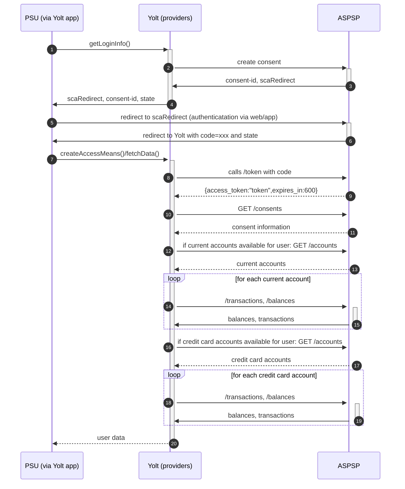

## Fineco Bank (AIS)
[Open issues on our side][4]

FinecoBank S.p.A., known as FinecoBank or just Fineco is an Italian financial service company that specialize in online brokerage
 
## BIP overview 

|                                       |                                                |
|---------------------------------------|------------------------------------------------|
| **Country of origin**                 | Italy                                          | 
| **Site Id**                           | 6b1e2a35-f296-44dd-9227-b5c9013efd2            |
| **Standard**                          | [Berlin Group Standard][1]                     |
| **Contact**                           | Email: devportal.tech@fineco.it or [Portal][3] |
| **Developer portal**                  |                                                |
| **Account SubTypes**                  | CURRENT_ACCOUNT, CREDIT_CARD                   |
| **IP Whitelisting**                   | There is no whitelisting                       |
| **AIS Standard version**              | N/A                                            |
| **Auto-onboarding**                   | There is no manual registration needed         |
| **Requires PSU IP address**           | yes                                            |
| **Type of Certificate**               |                                                |
| **Signing algorithms used**           | N/A                                            |
| **Mutual TLS Authentication support** | Yes                                            |
| **Repository**                        | https://git.yolt.io/providers/bespoke-fineco   |

## Links - development
|                            |                                                    |
|----------------------------|----------------------------------------------------|
| **Developer portal**       | https://devportal.finecobank.com/                  |
| **Sandbox environment**    | https://sandbox.api.finecobank.com/v1              |
| **Certificate validation** | https://devportal.finecobank.com/check-certificate |

https://sandbox.api.finecobank.com
## Links - production 
|                         |                                                          |
|-------------------------|----------------------------------------------------------|
| **Production base url** | https://api.finecobank.com                               |
| **Login domains**       | [openbanking.finecobank.com](openbanking.finecobank.com) |

## Client configuration overview
|                           |                             |
|---------------------------|-----------------------------|
| **Transport key id**      | eIDAS transport key id      |
| **Transport certificate** | eIDAS transport certificate |
| **Client id**             | PSDNL-DNB-B0163             |  

### Registration details
Fineco uses the eIDAS certificate as check of authorization (authentication step). So anyone who owns a valid eIDAS certificate can use Fineco API in production environment.

### Certificate rotation
According to Fineco:
> if your gurn will not change, your actual certificate has an ending date, and your new certificate will have a starting date.
> You will not have malfunctions switching your certificate.
> You must verify the validity of your new certificate on our developer portal at the following link https://devportal.finecobank.com/check-certificate

## Connection Overview

* Refresh token not supported
* **Consent validity rules** are set to EMPTY_RULES_SET for Fineco bank due to error page shares same HTML code with the correct one
* _Consent window_: According to documentation the valid period for transaction gathering is 90 days if consent is older than 20 minutes
* Fineco delivers only booked transactions
* Transaction amount signs are reversed (outgoing/debit = positive, incoming/credit = negative) See [C4PO-3109][5]
* Fineco returns exception instead of empty list if credit/current account is not supported for the user, so we examine consent to detect if current accounts/credit card accounts are available for current user    

Simplified sequence diagram:

** Consent testing 
Consent testing for PIS is blacklisted.
Consent testing for AIS is based on empty rule set.

## User Site deletion
This provider does NOT implement `onUserSiteDelete` method. 

## Business decisions

1. Beneficiaries not returned
1. Balance mapping for current accounts 
    * current <- INTERIMBOOKED
    * available <- INTERIMAVAILABLE
1. Balance mapping for credit card accounts
    * current, available <- INTERIMAVAILABLE

 |                                                                                                        |                             |
|--------------------------------------------------------------------------------------------------------|-----------------------------|
| **When exactly is the payment executed?**                                                              | execute-on-consent          |
| **it is possible to initiate a payment having no debtor account**                                      | Yes                         |
| **At which payment status we can be sure that the money was transferred from the debtor to creditor?** | AcceptedSettlementCompleted |

## External links
* [Berlin Group Standard][1]
* [Developer Portal][2]
* [Portal][3]
* [Open issues on our side][4]
 
[1]: <https://www.berlin-group.org/>
[2]: <https://devportal.finecobank.com/getting-started>
[3]: <https://devportal.finecobank.com/contact>
[4]: <https://yolt.atlassian.net/issues/?jql=project%20%3D%20%22C4PO%22%20AND%20component%20%3D%20Fineco%20AND%20status%20!%3D%20Done%20AND%20Resolution%20%3D%20Unresolved%20ORDER%20BY%20status>
[5]: <https://yolt.atlassian.net/browse/C4PO-3109?focusedCommentId=45986>
