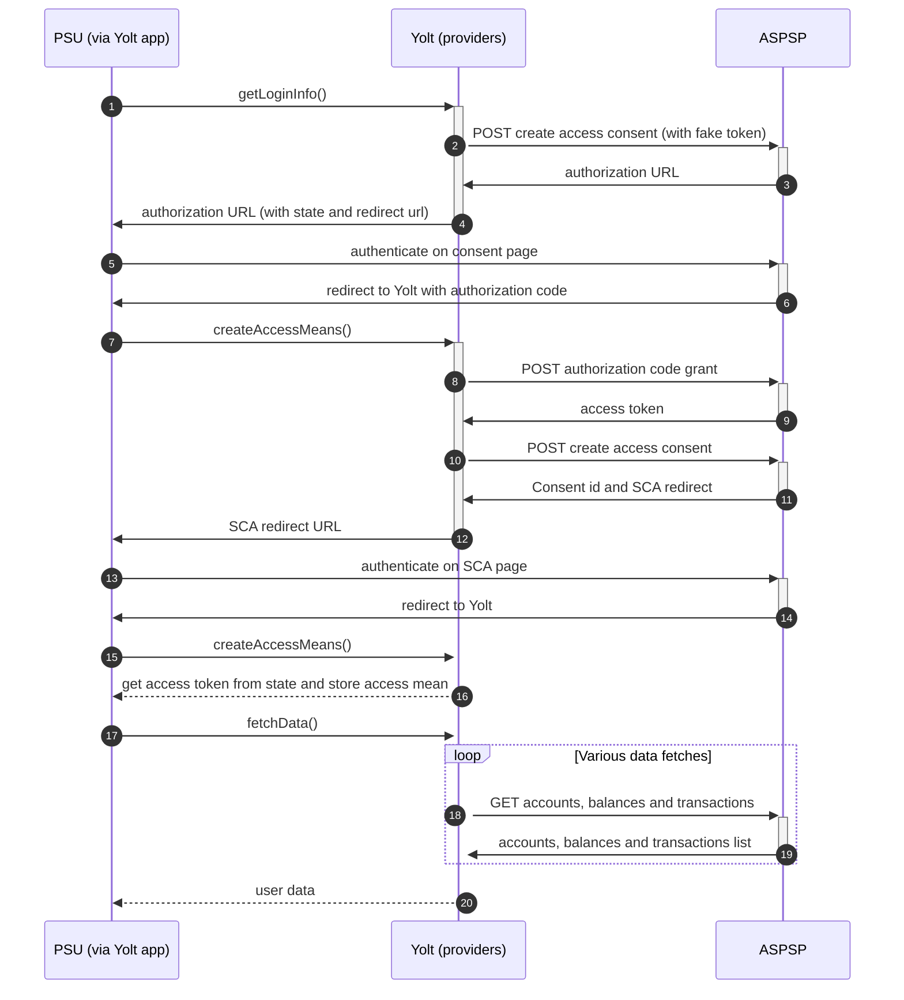

## Banca Mediolanum (AIS)

[Current open problems on our end][1]

Banca Mediolanum S.p.A. is an Italian bank, insurance and asset management conglomerate which is the parent company of
Gruppo Mediolanum (Mediolanum Group). The bank is listed on the Borsa Italiana and is a constituent of the FTSE MIB
index from the end of 2015 when it incorporated it parent company Mediolanum S.p.A.

## BIP overview

|                                       |                                                                                   |
|---------------------------------------|-----------------------------------------------------------------------------------|
| **Country of origin**                 | Italy                                                                             | 
| **Site Id**                           | 400c472c-a4ce-4d2f-be3d-59eb26291565                                              |
| **Standard**                          | [Berlin Standard][2]                                                              |
| **Contact**                           | Ticketing system: https://portal.mediolanum.it/en/component/apiportal/help/remedy |
| **Developer Portal**                  | https://portal.mediolanum.it/en/                                                  | 
| **Account SubTypes**                  | Current                                                                           |
| **IP Whitelisting**                   | No                                                                                |
| **AIS Standard version**              | 1.2                                                                               |
| **Auto-onboarding**                   | Yes                                                                               |
| **Requires PSU IP address**           | Yes                                                                               |
| **Type of certificate**               | eIDAS                                                                             |
| **Signing algorithms used**           | Signing is not used in this bank                                                  |
| **Mutual TLS Authentication Support** | Yes                                                                               |
| **Repository**                        | https://git.yolt.io/providers/bespoke-gruppo-cedacri                              |

## Links - sandbox

|                       |                                                                                                        |
|-----------------------|--------------------------------------------------------------------------------------------------------|
| **Base URL**          | https://sandbox.mediolanum.it/psd2/v1.2/bg/03062/v1                                                    |
| **Authorization URL** | It can be obtained by calling any PSD2 endpoint without valid access token. Each time URL is different | 
| **Token Endpoint**    | https://sandbox.mediolanum.it:9091/oauth/token                                                        |  

## Links - production

|                           |                                                                                                        |
|---------------------------|--------------------------------------------------------------------------------------------------------|
| **Base URL**              | https://api.mediolanum.it/psd2/v1.2/bg/03062/v1                                                        |
| **Authorization URL**     | It can be obtained by calling any PSD2 endpoint without valid access token. Each time URL is different | 
| **Token Endpoint**        | https://api.mediolanum.it:9090/oauth/token                                                             |  
| **Registration Endpoint** | https://api.mediolanum.it/psd2/v1/tpp                                                                  |  

## Client configuration overview

|                           |                                                                                                                                                             |
|---------------------------|-------------------------------------------------------------------------------------------------------------------------------------------------------------|
| **Client id**             | The client ID for TPP’s application. Obtained during registration process                                                                                   |
| **Client secret**         | The client secret is a secret credential for TPP’s application. Obtained during registration process                                                        |
| **Email**                 | This field identifies the TPP’s email, which the ASPSP can use for any communications. Used during registration process                                     |
| **Cancel link**           | TPP defines the call back url on which it wants to be redirect in case of cancelling the authorization of the OAuth token. Used during registration process |
| **Transport key id**      | Eidas transport key id                                                                                                                                      |
| **Transport certificate** | Eidas transport certificate (QWAC)                                                                                                                          |

## Registration details

Whole registration process was described in [documentation][3]. In this bank we have dynamic registration required.
Logic is very simple. There is no additional calls required. Everything can be done using one endpoint with basic data
described as client configuration overview.
There is one important thing to be mentioned. The bank allows for multiple scopes during registration, but as a result
different client id and client secret will be returned to each of used scopes. Based on bank documentation we know that
scopes are set based on certificate, not request body. It means that we have to send all scopes as those fields are mandatory,
but during registration only those will be used for which certificate was created. As a result we have to store responses
from onboarding calls to have authentication means for payments.
Bank supports all necessary operations which can be made with registration (create, update, remove).

## Multiple Registration

For now, we don't have any information about multiple registrations. What is more, we don't know if we will be able to
use the same certificates to make one registration for AIS and second one for PIS. Maybe there will be a need to update
existing registration, when PIS will be implemented.

## Connection Overview

Banca Mediolanum follows Berlin Group standard. What is more despite the fact that this is separate bank, documentation
and bank's portal looks the same as in Gruppo Cedacri. That's why we decided to implement it as a part of that group
to use the same code in all banks.

The _getLoginInfo_ method is used to generate login consent for user. First we have to get authorization URL. To do thi
we call consent endpoint with fake access token. As a result we receive 401 error code, but in response we can find
authorization URL. Such behavior can be observed on Grafana as 401 responses, but from Kibana perspective everything
looks as in other banks. The most important thing is that such flow won't trigger alerts on our side. Next we have to 
add some necessary parameters to it. Using this URL, user is redirected to the login domain to fill his credentials.

In _createAccessMeans_ method `code` is used to call for token. This token will be used to authenticate user
in next calls, so it is stored in provider state, because we have to make another call. We send request to _consents_
endpoint to create new consent. As a result we receive SCA link. Once again redirect step is returned. During the second
call of _createAccessMeans_ stored in provider state token is returned and authorization process is finished.

In response from _token_ endpoint, there is no `refresh_token` returned. Consent and `access_token` are valid for 90 days. 
It means that refresh token flow is not supported. _refreshAccessMeans_ is used only to force user with expired token
to perform consent step again.

As in other Berlin Group banks, the bank also allows for consent removal. It is done by generic code in _onUserSiteDelete_
method. Stored earlier `consentId` is used to perform this operation.

The most complex step is data fetching. Banca Mediolanum allows fetching information only about accounts, balances and
transactions. Bank supports only CURRENT accounts. Consent window isn't implemented. We relay on value provided by
site-management. This bank supports pagination for transactions. It returns only `BOOKED` transactions.

Simplified sequence diagram:

## Sandbox overview

Sandbox wasn't used during implementation process, but it is available. All necessary steps to use it were described in
documentation. To use it, registration on developer portal is required.

## Consent validity rules

Consent testing is turned on. Due to the fact that on consent page source there are only links to other Java Script files
we are not able to prepare consent validity rules. As a result EMPTY_RULES_SET is returned.

## User Site deletion

There's `onUserSiteDelete` method implemented by this provider.

## Business and technical decisions

*22.04.2022* - we decided to implement this separate bank as part of Gruppo Cedacri due to flow and requirements similarity.
Thanks that we will be able to reduce amount of code needed to use all those banks.

*25.04.2022* - with Tech Lead we have made decision to map INTERIM_AVAILABLE balance to Current balance and EXPECTED as
available balance. What is more we have found that bank supports multi-currency accounts and returns them under the same 
IBAN, but with different _resourceId_. We don't know how accounts-and-transactions behaves for this. For now, we decided
to implement it like there won't be any problem to simplify a flow of the bank.

## External links

* [Current open problems on our end][1]
* [Berlin Standard][2]
* [Documentation][3]

[1]: <https://yolt.atlassian.net/issues/?jql=project%20%3D%20%22C4PO%22%20AND%20component%20%3D%20BANCA_MEDIOLANUM%20AND%20status%20!%3D%20Done%20AND%20Resolution%20%3D%20Unresolved%20ORDER%20BY%20status>
[2]: <https://www.berlin-group.org/>
[3]: <https://portal.mediolanum.it/images/components/com_apiportal/assets/tnc/Banca-Mediolanum-NextGenPSD2-XS2A-Framework-Implementation.pdf/>