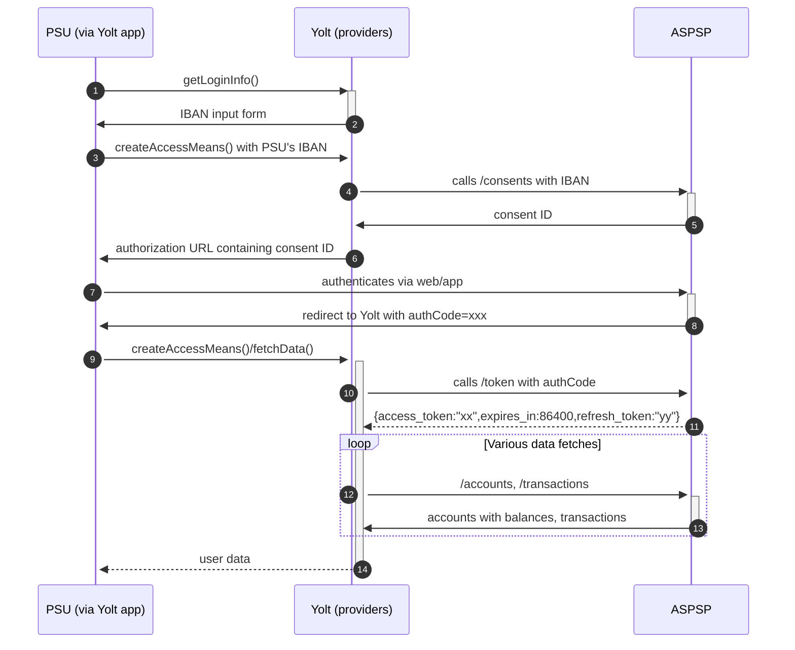

# KBC
[Current open problems on our end][1]

KBC Group N.V. is a Belgian universal multi-channel bank-insurer, focusing on private clients and small and medium-sized enterprises

## BIP overview 
[Main reference BIP][2]

|                             |                                                                                                       |
|-----------------------------|-------------------------------------------------------------------------------------------------------|
| **Country of origin**       | Belgium                                                                                               | 
| **Site Id**                 | 5101b4ec-9277-4f4d-bc7f-6a09bb617788                                                                  |
| **Standard**                | [Berlin Group Standard][3]                                                                            |
| **AIS Standard version**    | 2.0.6                                                                                                 |
| **PISP Standard version**   | (not implemented in providers)                                                                        |
| **Account types**           | CURRENT_ACCOUNT                                                                                       |
| **Requires PSU IP address** | No (according to documentation it is optional, but implemented based on experience with Berlin-Group) |
| **Repository**              | https://git.yolt.io/providers/bespoke-kbc                                                             |

## Links - development
|                      |                        | 
|----------------------|------------------------|
| **Developer portal** | [Developer Portal][4]  |

## Links - production 
|                              |                                                 |
|------------------------------|-------------------------------------------------|
| **Production base url**      | https://psd2.api.kbc.be/psd2/v2                 |
| **Production authorization** | https://idp.kbc.com/ASK/oauth/authorize/1       |
| **Production token**         | https://openapi.kbc-group.com/ASK/oauth/token/1 |

## Client configuration overview
|                           |                             |
|---------------------------|-----------------------------|
| **Transport key id**      | eIDAS transport key id      |
| **Transport certificate** | eIDAS transport certificate |

### Registration details
According to emails, no registration is needed. A valid eIDAS certificate should be enough to consume the AIS API.

### Certificate rotation
As the bank does not require any certification and there is no auto onboarding in place we can simply start using a new certificate.

## Connection Overview
Useful information can be found on the [Developer Portal][4] and in the [Authorization Guide][5] 
The AIS API swagger downloaded from bank can be found: [kbc-be-psd2-api.yaml][6]. 
Things worth noticing:
* There is a dynamic flow and the IBAN is required upfront to generate the consent page. **/consents** call is required prior to returning the authorization URL.
* There is no separate call for balances, they are retrieved together with accounts with the use of **withBalances** query parameter
* eIDAS's **organization identifier** should be provided as **client_id**

**Consent validity rules**
KBC Bank AIS uses dynamic flow, thus we are unable to determine consent validity rules for AIS.

Simplified sequence diagram:

**Payment Flow Additional Information**

|                                                                                                        |                             |
|--------------------------------------------------------------------------------------------------------|-----------------------------|
| **When exactly is the payment executed ( executed-on-submit/executed-on-consent)?**                    | execute-on-submit           |
| **it is possible to initiate a payment having no debtor account**                                      | YES                         |
| **At which payment status we can be sure that the money was transferred from the debtor to creditor?** | AcceptedSettlementCompleted |
  
## User Site deletion
This provider does NOT implement `onUserSiteDelete` method. 

## External links
* [Current open problems on our end][1]
* [Main reference BIP][2]
* [Berlin Group Standard][3]
* [Developer Portal][4]
* [Authorization Guide][5]
* [kbc-be-psd2-api.yaml][6]
 
[1]: <https://yolt.atlassian.net/issues/?jql=project%20%3D%20%22C4PO%22%20AND%20component%20%3D%20KBC%20AND%20status%20!%3D%20Done%20AND%20Resolution%20%3D%20Unresolved%20ORDER%20BY%20status>
[2]: 
[3]: <https://www.berlin-group.org/>
[4]: <https://kbc.layer7.saas.broadcom.com/admin/login>
[5]: <https://multimediafiles.kbcgroup.eu/ng/published/pdf/kbc-user-guide-authorization-api.pdf>
[6]: ./swagger/kbcgroup/kbc-be-psd2-api.yaml
