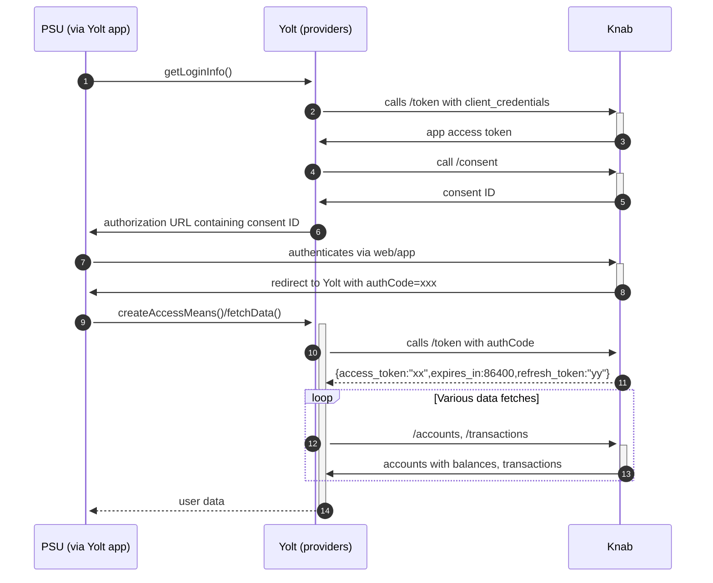

## Knab Bank (AIS)

{in progress}

## BIP overview 
[Main reference BIP][1]

|                                       |                                            |
|---------------------------------------|--------------------------------------------|
| **Country of origin**                 | Netherland                                 | 
| **Site Id**                           | d47c60db-5034-4c87-bf96-91142aff6107       |
| **Standard**                          | [Berlin group Standard][2]                 |
| **Contact**                           | E-mail: openbanking@knab.nl                |
| **Developer Portal**                  | https://developer.knab.nl                  |
| **Account SubTypes**                  | Current, soon savings                      |
| **IP Whitelisting**                   |                                            |
| **AIS Standard version**              | v1                                         |
| **Auto-onboarding**                   |                                            |
| **Requires PSU IP address**           |                                            |
| **Type of certificate**               |                                            |
| **Signing algorithms used**           |                                            |
| **Mutual TLS Authentication Support** |                                            |
| **Repository**                        | https://git.yolt.io/providers/bespoke-knab |

## Client configuration overview
|                                  |                                                                               |
|----------------------------------|-------------------------------------------------------------------------------|
| **Signing key id**               | Eidas signing key id {in progress}                                            | 
| **Signing certificate**          | Eidas signing certificate  {in progress}                                      | 
| **Transport key id**             | Eidas transport key id {in progress}                                          |
| **Transport certificate**        | Eidas transport certificate {in progress}                                     |
| **Certificate Agreement Number** | value obtainable from our Eidas certificate, extensions {in progress}         |
| **Client id**                    | Equal to certificate agreement number if we do not use aliasing {in progress} | 

### Registration details
Manual - via email message - we received clientId and clientSecret

### Certificate rotation
{in progress}

## Connection Overview

**Consent validity rules** are implemented for Knab AIS.

Simplified sequence diagram:
{in progress}

## User Site deletion
This provider does NOT implement `onUserSiteDelete` method. 

## Business decisions
We map field: dateTime in ProviderTransactionDTO as transationDate - it has been consulted and requested by Jortt.

## Sandbox overview
Full Authorization flow + accounts fetch available in Knab-sandbox-postman-collection.json when imported into postman  

**Payment Flow Additional Information**

|                                                                                                        |                   |
|--------------------------------------------------------------------------------------------------------|-------------------|
| **When exactly is the payment executed ( executed-on-submit/executed-on-consent)?**                    | execute-on-submit |
| **it is possible to initiate a payment having no debtor account**                                      | NO                |
| **At which payment status we can be sure that the money was transferred from the debtor to creditor?** | RCVD status       |

## External links
* [Main reference BIP][1]
* [Berlin group Standard][2]
* [Developer portal][3]
 
[1]: 
[2]: <https://www.berlin-group.org/nextgenpsd2-downloads>
[3]: <https://developer.knab.nl>
