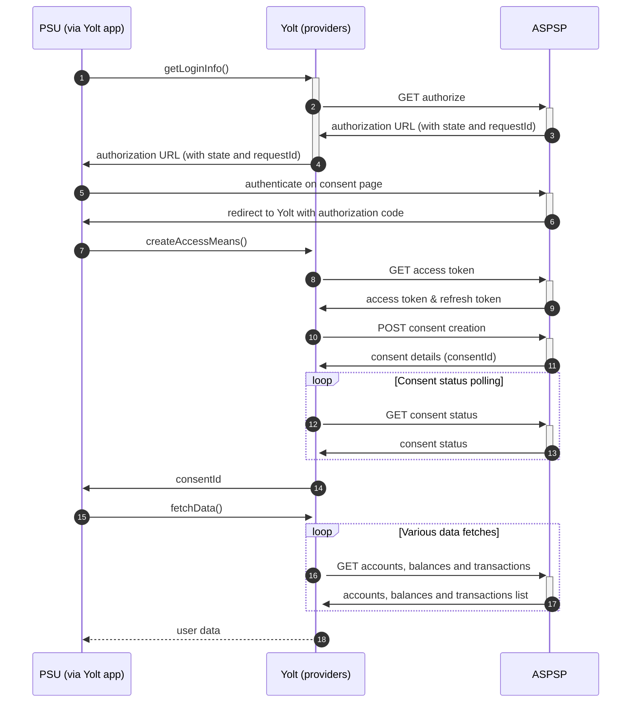

## N26 (AIS)
[Current open problems on our end][1]

## BIP overview 

|                                       |                                                                                           |
|---------------------------------------|-------------------------------------------------------------------------------------------|
| **Country of origin**                 | German                                                                                    | 
| **Site Id**                           | a6fe9812-a242-4902-850d-20b29102dba2                                                      |
| **Standard**                          | [Berlin Group Standard][2]                                                                |
| **Contact**                           | E-mail: open.banking@n26.com   Primary contact person: anderson.yamamoto@n26.com   |
| **Developer Portal**                  | N26 PSD2 Dedicated Interface AIS documentation in pdf, provided by the N26                | 
| **Account SubTypes**                  | Current                                                                                   |
| **IP Whitelisting**                   | No                                                                                        |
| **AIS Standard version**              | v1                                                                                        |
| **Auto-onboarding**                   | No                                                                                        |
| **Requires PSU IP address**           | Yes                                                                                       |
| **Type of certificate**               | eIDAS certificate required: QWAC                                                          |
| **Signing algorithms used**           | There is no signing                                                                       |
| **Mutual TLS Authentication Support** | Yes                                                                                       |
| **Repository**                        | https://git.yolt.io/providers/bespoke-n26                                                 |

## Links - sandbox

Currently the N26 PSD2 Dedicated Interface provides no sandbox environment.

## Links - production 

|                       |                                         |
|-----------------------|-----------------------------------------|
| **Base URL**          | https://xs2a.tech26.de                  |
| **Authorization URL** | https://xs2a.tech26.de/oauth2/authorize | 
| **Token Endpoint**    | https://xs2a.tech26.de/oauth2/token     |  

## Client configuration overview

|                           |                                                       |
|---------------------------|-------------------------------------------------------|
| **Transport key id**      | Eidas transport key id                                |
| **Transport certificate** | Eidas transport certificate                           |
| **Client id**             | Global Unique Reference Number from eIDAS certificate | 

## Registration details

There is no registration required: 
1. A TPP shall connect to the N26 PSD2 dedicated API by using an eIDAS valid certificate (QWAC) issued
2. N26 shall check the QWAC certificate and allow the TPP to identify themselves automatically with the subsequent API calls
3. As the result of the steps above, the TPP should be able to continue using the API without manual involvement from the N26 side

## Multiple Registration

N26 currently accepting multiple certificates per TPP. A consent created by one certificate can be accessed by another 
if the Subject Common Name and TPP number matches. Subject Common Name is the name listed as CN on the subject line. 

## Connection Overview

Bank doesn't have developer portal. During implementation the documentation was sent to us via email. However, it seems 
that bank placed documentation with small FAQ here: [git-n26-psd2-tpp-docs][3] (noticed in 08.2022)

The _getLoginInfo_ method is used to generate login consent for user. First of all we call _authorization_ endpoint.
Bank should respond us with 302 code response and _location_ header, which include consent URL. Due to the fact that
we can automatically redirect user to this URL, automatic redirect was turned off for `restTemplate` used in this bank.
Received URL is sent to s-m in `RedirectStep`.

In _createNewAccessMeans_ method _code_ is taken and used to call for token. This token will be used to authenticate user
in next calls. Additionally we create consent on bank side. After this step _consentId_ is received and can be also used
in further calls. The most important thing is that N26 supports DECOUPLED mechanism. It means that after consent step, 
user has to accept popup which will display on his mobile phone where user has N26 banking app installed. It can be a different device that that on which Yolt app
is installed. Due to that fact we have to have polling mechanism implemented to get consent status before create access means
step ends. It is done by `ScheduledExecutorService`. 
In order to have polling working inside _createNewAccessMeans_ method there was need to extend read timeout 
for _restTemplate_ in _ProviderRestClient_ inside site-management from default 10 secs to 70 secs. 

In _getLoginInfo_ method RedirectStep is returned with dummy _externalConsentId_ in order to enable _onUserSiteDelete_ handling.

During fetch data step only accounts, balances and transactions are collected. There is no additional data to get from
this bank. Important information is that this bank doesn't support pagination for now. It returns only `BOOKED` transactions.

Refresh token flow is supported. Consent is valid for 90 days. First refresh token is one-use. It means that after every
refresh we should map both access and refresh tokens values.

**Consent validity rules** are set to EMPTY_RULES_SET for N26 AIS bank due to error page shares same HTML code as a correct one.

Simplified sequence diagram:

   
## Sandbox overview

Currently the N26 PSD2 Dedicated Interface provides no sandbox environment.

## User Site deletion

There's `onUserSiteDelete` method implemented by this provider, however, only in a best effort manner.
  
## Business and technical decisions

During implementation we made following business decisions:

Only accounts marked as `enabled` are mapped. Bank sends us also removed accounts, but we don't want to display such data
to our users.

Bank support only `Expected` balance type, so me decided to map it to both current and available balances in our model.

Due to the fact that account name is required, we decided to use default name based on account type (`Main Account` and
`Space`) if there is no name in response.

Additional information like `Details` and `RemittanceInformation` are optional, we decided to try map `Details` first to
_Description_ field. If it is not present, we try to use data from `RemittanceInformation`.
Base on our tester experience, RDD and what is showne in N26 mobile banking app we decided to map `creditorName` or `debtorName` as transaction description
in case `Details` and `RemittanceInformation` are not provided by bank. Finally we use `N/A` value
to inform that this data is not available.

We decided to implement polling mechanism to `createAccessMeans` step to be compliant with our business requirements.
Maximal waiting time for consent status is about five minute, due to the fact that timeout value for this endpoint is
70 seconds. The waiting time has been suggested by N26 support, mail topic is [C4PO-8678] Consent status received after 1 minute after creation.

**02.03.2022** We have received following email from the bank:

We would like to inform you that from Monday 14th March 2022, we will change how we classify the booking status of transactions in our Dedicated (XS2A) Interface in order to be more consistent with the N26 app. More specifically, transactions previously classified as “pending” will be classified as “booked” transactions.

What does this mean for you?
This means that we will only support “bookingStatus”=“booked”, as well as “bookingStatus”=“information” for standing orders.

Regarding this proper changes were made and for now only BOOKED transactions are supported.

**Payment Flow Additional Information**

|                                                                                                        |                             |
|--------------------------------------------------------------------------------------------------------|-----------------------------|
| **When exactly is the payment executed ( executed-on-submit/executed-on-consent)?**                    | execute-on-consent          |
| **it is possible to initiate a payment having no debtor account**                                      | NO                          |
| **At which payment status we can be sure that the money was transferred from the debtor to creditor?** | AcceptedSettlementCompleted |

## External links
* [Current open problems on our end][1]
* [Berlin Standard][2]
* [[git-n26-psd2-tpp-docs][3]

[1]: <https://yolt.atlassian.net/browse/C4PO-5713?jql=project%20%3D%20%22C4PO%22%20AND%20component%20%3D%20N26%20AND%20status%20!%3D%20Done%20AND%20Resolution%20%3D%20Unresolved%20ORDER%20BY%20status>
[2]: <https://www.berlin-group.org/>
[3]: <https://github.com/n26/psd2-tpp-docs>
