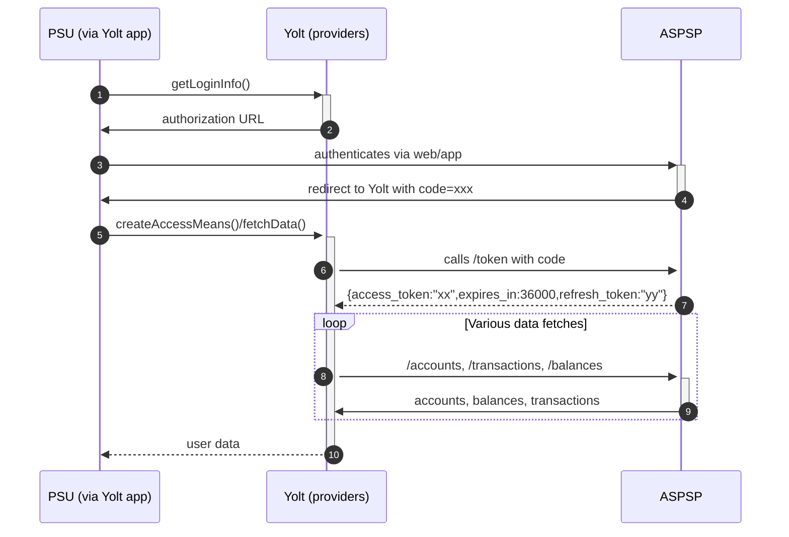

## Rabobank (AIS)
[Current open problems on our end][1]

Rabobank is a Dutch multinational banking and financial services company headquartered in Utrecht, Netherlands. 
In the Netherlands, Rabobank is the third-largest retail bank by market share, and second largest by number of current accounts at 30%.
 
## BIP overview 
|                                       |                                                                                                                                      |
|---------------------------------------|--------------------------------------------------------------------------------------------------------------------------------------|
| **Country of origin**                 | Netherlands                                                                                                                          | 
| **Site Id**                           | eedd41a8-51f8-4426-9348-314a18dbdec7                                                                                                 |
| **Standard**                          | [Berlin Group Standard][2]                                                                                                           |
| **Contact**                           | Email : openbanking@rabobank.nl / Contact form: https://developer.rabobank.nl/contact (bank's request was to contact them by portal) |
| **Developer Portal**                  | https://developer.rabobank.nl                                                                                                        |
| **Account SubTypes**                  | Current                                                                                                                              |
| **IP Whitelisting**                   | Bank is not supporting Whitelisting                                                                                                  |
| **AIS Standard version**              | 3.0.11 (4.0.19 available on bank side)                                                                                               |
| **Auto-onboarding**                   | No                                                                                                                                   |
| **Requires PSU IP address**           | No (header is optional, but we use it)                                                                                               |
| **Type of certificate**               | Eidas certificates are required : QWAC and QSEAL                                                                                     |
| **Signing algorithms used**           | RS512                                                                                                                                |
| **Mutual TLS Authentication Support** | Yes                                                                                                                                  |
| **Repository**                        | https://git.yolt.io/providers/bespoke-rabobank                                                                                       |

## Links - sandbox
|                     |                                                  |
|---------------------|--------------------------------------------------|
| **Sandbox baseUrl** | https://api-sandbox.rabobank.nl/openapi/sandbox/ |

## Links - production 
|                              |                                                    |
|------------------------------|----------------------------------------------------|
| **Production base url**      | https://api.rabobank.nl/openapi/                   |
| **Production authorization** | https://oauth.rabobank.nl/openapi/oauth2/authorize |
| **Production token**         | https://oauth.rabobank.nl/openapi/oauth2/token     |

## Client configuration overview
|                                |                                                                            |
|--------------------------------|----------------------------------------------------------------------------|
| **Client id**                  | Client id value received after manual app creation on developer portal     |
| **Client secret**              | Client secret value received after manual app creation on developer portal | 
| **Client certificate**         | Eidas transport certificate                                                |
| **Transport kid**              | Eidas transport key id                                                     |      
| **Client signing certificate** | Eidas signing certificate                                                  | 
| **Signing kid**                | Eidas signing key id                                                       | 

## Registration details
Onboarding Rabobank on production is a manual process.
We can't automate this currently by implementing the interface `AutoOnboardingProvider` in DataProvider class.
As described below, Rabobank does not return client-id/client-secret synchronously in response to our onboarding request.

Rabobank has a unusual production onboarding flow.
The bank requires us to perform a signed http call that's in response to which they send back 202 Accepted.
After a while they send an e-mail with information that contains a production login to a production developer portal.

Whole onboarding process is described here: [JWS TPP enrollment][3]. It was automated on our side. This functionality can 
by find on YTS Assistance Portal in Bank Onboarding tab. There is separate Rabobank button, where registration process ca be performed.

After this you can add production applications on their portal. During that you will have to provide redirectUrl 
(one per registration) and QWAC certificate for TLS. You will get a Client ID and Client Secret after you've registered the app. 

## Connection Overview
AIS and PIS DTOs were created using swaggers downloaded from developer portal. In our implementation we used swaggers 
dedicated for [Rabobank][5] and for [Berlin standard][4]. From second one only Balance class is used, but I think it can 
be replaced by class from Rabobank's swagger. It means that this swagger is unnecessary. What is more we are using for 
AIS swaggers in version 3.0.7, which are outdated. 

Documentation for the bank and swaggers can be found on their developer portal [https://developer.rabobank.nl/api-marketplace][6]. 
To access those data you don't have to login using credentials and special code from Google Authenticator app (ask Support 
stream for more details) as it is required to access production applications.

To generate consent there is no access token required. All we have to do is to create proper url on _/authorize_ endpoint 
and redirect user to it.

AIS API version accounts:4.0.8 , balances:4.0.6, transactions:4.0.13 release introduce several changes indicated in release note. This changes include:
- balances type limited to 'expected' type;
- AccountDetails field 'name' renamed to 'ownerName';
- links are no longer primitive types (they contain field 'href');
- paths do not contain '/v3' segment;
- API now does not return pending (temporary) bookings and only final bookings;
- renamed fields names: exchangeRate tag into currencyExchange, rateFrom to exchangeRate, currencyFrom to sourceCurrency, currencyTo to targetCurrency;
- removed unused fields from swagger and API: rateDate, rateContract, checkId, rateTo, purposeProprietary, proprietaryBankTransactionCode;
- error handling in transactions API has been aligned to documentation of Berlin group;
- pagination change to use nextPageToken
- Berlin group psd2 standard upgraded to 1.3.6 version.

Bank suddenly (19.05.2022) started providing instructedAmount object describing the original amount/currency of transaction:
` "instructedAmount": {
"amount": 5.12,
"sourceCurrency": "EUR"
}`
It is worth noting here that object is being sent also sometimes for same currency transactions. This is an indication of its presence being correlated with something more (like transaction type or purpose, than just different currencies).

**Consent validity rules**
Rabobank PIS consent page is an SPA, thus we are unable to determine consent validity rules.
Consent validity rules for Rabobank AIS are implemented.

### Signing in/Authenticating the user
Rabobank uses OAuth2 to authenticate and authorize users. Which follows the regular OAuth steps:
1. Redirect the user to Rabobank’s Authorization page (generate login url)
2. User Gives consent and is redirected to the redirect URL
4. We request the OAuth tokens
5. We are authorized to call Rabobank secured APIs on behalf of the user.

#### Redirecting the user
The generated login url has to have the following query parameters:
* `response_type` should **always** have the value `code`
* `scope` a space separated list of the scopes we're going to consume. 
For specific names of the scopes connected to all the APIs we're consuming please see Rabobank API pages
* `redirect_uri` (optional) this is the redirect uri we've registered when creating the app at Rabobank's Developer portal
* `state` (optional) the state id which we get from site-management

Even though the `redirect_uri` and the `state` parameters are optional, we include them because they are necessary for our backend to function properly.
After we've created the login url, the user can visit the page and they can then give their consent.
They will then be redirected to the yolt redirect page and we get an `authorization_code`.

#### Requesting and refreshing the token
We can use the `authorization_code` grant type for the access and `refresh_token` to refresh token. 
This is done through a POST request, we're using Spring's built-in OAuth implementation/library to handle these requests.

#### Required headers
For AIS call there are _Digest_ and _Signature_ headers required. The provider uses [RFC 7616][7] for calculating the 
digest with SHA-512 algorithm. Signature header has following format: 
`keyId="KEY",algorithm="rsa-sha512",headers="date digest x-request-id",signature="SIGNATURE"`

Apart from the already mentioned security headers, we also have to include the signature certificate in the `TPP-Signature-Certificate` header.
The format of this certificate does NOT include the `-----BEGIN CERTIFICATE-----` and `-----END CERTIFICATE-----` tags.

#### Additional information
Bank allows to get only _booked_ transactions. Parameter _dateFrom_ is optional, but if it is empty, default 90 days of 
transactions history will be returned.

PIS logic is implemented based on SEPA Payment standard.

Simplified sequence diagram:

## Sandbox overview
At the beginning only Sandbox was connected, because it didn't require eIDAS certificate. 

The Rabobank sandbox was very accessible for testing. It provides preconfigured testing accounts.
This allowed us to test the whole add bank flow on a local machine or your team environment.

When Yolt was able to get such certificate, we connected production API. It means that sandbox was used during 
implementation process, but access to endpoints and documentation for Sandbox required account creation on their portal. 
There is a [link][8] to register for sandbox.

## User Site deletion
This provider does NOT implement `onUserSiteDelete` method.

## Business and technical decisions
Rabobank returns only one balance type (EXPECTED). It is mapped only as current balance. For available balance we expect
AVAILABLE type, but based on documentation it is not send, so there will be always _null_.

Bank returns only one type of transactions (BOOKED). Despite that fact our logic is ready to map PENDING transactions too.

Agreed with Leon to use static (dutch) naming for account name. It means that every account has name _"Rabobank rekening"_;

Based on our experience with other Berlin Standard banks we decided to add PSU-IP-Address header to our fetch data requests.

**30.07.2020** Payment has been successfully tested (29.07.2020), so we switched LIVE, but we do not have any clients on 
YFB-EXT-PRD, so it stays behind feature toggle.

## Certificate rotation
Rotation of certificates looks different and depends on certificate types (QWAC, QSEAL). For QSEAL it is simple, because
bank doesn't store our certificate during registration. All we have to do is to use valid eIDAS certificate. That's why
the only thing to do is to change authentication means on our side. For QWAC we also have to do the same, but this time 
it is breaking change. After rotation on our side, we have to login on developer portal and change pinned certificate
for TLS on proper application. After that bank should work again. Remember that due to the fact that only one _redirectUrl_
is allowed for each of application, we have to make this change separately for AIS and PIS. 

**Payment Flow Additional Information**

|                                                                                                        |                                                                             |
|--------------------------------------------------------------------------------------------------------|-----------------------------------------------------------------------------|
| **When exactly is the payment executed ( executed-on-submit/executed-on-consent)?**                    | execute-on-submit                                                           |
| **it is possible to initiate a payment having no debtor account**                                      | YES                                                                         |
| **At which payment status we can be sure that the money was transferred from the debtor to creditor?** | AcceptedSettlementCompleted/AcceptedSettlementInProcess for instant payment |

## External links
* [Current open problems on our end][1]
* [Berlin Standard][2]
* [RFC 7616][7]
* [Developer portal][9]
 
[1]: <https://yolt.atlassian.net/issues/?jql=project%20%3D%20%22C4PO%22%20AND%20component%20%3D%20Rabobank%20AND%20status%20!%3D%20Done%20AND%20Resolution%20%3D%20Unresolved%20ORDER%20BY%20status>
[2]: <https://www.berlin-group.org/>
[3]: <https://developer.rabobank.nl/jws-request-tpp-enrollment>
[4]: ./swagger/berlingroup/psd2-api-1.2_2018-07-27.yaml
[5]: ./swagger/rabobank
[6]: <https://developer.rabobank.nl/api-marketplace>
[7]: <https://tools.ietf.org/html/rfc7616>
[8]: <https://developer-sandbox.rabobank.nl/user/register>
[9]: <https://developer.rabobank.nl>
