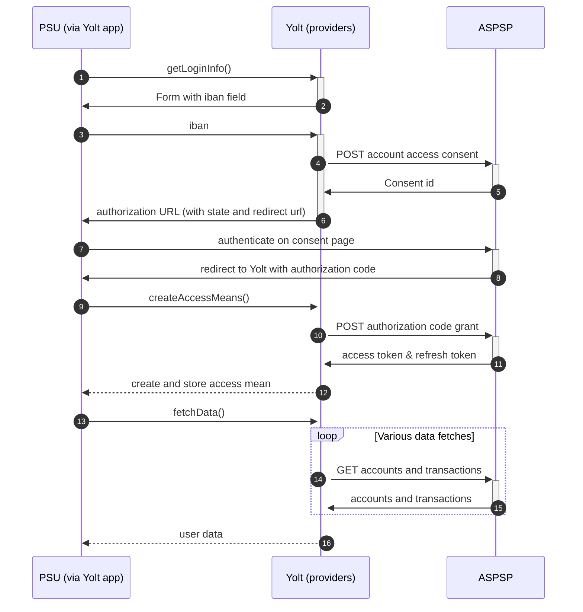

## Bank Name (AIS)
[Current open problems on our end][1]

Raiffeisen Bank is a top universal bank on the Romanian market, offering a complete range of products and services of 
superior quality to individuals, SMEs and large corporations, through multiple distribution channels: banking units, 
ATM and EPOS networks, telephone- banking (Raiffeisen Direct), mobile banking (Raiffeisen Smart Mobile) and internet 
banking (Raiffeisen Online).

## BIP overview 

|   |                                                                                                                                                                          |
|---|--------------------------------------------------------------------------------------------------------------------------------------------------------------------------|
| **Country of origin** | Romania                                                                                                                                                                  | 
| **Site Id** | 654c5380-7ec7-480f-8963-f5bb43137b37                                                                                                                                     |
| **Standard** | [Berlin Standard][2]                                                                                                                                                     |
| **Contact** | E-mail: developer_support@raiffeisen.ro   Primary contact person: N/A   Ticketing system: https://developer.raiffeisen.ro/support/user/292 (bank do not response) |
| **Developer Portal** | new API Market: https://api.rbinternational.com/home Local RO Developer portal: https://developer.raiffeisen.ro/                                                                                      | 
| **Account SubTypes** | Current, Credit                                                                                                                                                          |
| **IP Whitelisting** | No                                                                                                                                                                       |
| **AIS Standard version** | 1.3.2.2                                                                                                                                                                  |
| **Auto-onboarding** | No                                                                                                                                                                       |
| **Requires PSU IP address** | It shall be contained if and only if this request was actively initiated by the PSU                                                                                      |
| **Type of certificate** | eIDAS                                                                                                                                                                    |
| **Signing algorithms used** |                                                                                                                                                                          |
| **Mutual TLS Authentication Support** |                                                                                                                                                                          |
| **Repository** | https://git.yolt.io/providers/bespoke-raiffeisen                                                                                                                         |

## Links - sandbox

|   |   |
|---|---|
| **Base URL** | Not available yet | 
| **Authorization URL** | Not available yet | 
| **Token Endpoint** | Not available yet | 

## Links - production 

|   |   |
|---|---|
| **Base URL** | https://api.raiffeisen.ro |
| **Authorization URL** |  https://api-auth.raiffeisen.ro/oauth2/authorize |
| **Token Endpoint** |   https://api-auth.raiffeisen.ro/oauth2/token | 

## Client configuration overview

|   |   |
|---|---|
| **Authentication mean name** | Authentication mean description |

## Registration details

Registration is manual process. We need to register organisation on our account in developer portal which name have to match name used in the PSD2 certificate issued by QTSP.
Then new application needs to be created and subscribed to specific APIs

## Multiple Registration

Multiple registrations are possible via developer portal account

## Connection Overview

Describe bank flow. There should be information about the flow in each of our interface method. Describe supported 
transaction types, endpoints, token validity etc. Pay attention for those places where logic is specific and doesn't
look like any other provider.

Simplified sequence diagram:

   
## Sandbox overview

If sandbox was used, you have to describe here information about it. You can also explain why we skipped sandbox during
implementation of provider.

## Consent validity rules

Describe if consent testing was turned on or off and what consent validity rules are used.

## User Site deletion

There's `onUserSiteDelete` method implemented by this provider, however, only in a best effort manner.

## Business and technical decisions

Place here all business decisions which were made in this provider. Pay attention for mappings and error handling.

## External links
* [Current open problems on our end][1]
* [Berlin Standard][2]

[1]: <https://yolt.atlassian.net/issues/?jql=project%20%3D%20%22C4PO%22%20AND%20component%20%3D%20REIFFAISEN_BANK_RO%20AND%20status%20!%3D%20Done%20AND%20Resolution%20%3D%20Unresolved%20ORDER%20BY%20status>