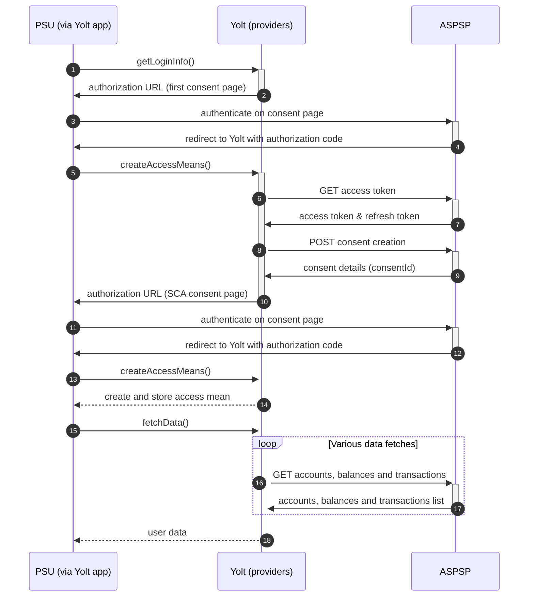

## La Caixa (AIS)
[Current open problems on our end][1]

Caixa Bank is a Spanish financial services company owned by CriteriaCaixa with a 40% stake. It is based in Valencia and 
Barcelona in Spain. It is Spain's third-largest lender by market value, after Banco Santander and BBVA. CaixaBank has 
5,397 branches to serve its 15.8 million customers, and has the most extensive branch network in the Spanish market. 
It is listed in the Bolsa de Madrid and is part of the IBEX 35.
 
## BIP overview 
|                                       |                                                                                                                                                                                                                                                                                |
|---------------------------------------|--------------------------------------------------------------------------------------------------------------------------------------------------------------------------------------------------------------------------------------------------------------------------------|
| **Country of origin**                 | Spain                                                                                                                                                                                                                                                                          | 
| **Site Id**                           | 9811a3bd-1c8d-4461-b795-4ff63868fc58                                                                                                                                                                                                                                           |
| **Standard**                          | [Berlin Group Standard][2]                                                                                                                                                                                                                                                     |
| **Contact**                           | Email (production): psd2.hub.soporte@redsys.es / Email (sandbox) : psd2.sandbox.soporte@redsys.es.  Email should contain [YOLT][{Bank name}] in its title.  Attach filled Query_details.xlsx.  If any video is sent remember to send it as compressed ZIP archive. |
| **Developer Portal**                  | https://market.apis-i.redsys.es/psd2/xs2a/nodos/caixabank                                                                                                                                                                                                                      |
| **Account SubTypes**                  | Current                                                                                                                                                                                                                                                                        |
| **IP Whitelisting**                   | Bank is not supporting Whitelisting                                                                                                                                                                                                                                            |
| **AIS Standard version**              | 1.7.1                                                                                                                                                                                                                                                                          |
| **Auto-onboarding**                   | No                                                                                                                                                                                                                                                                             |
| **Requires PSU IP address**           | yes                                                                                                                                                                                                                                                                            |
| **Type of certificate**               | Eidas certificates are required : QWAC and QSEAL                                                                                                                                                                                                                               |
| **Signing algorithms used**           | RS256                                                                                                                                                                                                                                                                          |
| **Mutual TLS Authentication Support** | Yes                                                                                                                                                                                                                                                                            |
| **Repository**                        | https://git.yolt.io/providers/bespoke-redsys                                                                                                                                                                                                                                   |

## Links - sandbox
|                       |                                                                                 |
|-----------------------|---------------------------------------------------------------------------------|
| **Base url**          | https://apis-i.redsys.es:20443/psd2/xs2a/api-entrada-xs2a/services/caixabank    |
| **Authorization url** | https://apis-i.redsys.es:20443/psd2/xs2a/api-oauth-xs2a/services/rest/caixabank |

## Links - production 
|                       |                                                                                    |
|-----------------------|------------------------------------------------------------------------------------|
| **Base url**          | https://psd2.redsys.es/api-entrada-xs2a/services/caixabank                         |
| **Authorization url** | https://hubpsd2.redsys.es/api-oauth-xs2a/services/rest/caixabank                   |
| **Login domains**     | [loc7.caixabank.es](loc7.caixabank.es)   [hubpsd2.redsys.es](hubpsd2.redsys.es) |

## Client configuration overview
|                           |                                                       |
|---------------------------|-------------------------------------------------------|
| **Client id**             | Global Unique Reference Number from eIDAS certificate |
| **Transport certificate** | Eidas transport certificate                           |
| **Transport key id**      | Eidas transport key id                                |      
| **Signing certificate**   | Eidas signing certificate                             | 
| **Signing key id**        | Eidas signing key id                                  | 

## Registration details
In whole Redsys group there is no manual or dynamic registration. It is enough to use a valid eIDAS certificate (QWAC & QSEAL) 
with a unique organization identifier (GURN - Global Unique Reference Number) during mutual TLS authentication and signing the request.
The Global Unique Reference Number is used as _Client Id_.

## Connection Overview
Swagger can be downloaded from developer portal, but during implementation process we discovered that it is deprecated, 
so all model DTOs in our implementation were created manually based on documentation.

Documentation for the bank and swaggers can be found on their [developer portal][3]. To access those data you don't have 
to login using any credentials.

Redsys group has specific authorization flow. During `getLoginInfo` step user is redirected to consent page. Next during
first call of `createAccessMeans` user is redirected once again to bank site. This time SCA consent has to be filled.
After that we have _consentId_ value, which is required to fetch data.

Additionally `X-Request-ID` header has specific behaviour. It has to be different each call, except calls for transactions pages.
What is more in this group of banks there is `PSU-IP-Address` header required. It means that there is no limit for usage
of bank's api when call is triggered by user and  this header is present. For flywheel calls in some banks there are limits.
Due to that fact in whole group `BackPressureRequestException` exception is thrown when we receive _429_ error code in response
during fetch data process. From application perspective it means that this result should be skipped, so user doesn't know
that there was something wrong.

In Caixa Bank there is additional solution. On _/accounts_ endpoint parameter `withBalances` is used to get also 
information about balances and reduce number of calls per day.

In Redsys group we have to pay attention for transactions fetching time. In Caixa Bank we can request for transactions 
dated up to two years back on first call after user site creation, and up to three months on subsequent calls. 
However, we decided to maintain the standard one-year fetch window for first fetch in Caixa Bank for standardization.

Simplified sequence diagram:

**Consent validity rules**

Consent validity rules are set to EMPTY_RULES_SET. We either get consent page, or we get error status.

## Sandbox overview
During implementation of whole group sandbox (Caixa Bank) was user. We were able to verify authorization API, but there was no possibility
to perform calls for AIS, because of requirement of eIDAS certificate for signature signing. 

## User Site deletion
This provider does NOT implement `onUserSiteDelete` method. 

## Business and technical decisions
In Redsys group returned balance types depends on bank. Due to that fact we decided to prepare logic based on preferences
list. It means that as _Current Balance_ CLOSING_BOOKED, INTERIM_BOOKED, INTERIM_AVAILABLE, OPENING_BOOKED, EXPECTED types
are mapped in presented order. The same mechanism is implemented for _Available Balance_ and the order is as follows 
INTERIM_AVAILABLE, INTERIM_BOOKED, OPENING_BOOKED, CLOSING_BOOKED, EXPECTED. For Caixa only CLOSING_BOOKED is returned.

Generic implementation is able to map both _pending_ and _booked_ transaction types and Caixa Bank allows for both of them.
But was proven to use only working is _booked_ bookingStatus for Caixa. Type _pending_ is not allowed, _both_ gives an error.

## Certificate rotation
Rotation of certificates is easy process. Due to the fact that there is no registration required, we can just update
authentication means on our side. Remember that certificates have to contain the same Global Unique Reference Number. 
Otherwise we also have to update _clientId_ authentication means and users will have to start from consent step, because 
from bank's perspective we will be treated as other TPP. 

**Payment Flow Additional Information**

|                                                                                                        |                    |
|--------------------------------------------------------------------------------------------------------|--------------------|
| **When exactly is the payment executed ( executed-on-submit/executed-on-consent)?**                    | execute-on-consent |
| **it is possible to initiate a payment having no debtor account**                                      | YES                |
| **At which payment status we can be sure that the money was transferred from the debtor to creditor?** | ISCT               |

## External links
* [Current open problems on our end][1]
* [Berlin Standard][2]
* [Developer portal][3]
 
[1]: <https://yolt.atlassian.net/browse/C4PO-4877?jql=project%20%3D%20%22C4PO%22%20AND%20component%20%3D%20Caixa%20AND%20status%20!%3D%20Done%20AND%20Resolution%20%3D%20Unresolved%20ORDER%20BY%20status>
[2]: <https://www.berlin-group.org/>
[3]: <https://market.apis-i.redsys.es/psd2/xs2a/nodos/caixabank>
