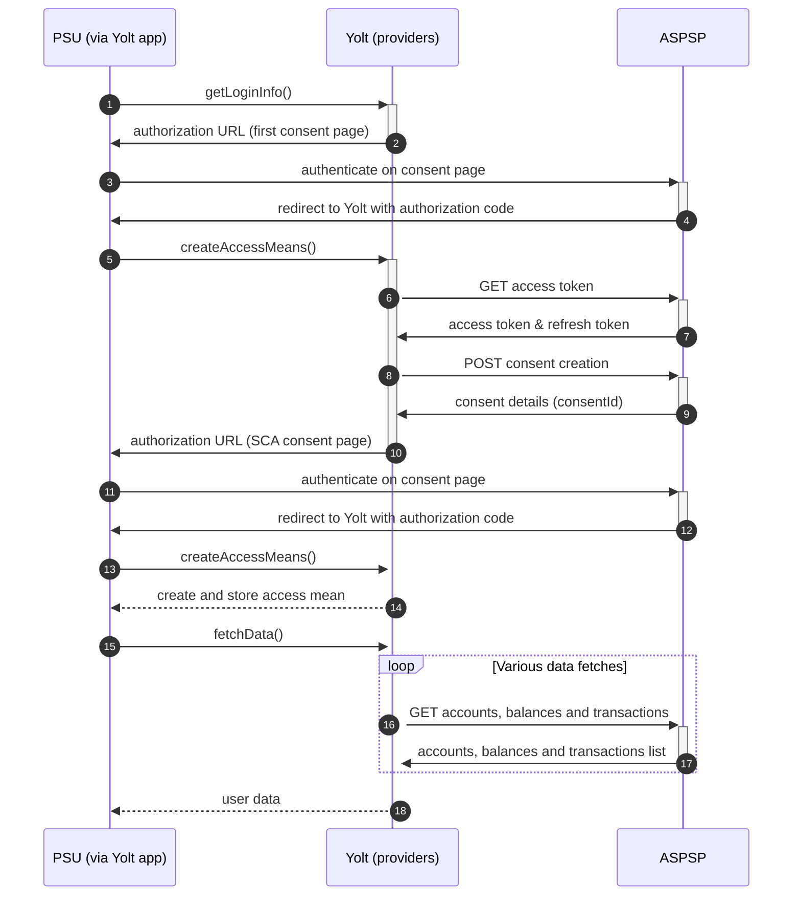

## Evo Banco (AIS)
[Current open problems on our end][1]

EVO Banco, S.A.U. is a Spanish bank based in Madrid. It was created by NCG Banco on March 12, 2012 as a division that 
would operate its assets outside the autonomous communities of Galicia, Asturias and the province of León. As part of 
their launch campaign it introduced its main financial product: Cuenta Inteligente.

## BIP overview 

|                                       |                                                                                                                                                                                                                 |
|---------------------------------------|-----------------------------------------------------------------------------------------------------------------------------------------------------------------------------------------------------------------|
| **Country of origin**                 | Spain                                                                                                                                                                                                           | 
| **Site Id**                           | a5e54d0a-9756-4365-aea8-928bd3ad5876                                                                                                                                                                            |
| **Standard**                          | [Berlin Group Standard][2]                                                                                                                                                                                      |
| **Contact**                           | E-mail: psd2.hub.soporte@redsys.es.  Email should contain [YOLT][{Bank name}] in its title.  Attach filled Query_details.xlsx.  If any video is sent remember to send it as compressed ZIP archive. |
| **Developer Portal**                  | https://market.apis-i.redsys.es/psd2/xs2a/nodos/evobanco                                                                                                                                                        | 
| **Account SubTypes**                  | Current                                                                                                                                                                                                         |
| **IP Whitelisting**                   | No                                                                                                                                                                                                              |
| **AIS Standard version**              | 1.7.3                                                                                                                                                                                                           |
| **Auto-onboarding**                   | No                                                                                                                                                                                                              |
| **Requires PSU IP address**           | Yes                                                                                                                                                                                                             |
| **Type of certificate**               | eIDAS                                                                                                                                                                                                           |
| **Signing algorithms used**           | RS256                                                                                                                                                                                                           |
| **Mutual TLS Authentication Support** | Yes                                                                                                                                                                                                             |
| **Repository**                        | https://git.yolt.io/providers/bespoke-redsys                                                                                                                                                                    |

## Links - sandbox

|                            |                                                                                |
|----------------------------|--------------------------------------------------------------------------------|
| **Base URL**               | https://apis-i.redsys.es:20443/psd2/xs2a/api-entrada-xs2a/services/EVOBANCO    | 
| **Authorization Endpoint** | https://apis-i.redsys.es:20443/psd2/xs2a/api-oauth-xs2a/services/rest/EVOBANCO |

## Links - production 

|                            |                                                                  |
|----------------------------|------------------------------------------------------------------|
| **Base URL**               | https://psd2.redsys.es/api-entrada-xs2a/services/EVOBANCO        | 
| **Authorization Endpoint** | https://hubpsd2.redsys.es/api-oauth-xs2a/services/rest/EVOBANCO  | 

## Client configuration overview

|                           |                                                       |
|---------------------------|-------------------------------------------------------|
| **Client id**             | Global Unique Reference Number from eIDAS certificate |
| **Transport certificate** | Eidas transport certificate                           |
| **Transport key id**      | Eidas transport key id                                |      
| **Signing certificate**   | Eidas signing certificate                             | 
| **Signing key id**        | Eidas signing key id                                  | 

## Registration details

In whole Redsys group there is no manual or dynamic registration. It is enough to use a valid eIDAS certificate (QWAC & QSEAL)
with a unique organization identifier (GURN - Global Unique Reference Number) during mutual TLS authentication and signing the request.
The Global Unique Reference Number is used as _Client Id_.

## Multiple Registration

As there is no registration required on bank side, we think that the only requirement is to have unique TPP number. As
long as we are using the same authentication means values we will be treated by the bank as the same client.

## Connection Overview

Swagger can be downloaded from developer portal, but during implementation process we discovered that it is deprecated,
so all model DTOs in our implementation were created manually based on documentation.

Documentation for the bank and swaggers can be found on their [developer portal][3]. To access those data you don't have
to login using any credentials.

Redsys group has specific authorization flow. During `getLoginInfo` step user is redirected to consent page. Next during
first call of `createAccessMeans` user is redirected once again to bank site. This time SCA consent has to be filled.
After that we have _consentId_ value, which is required to fetch data.

Additionally `X-Request-ID` header has specific behaviour. It has to be different each call, except calls for transactions pages.
What is more in this group of banks there is `PSU-IP-Address` header required. It means that there is no limit for usage
of bank's api when call is triggered by user and  this header is present. For flywheel calls in some banks there are limits.
Due to that fact in whole group `BackPressureRequestException` exception is thrown when we receive _429_ error code in response
during fetch data process. From application perspective it means that this result should be skipped, so user doesn't know
that there was something wrong.

When fetching accounts (_/accounts_ endpoint) parameter `withBalances` is not used, so information about balances are
collected separately.

In Redsys group we have to pay attention for transactions fetching time. In Evo Banco we are not aware of any limit so 
far, so we collect data based on value from _site-management_.

Simplified sequence diagram:

## Sandbox overview

Sandbox has not been used.

## Consent validity rules

Consent testing is turned on. Consent validity rules are set to EMPTY_RULES_SET. We either get consent page, or we get 
error status.

## User Site deletion

This provider does NOT implement `onUserSiteDelete` method. 

## Business and technical decisions

## Certificate rotation

Rotation of certificates is easy process. Due to the fact that there is no registration required, we can just update
authentication means on our side. Remember that certificates have to contain the same Global Unique Reference Number.
Otherwise we also have to update _clientId_ authentication means and users will have to start from consent step, because
from bank's perspective we will be treated as other TPP.
  
## External links
* [Current open problems on our end][1]
* [Berlin Standard][2]

[1]: <https://yolt.atlassian.net/issues/?jql=project%20%3D%20%22C4PO%22%20AND%20component%20%3D%20%22Evo%20Banco%22%20AND%20status%20!%3D%20Done%20AND%20Resolution%20%3D%20Unresolved%20ORDER%20BY%20status>
[2]: <https://www.berlin-group.org/>
[3]: <https://market.apis-i.redsys.es/psd2/xs2a/nodos/evobanco/>