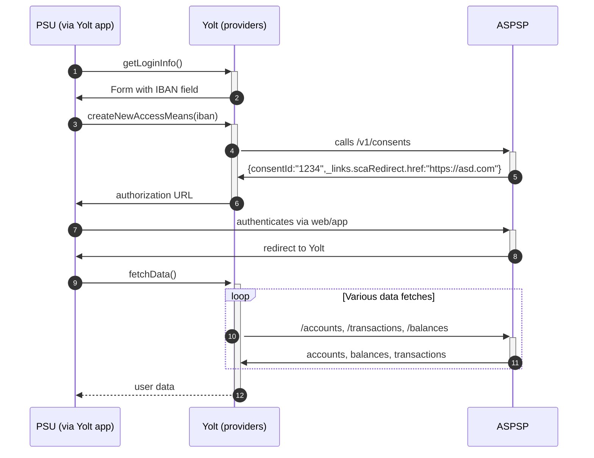

## UniCredit RO (AIS)

[Current open problems on our end][1]

UniCredit RO is a Romanian bank which belongs to UniCredit Group.
UniCredit Group PSD2 API is implemented based on Berlin Group Implementation Guidelines 1.3.4
 
## BIP overview 

|                             |                                                 |
|-----------------------------|-------------------------------------------------|
| **Country of origin**       | Romania                                         | 
| **Site Id**                 | c62c3b5d-e5f1-4d56-ac52-9c08957fde47            |
| **Standard**                | [Berlin Group][2]                               |
| **AIS Standard version**    | 1.3.4                                           |
| **PISP Standard version**   | 1.3.4 (not implemented in providers)            |
| **Account types**           | CURRENT_ACCOUNT                                 |
| **Requires PSU IP address** | Always for request initiated directly by PSU    |
| **Consent flow type**       | Detailed                                        |
| **Repository**              | https://git.yolt.io/providers/bespoke-unicredit |

## Client configuration overview
|                           |                             |
|---------------------------|-----------------------------|
| **Transport key id**      | eIDAS transport key id      |
| **Transport certificate** | eIDAS transport certificate |

### Registration details
Client registration is needed only once per single eIDAS for all the banks from UniCredit Group.
It means that when we have been successfully onboarded for our very first UniCredit Group bank, 
we are already onboarded for the other banks from UniCredit Group which are implemented based on Berlin Group standards.
There are no client credentials used for communication with bank's API - client is authenticated based on eIDAS QWAC cert in mTLS.

### Consent Issue
According to the bank, for UniCredit RO only detailed consent type is supported at the moment.
The Bank plans to release the bank-offered consent type for several countries firstly for Sandbox API’s (change planned currently by end of 2021) 
and later on for Real API’s (change currently planned for the summer of 2022). 

**Please note that Swagger documentation reflect specifications that will be released while Developer Portal Documentation reflects feature already in place.
Documentation section will be updated when the feature will be available on Real environment**

### Certificate rotation
According to the UniCredit's API documentation there is no possibility to register more than one eIDAS for the same company, from doc:
"It is possible to onboard once with a single eIDAS certificate. Other onboarding calls will be rejected."
However, in API CATALOG in Dev Portal, there is a section "TPP MANAGEMENT" with "TPP Offboarding" endpoint 
documentation available - perhaps it may be used to revoke the old eIDAS and let us re-onboard using the new one.

## Connection Overview

**Consent validity rules** 
UniCredit RO AIS uses dynamic flow, thus we are unable to determine consent validity rules for it.

## User Site deletion
This provider does NOT implement `onUserSiteDelete` method. 

## Business decisions
--empty--

## Sandbox overview
--empty--

**Payment Flow Additional Information**

|                                                                                                        |                             |
|--------------------------------------------------------------------------------------------------------|-----------------------------|
| **When exactly is the payment executed ( executed-on-submit/executed-on-consent)?**                    | execute-on-consent          |
| **it is possible to initiate a payment having no debtor account**                                      | NO                          |
| **At which payment status we can be sure that the money was transferred from the debtor to creditor?** | AcceptedSettlementCompleted |

## External links
* [Current open problems on our end][1]
* [Berlin Group][2]
* [Developer Portal][3]
 
[1]: <https://yolt.atlassian.net/browse/C4PO-2851?jql=project%20%3D%20%22C4PO%22%20AND%20text%20~%22unicredit%20ro%22%20AND%20status%20!%3D%20Done%20AND%20Resolution%20%3D%20Unresolved%20ORDER%20BY%20status>
[2]: <https://www.berlin-group.org/>
[3]: <https://developer.unicredit.eu/>
