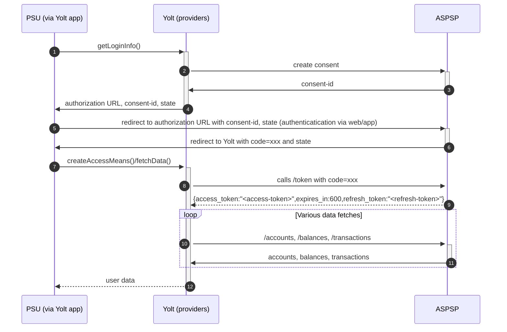

## SNS Bank (AIS)
[Current open problems on our end][4]

De Volksbank ("the people's bank") is a Dutch retail bank offering financial products to both companies and individuals. Prior to a 2017 restructuring, it was called SNS Bank, which remains its major brand name.
 
## BIP overview 

|                                       |                                                 |
|---------------------------------------|-------------------------------------------------|
| **Country of origin**                 | Netherlands                                     | 
| **Site Id**                           | 13c00f7c-9746-11e9-bc42-526af7764f64            |
| **Standard**                          | [Berlin Group Standard][1]                      |
| **Contact**                           | Email: openbanking@devolksbank.nl               |
| **Developer Portal**                  |                                                 | 
| **Account SubTypes**                  | CURRENT_ACCOUNT                                 |
| **IP Whitelisting**                   | no whitelisting                                 |
| **AIS Standard version**              | 1.6                                             |
| **Auto-onboarding**                   | manual registration                             |
| **Requires PSU IP address**           | yes                                             |
| **Type of certificate**               | eIDAS                                           |
| **Signing algorithms used**           | not used                                        |
| **Mutual TLS Authentication support** | Yes                                             |
| **Repository**                        | https://git.yolt.io/providers/bespoke-volksbank |

## Links - development
|                               |                                                                   |
|-------------------------------|-------------------------------------------------------------------|
| **Developer portal**          | https://developer.devolksbank.nl/admin                            |
| **Sandbox base url**          | https://psd.bancairediensten.nl/psd2/snsbank/sandbox/v1           |
| **Sandbox authorization url** | https://psd.bancairediensten.nl/psd2/snsbank/sandbox/v1/authorize |

## Links - production 
|                              |                                                   |
|------------------------------|---------------------------------------------------|
| **Production base url**      | api.snsbank.nl                                    |
| **Production authorization** | psd.bancairediensten.nl/psd2/snsbank/v1/authorize |
| **Production token**         | psd.bancairediensten.nl/psd2/snsbank/v1/token     |

## Client configuration overview
|                           |                                                              |
|---------------------------|--------------------------------------------------------------|
| **Transport key id**      | eIDAS transport key id                                       |
| **Transport certificate** | eIDAS transport certificate                                  |
| **Client secret**         | Client secret value generated during auto onboarding process | 
| **Client id**             | Client id value generated during auto onboarding process     | 
 

### Registration details
Manual registration on the portal : [Developer Portal][2]
Registration for entire group (ANS, SNS, RegioBank)
Scopes registered: AIS PIS
Applications registered: Yolt-Production, ING production, YTS Group, Yolt-Sandbox
Each registration consists of:
* App Name
* Client ID/API Key
* Shared Secret
* State (enabled/disabled)
* OAuth scope
* Shared secret state (None/Public/Confidential)

### Certificate rotation
We do not have to deliver any own PSD2 production or test/development certificates for installation purposes anymore as long as these certificates are issued by a provider defined in the TLB.
After the rotation re-consent won't be necessary.

## Connection Overview
Simplified sequence diagram:

**Consent validity rules**

SNS Bank AIS & PIS consent pages are SPA, thus we are unable to determine consent validity rules neither for AIS nor PIS.

###Credit/Debit transaction detection
Credit/Debit transaction detection is no longer based on bank transaction code but on amount sign (as in Berlin Group Standard).

## User Site deletion
This provider does NOT implement `onUserSiteDelete` method. 

## Business decisions
* Each account is added to list of beneficiaries.
* According to documentation bank only supports one balance: interimAvailable    
* Transactions are being fetched with limit hardcoded to 2000
* Volksbank group banks supports only BOOKED transactions

## Sandbox overview
Sandbox was used during development. Links available in _Links - development_ section.

**Payment Flow Additional Information**

|                                                                                                        |                             |
|--------------------------------------------------------------------------------------------------------|-----------------------------|
| **When exactly is the payment executed ( executed-on-submit/executed-on-consent)?**                    | execute-on-consent          |
| **it is possible to initiate a payment having no debtor account**                                      | YES                         |
| **At which payment status we can be sure that the money was transferred from the debtor to creditor?** | AcceptedSettlementCompleted |

## External links
* [Berlin Group Standard][1]
* [Developer Portal][2]
* [Documentation][3]
 
[1]: <https://www.berlin-group.org/>
[2]: <https://developer.devolksbank.nl/admin>
[3]: <https://openbanking.devolksbank.nl/>
[4]: <https://yolt.atlassian.net/issues/?jql=project%20%3D%20%22C4PO%22%20AND%20component%20%3D%20SNS%20AND%20status%20!%3D%20Done%20AND%20Resolution%20%3D%20Unresolved%20ORDER%20BY%20status>
