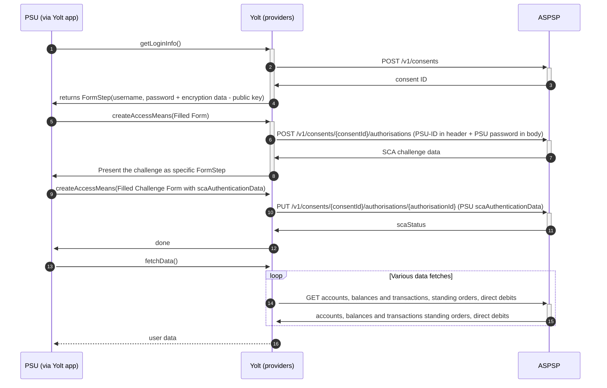

## Volksbanken Raiffeisen (AIS)
[Current open problems on our end][1]

Volksbanken Raiffeisen is a major cooperative banking network in Germany that includes local banks named Volksbanken ("people's banks") and Raiffeisenbanken ("Raiffeisen banks"), the latter in tribute to 19th-century cooperative movement pioneer Friedrich Wilhelm Raiffeisen. The Cooperative Group represents one of the three "pillars" of Germany's banking sector, the other two being, respectively, the Sparkassen-Finanzgruppe of public banks, and the commercial banking sector represented by the Association of German Banks.
The services are handled by Atruvia AG, and it has more banks that Volksbanken Raiffeisen.

## BIP overview 

|                                       |                                                                                  |
|---------------------------------------|----------------------------------------------------------------------------------|
| **Country of origin**                 | Germany                                                                          | 
| **Site Id**                           | c9f82c9e-f05f-4e5a-92fe-e86b9f6de82b                                             |
| **Standard**                          | [NextGenPSD2][2]                                                                 |
| **Contact**                           | E-mail: xs2a-support@fiduciagad.de                                               |
| **Developer Portal**                  | https://xs2a-test.fiduciagad.de/xs2a/bg13/swagger-ui/index.html                  | 
| **Account SubTypes**                  | Current                                                                          |
| **IP Whitelisting**                   | No                                                                               |
| **AIS Standard version**              | It is based on the NextGenPSD2 Framework Version 1.3 defined by the Berlin Group |
| **Auto-onboarding**                   | No                                                                               |
| **Requires PSU IP address**           | Yes                                                                              |
| **Type of certificate**               | QSEAL                                                                            |
| **Signing algorithms used**           | Code snippets use RSA-SHA256                                                     |
| **Mutual TLS Authentication Support** | No                                                                               |
| **Repository**                        | https://git.yolt.io/providers/monorepo-group                                     |

## Links - sandbox

|                                               |                                                                  |
|-----------------------------------------------|------------------------------------------------------------------|
| **Base URL**                                  | https://xs2a-test.fiduciagad.de/services_xs2a/bg13/v1/           |
| **Registration form for SANDBOX (web based)** | https://atruvia.de/drittanbieter-schnittstelle-xs2a-sandbox-test |

## Links - production 

|                        |                                                       |
|------------------------|-------------------------------------------------------|
| **Sample Base URL**    | https://www.vrbank-weimar.de/services_xs2a/bg13/v1/   |
| **Base URL full list** | https://atruvia.de/uploads/files/Xs2aApiDirectory.zip |

## Client configuration overview

|                              |                                 |
|------------------------------|---------------------------------|
| **Authentication mean name** | Authentication mean description |

## Registration details

There is no registration process, apart from the sandbox. To register on sandbox you have to use a special registration form. 

## Multiple Registration

There is no registration process

## Connection Overview

This bank uses embedded flow, which makes it distinct from most of OAUTH2-like connections. There are multiple challenges with it as it relies on dynamic form steps. 
* In the beginning it requires a pair of username/password to initiate the authorization process (See flow steps 1-6)
* The consent to be valid needs to pass SCA. This can be performed dynamically as bank can present the data for the SCA Form. We need to generate a FormStep and after it is filled out we post this authentication data to get a valid consent (steps 7-12).
* After obtaining a valid consent we need to use the consent-ID alongside QSEAL Certificate to perform fetch data calls
* In between steps 6 and 7 most likely we'd need to perform another form step operation - choosing the SCA Method. This step might be omitable (check on sandbox first). 

Simplified sequence diagram:

   
## Sandbox overview

Due to the complication of the flow, and the need for user credentials in one of first step most likely usage of sandbox may be a necessity for this flow. There is an indication under [here][3] that a commercial test eidas is required, but there is also an indication that it is not validated.

## Consent validity rules

Describe if consent testing was turned on or off and what consent validity rules are used.

## User Site deletion

There's `onUserSiteDelete` method implemented by this provider, however, only in a best effort manner.

## Business and technical decisions

Place here all business decisions which were made in this provider. Pay attention for mappings and error handling.

## External links
* [Current open problems on our end][1]
* [Standard][2]

[1]: <https://yolt.atlassian.net/issues/?jql=project%20%3D%20%22C4PO%22%20AND%20component%20%3D%20VOLKSBANKEN_RAIFFEISEN%20AND%20status%20!%3D%20Done%20AND%20Resolution%20%3D%20Unresolved%20ORDER%20BY%20status>
[2]: <https://www.berlin-group.org/nextgenpsd2-downloads>
[3]: <https://xs2a-test.fiduciagad.de/xs2a/bg13/TPP-Sandbox-Documentation.zip>
