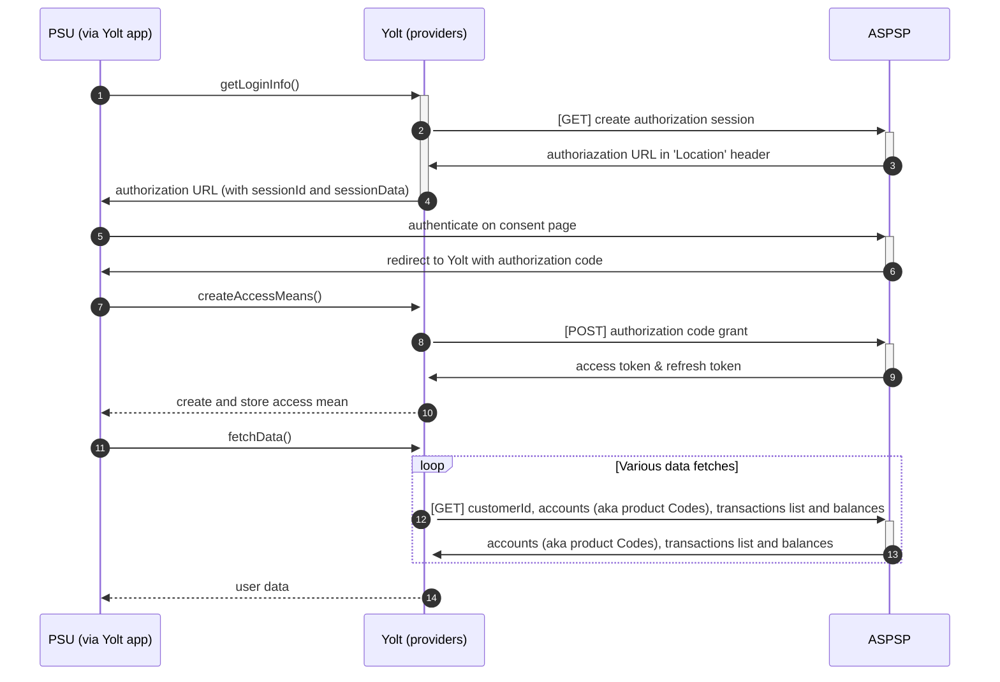

## CheBanca! (AIS)

[Current open problems on our end][1]

CheBanca! SpA was born on 12 May 2008. During the first year of opening it reaches 5.3 billion deposits and
170,000 open accounts. In 2015 CheBanca! reaches an agreement for the purchase of the Italian assets of Barclays,
at no cost. Indeed, the British will correspond to CheBanca! 237 million euros, as reimbursement for the rationalization
and relaunch of the network. In exchange, a collaboration will be launched on the development of funds
and mortgages in Italy. For CheBanca!, the agreement makes it possible to increase the portfolio of 220,000 new
customers (for a total of 770,000 customers), 2.9 billion in residential mortgages, 89 branches, 550 employees in the
commercial area and 70 financial advisors.

## BIP overview

|                                       |                                                                                                                                  |
|---------------------------------------|----------------------------------------------------------------------------------------------------------------------------------|
| **Country of origin**                 | Italy                                                                                                                            | 
| **Site Id**                           | 73767692-df03-4fdd-b1a6-2bc35dbed792                                                                                             |
| **Standard**                          | bespoke                                                                                                                          |
| **Contact**                           | E-mail: developers@chebanca.it   More contacts is availalbe here: https://developer.chebanca.it/profile/private-support   |
| **Developer Portal**                  | [Developer portal][2]                                                                                                            | 
| **Account SubTypes**                  | Current, Savings, Credit Cards                                                                                                   |
| **IP Whitelisting**                   | No                                                                                                                               |
| **AIS Standard version**              | 1.0.0                                                                                                                            |
| **Auto-onboarding**                   | No                                                                                                                               |
| **Requires PSU IP address**           | No                                                                                                                               |
| **Type of certificate**               | eIDAS                                                                                                                            |
| **Signing algorithms used**           | RS256                                                                                                                            |
| **Mutual TLS Authentication Support** | Yes                                                                                                                              |
| **Repository**                        | https://git.yolt.io/providers/monorepo-group                                                                                     |

## Links - sandbox

|                       |                                                          |
|-----------------------|----------------------------------------------------------|
| **Base URL**          | https://sandbox-api.chebanca.io                          |
| **Authorization URL** | https://sandbox-api.chebanca.io/auth/oauth2/v2/authorize | 
| **Token Endpoint**    | https://sandbox-api.chebanca.io/auth/oauth/v2/token      |  

## Links - production

|                       |                                                           |
|-----------------------|-----------------------------------------------------------|
| **Base URL**          | https://external-api.chebanca.io                          |
| **Authorization URL** | https://external-api.chebanca.io/auth/oauth2/v2/authorize | 
| **Token Endpoint**    | https://external-api.chebanca.io/auth/oauth/v2/token      |

## Client configuration overview

|                           |                                                            |
|---------------------------|------------------------------------------------------------|
| **Signing key id**        | Eidas signing key id                                       |
| **Signing certificate**   | Eidas signing certificate                                  |
| **Transport key id**      | Eidas transport key id                                     |
| **Transport certificate** | Eidas transport certificate                                |
| **Client Id**             | Client Id assigned at registration                         |
| **Client Secret**         | Client secret assigned at registration                     |
| **Client App Id**         | App's Id assigned at app creation step on developer portal |

## Registration details

On developer portal there is a form where the certificates could be uploaded and on base of that (if cert are approved)
there is an option to create application. In a result we will receive client_id and client_secret.

|                          |                                                                                                               |
|--------------------------|---------------------------------------------------------------------------------------------------------------|
| **Certificate rotation** | On developer portal there is a section where the certificates can be managed 'Profile'->'EBA Entity Details'. |

## Multiple Registration

We asked bank:
do you allow one TPP to use more than one certificate? I mean multiple registration possibility.

Bank answered:
you must register for PSD2 with only one certificate for each type (QWAC, QSEAL); after the registration has been
completed, you can add other valid certificates for the PSD2 TPP in
the https://developer.chebanca.it/profile/ebaentity-details  section

## Certificate rotation

On developer portal there is a section where the certificates can be managed 'Profile'->'EBA Entity Details'.

## Connection Overview

Simplified sequence diagram:

## Sandbox overview

Sandbox is operational on 19.08.2022. It requires mTLS with certificates given by bank on developer portal.
More information how to build signature and establishing connection you can find on developer portal.
Bellow example which was worked with sandbox.

Note that:

- redirect_url must be encoded
- date must be always in GMT
- state parameter must be placed at the end of queryPath
- clientId, redirect are taken from application details on developer portal
- request-target must include path with queryPath from URL
- digest must be included in headers to sign and signature header in all calls except GET's type

**Building signature**

In command line:

`read -r -d '' TOSIGN << EOM
(request-target): get /auth/oauth/v2/authorize?response_type=code&client_id=f14b9c94-b19b-488b-bf11-7540fcf1ef07&redirect_uri=https%3A%2F%2Fclient-redirect.yts.yolt.io&state=8378a7a4-07c2-47c0-9c65-c2938ec1e3a3
tpp-request-id: dcb91026-e3d6-4b0d-8c8d-e6a524bf9ed2
date: Tue, 09 Aug 2022 10:47:00 GMT
EOM`

Next use this command

`printf %s "$TOSIGN" | openssl dgst -sha256 -binary -sign CB_TPP_SANDBOX_QSEALC_v01.key | openssl base64 -A`

Value must be pasted in template.

Note that:

- signature parameters must be divided only by sema char (without whitespaces)
- keyId is the same of application created on developer Portal of ChaBanca
- signature parameters must have the same order as they were used to calculate signature
- http method (here get) must be used only when signature is calculated and not placed in signature header template

Signature header will go as follow:

`keyId="TEST_YOLT",algorithm="rsa-sha256",headers="(request-target) tpp-request-id date",signature="jwIVhFiihqCmI5RxmoXIAkwqVYYrMHSXMk0ec7SRHYQR0bRZr+Vu7Ft3jgRG7TWM4kQ329egwwmXmpJPtQy2D4FNJpvNUDI+BYbIIeeMXT+0K2MjI22oHPzV7R7hUuZsZGu2hJH+Tvijrhd6dBLadL2W6FiSgSmDZ+KYm30MPBSmWkWk1J8HSIAsoO0QH2sJz+Jvw52OYU7W1ArdiZGk0xq+QPF/KDebqQB/wXxFI0tZDSNdHXHgymBE8CqttK0LELPP220tggBE9rBHa2vaFOrJy+DQo3x8bNecDUe2+hsG7IuUDnrf/Pxk1wW+0fRWPvtnFKLuagZIErpINeND0zlhWUAlfkG9fDcazN52p8xc4Gk91nDvVtbiT1CpyxE3KKehw9qQ4WLraK9cFhCLCfGgJ3yIR7JWIkcFdUGPhIJE57EWD3uVkkCe1RzNSi58nmoZlAd5WxAP2SIvu6UGSelbnCaBtLmsq0nx8AZHTRiw1PG0cLs5evyB2Ini8/Yg2xlFAFnOOwEW9Dp+p5OXKW+d3JXXKreBRiI1ecXXxF139+VM5H9yNSbXaZVYAvw0af14Pz4QGozF4Q1ZgFmucD8K7V/ZheTwNwCVZW+Rgpw4LLNLjqg9ArdiSud/A0LgAILc1BCyY9jtvei843wytxvGuPS0fHW9MbuzZ7Baa5Q="`

**In CURL version it looks like this:**

`curl --verbose --cacert SANDBOX_CHEBANCA_CA_v01.crt \
--cert CB_TPP_SANDBOX_QWAC_v01.pem --key CB_TPP_SANDBOX_QWAC_v01.key \
-X GET \
-H 'Host: sandbox-api.chebanca.io' \
-H 'Date: Tue, 09 Aug 2022 10:47:00 GMT' \
-H 'Postman-Token: 4c89fe1c-6b93-41df-a7d0-1a372bc4fa94' \
-H 'Signature: keyId="TEST_YOLT",algorithm="rsa-sha256",headers="(request-target) tpp-request-id date",signature="jwIVhFiihqCmI5RxmoXIAkwqVYYrMHSXMk0ec7SRHYQR0bRZr+Vu7Ft3jgRG7TWM4kQ329egwwmXmpJPtQy2D4FNJpvNUDI+BYbIIeeMXT+0K2MjI22oHPzV7R7hUuZsZGu2hJH+Tvijrhd6dBLadL2W6FiSgSmDZ+KYm30MPBSmWkWk1J8HSIAsoO0QH2sJz+Jvw52OYU7W1ArdiZGk0xq+QPF/KDebqQB/wXxFI0tZDSNdHXHgymBE8CqttK0LELPP220tggBE9rBHa2vaFOrJy+DQo3x8bNecDUe2+hsG7IuUDnrf/Pxk1wW+0fRWPvtnFKLuagZIErpINeND0zlhWUAlfkG9fDcazN52p8xc4Gk91nDvVtbiT1CpyxE3KKehw9qQ4WLraK9cFhCLCfGgJ3yIR7JWIkcFdUGPhIJE57EWD3uVkkCe1RzNSi58nmoZlAd5WxAP2SIvu6UGSelbnCaBtLmsq0nx8AZHTRiw1PG0cLs5evyB2Ini8/Yg2xlFAFnOOwEW9Dp+p5OXKW+d3JXXKreBRiI1ecXXxF139+VM5H9yNSbXaZVYAvw0af14Pz4QGozF4Q1ZgFmucD8K7V/ZheTwNwCVZW+Rgpw4LLNLjqg9ArdiSud/A0LgAILc1BCyY9jtvei843wytxvGuPS0fHW9MbuzZ7Baa5Q="' \
-H 'TPP-Request-ID: dcb91026-e3d6-4b0d-8c8d-e6a524bf9ed2' \
'https://sandbox-api.chebanca.io/auth/oauth/v2/authorize?response_type=code&client_id=f14b9c94-b19b-488b-bf11-7540fcf1ef07&redirect_uri=https%3A%2F%2Fclient-redirect.yts.yolt.io&state=8378a7a4-07c2-47c0-9c65-c2938ec1e3a3'`

## Consent validity rules

Consent validity rules are set to EMPTY_RULES_SET. Because of JavaScript we cannot use consent testing.
Therefore the CT for Chebanca is disabled.

## User Site deletion

There's no `onUserSiteDelete` method implemented by this provider. But probably exists and it's a matter
of digging through sandbox and bank's swagger to figure out how deletion works.

## Business and technical decisions

Due to change priority bank is in HOLD. Consent page is working. Next step will be
adjusting fetching data according to the test. What should be done firstly is to fix signature building for
fetching steps as it was done at authorization step.

## External links

* [Current open problems on our end][1]
* [Developer portal][2]

[1]: <https://yolt.atlassian.net/issues/?jql=project%20%3D%20%22C4PO%22%20AND%20component%20%3D%20CHEBANCA%20AND%20status%20!%3D%20Done%20AND%20Resolution%20%3D%20Unresolved%20ORDER%20BY%20status/>

[2]: <https://developer.chebanca.it/>
