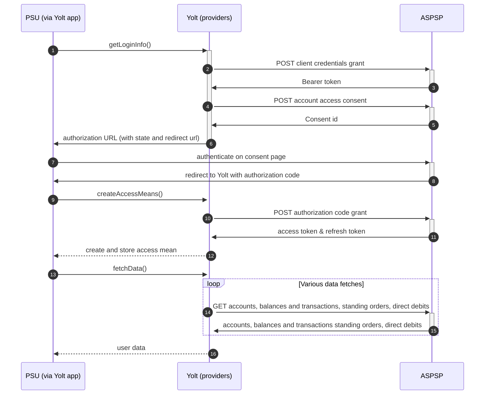

## Handelsbanken NL (AIS)

[Current open problems on our end][1]

Handelsbanken is swedish bank network that has branches in: Sweden, Netherlands, Denmark, Norway, UK and Finland.

## BIP overview

|                                       |                                                                |
|---------------------------------------|----------------------------------------------------------------|
| **Country of origin**                 | The Netherlands                                                | 
| **Site Id**                           | 3bab6974-308a-474b-b756-9cb9aefc9766                           |
| **Standard**                          | [Berlin Group][2]                                              |
| **Contact**                           | Ticketing system: https://developer.handelsbanken.com/feedback |
| **Developer Portal**                  | https://developer.handelsbanken.com/                           | 
| **Account SubTypes**                  | Current, Credit Cards                                          |
| **IP Whitelisting**                   | No                                                             |
| **AIS Standard version**              | 2.1.20 (AIS)                                                   |
| **Auto-onboarding**                   | Yes                                                            |
| **Requires PSU IP address**           | NO                                                             |
| **Type of certificate**               | eIDAS                                                          |
| **Signing algorithms used**           | None                                                           |
| **Mutual TLS Authentication Support** | Yes                                                            |
| **Repository**                        | https://git.yolt.io/providers/monorepo-group/                  |

## Links - sandbox

|                       |                                                                |
|-----------------------|----------------------------------------------------------------|
| **Base URL**          | https://sandbox.handelsbanken.com                              |
| **Authorization URL** | returned from /consents endpoint                               | 
| **Token Endpoint**    | https://sandbox.handelsbanken.com/openbanking/oauth2/token/1.0 |  

## Links - production

|                            |                                                                                                                                       |
|----------------------------|---------------------------------------------------------------------------------------------------------------------------------------|
| **Base URL**               | https://api.handelsbanken.com/                                                                                                        |
| **Authorization URL**      | returned from /consents endpoint                                                                                                      | 
| **Token Endpoint**         | https://api.handelsbanken.com/openbanking/oauth2/token/1.0                                                                            |  
| **Registration  Endpoint** | https://api.handelsbanken.com/openbanking/psd2/v1/third-parties   https://api.handelsbanken.com/openbanking/psd2/v1/subscriptions |  

## Client configuration overview

|                              |                                    |
|------------------------------|------------------------------------|
| **Authentication mean name** | Authentication mean description    |
| **Transport key id**         | Eidas transport key id             |
| **Transport certificate**    | Eidas transport certificate        |
| **TPP ID**                   | Value returned from autoonboarding |
| **Client ID**                | Value returned from autoonboarding |
| **Application name**         | Value used during autoonboarding   |
| **Application description**  | Value used during autoonboarding   |

## Registration details

For PROD access it looks like they require autoonboarding and also calling subscription endpoint (multiple times, once
for each API we are planning to use).

Only one redirect URL is allowed, each next redirect URL requires separate registration.

## Multiple Registration

TBA

## Connection Overview

Describe bank flow. There should be information about the flow in each of our interface method. Describe supported
transaction types, endpoints, token validity etc. Pay attention for those places where logic is specific and doesn't
look like any other provider.

Simplified sequence diagram:

## Sandbox overview

Sandbox hasn't been used so far

## Consent validity rules

TBA

## User Site deletion

TBA

## Business and technical decisions

TBA

## External links

* [Current open problems on our end][1]
* [Berlin Group][2]

[1]: <https://yolt.atlassian.net/issues/?jql=project%20%3D%20%22C4PO%22%20AND%20component%20%3D%20HANDELSBANKEN_NL%20AND%20status%20!%3D%20Done%20AND%20Resolution%20%3D%20Unresolved%20ORDER%20BY%20status>

[2]: <https://www.berlin-group.org//>