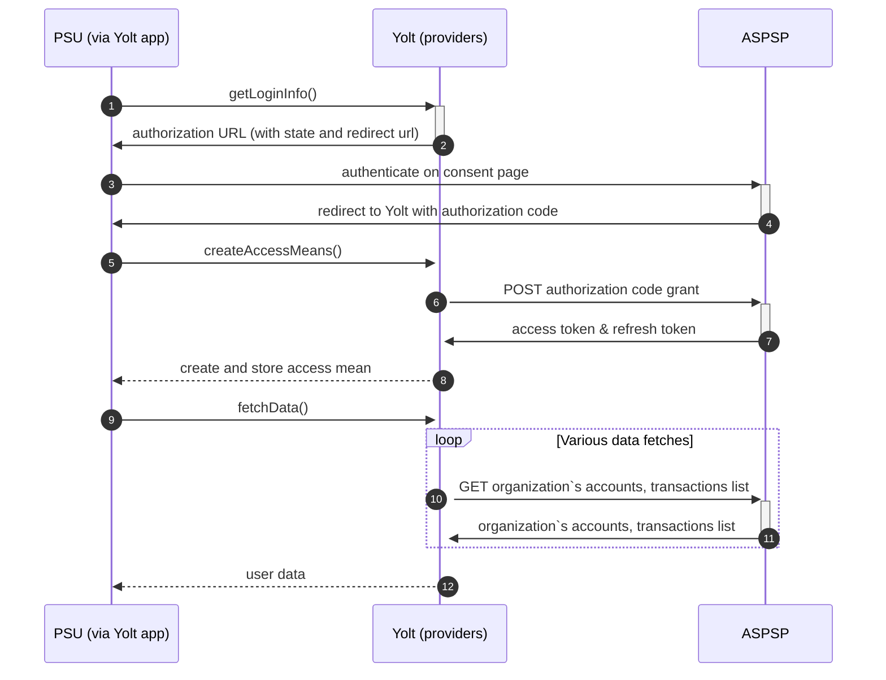

## Qonto (AIS)

[Current open problems on our end][1]

Short description of the bank.

## BIP overview

|                                       |                                                                                |
|---------------------------------------|--------------------------------------------------------------------------------|
| **Country of origin**                 | France                                                                         | 
| **Site Id**                           | 5374e3da-0805-11ed-861d-0242ac120002                                           |
| **Standard**                          | Bespoke                                                                        |
| **Contact**                           | Ticketing system: https://getqonto.atlassian.net/servicedesk/customer/portal/5 |
| **Developer Portal**                  | https://api-doc.qonto.com/                                                     | 
| **Account SubTypes**                  | Current                                                                        |
| **IP Whitelisting**                   | No                                                                             |
| **AIS Standard version**              | v2                                                                             |
| **Auto-onboarding**                   | No                                                                             |
| **Requires PSU IP address**           | Yes                                                                            |
| **Type of certificate**               | eIDAS QSEAL                                                                    |
| **Signing algorithms used**           | RS256                                                                          |
| **Mutual TLS Authentication Support** | No                                                                             |
| **Repository**                        | https://git.yolt.io/providers/monorepo-group                                   |

## Links - sandbox

|                       |                                                     |
|-----------------------|-----------------------------------------------------|
| **Base URL**          | https://thirdparty-sandbox.staging.qonto.co         |
| **Authorization URL** | https://oauth-sandbox.staging.qonto.co/oauth2/auth  | 
| **Token Endpoint**    | https://oauth-sandbox.staging.qonto.co/oauth2/token |  

## Links - production

|                       |                                      |
|-----------------------|--------------------------------------|
| **Base URL**          | https://thirdparty.qonto.com         |
| **Authorization URL** | https://oauth.qonto.com/oauth2/auth  | 
| **Token Endpoint**    | https://oauth.qonto.com/oauth2/token |  

## Client configuration overview

|                            |                                  |
|----------------------------|----------------------------------|
| **client_id**              | client identificator             |
| **client_secret**          | client secret                    |
| **signing_certificate_id** | Id of signing certificate in HSM |
| **signing_certificate**    | Signing certificate              |

## Registration details

Registration proces is manual. You have to fill form available
at https://getqonto.atlassian.net/servicedesk/customer/portal/5. After few days you will receive e-mial with client id
and secret for sandbox and production.

## Multiple Registration

Registration process based on DNB license, so it isn't possible to register once again based on the same license.

## Connection Overview

The _getLoginInfo_ method creates authorization url based on properties and authentication means - client id and client
secret.
The _createAccessMeans_ method use `code` parameter from callback url to exchange it to `accessToken` and `refreshToken`
. Both values are stored in `providerState` for future fetching data. `accesToken` is valid for 1 hour, `refreshToken`
for 90 days.
The _refreshAccessMeans_ method uses `refreshToken` from `providerState` to exchange it to new `accessToken`. New values
are stored in `providerState` and will be used for future fetching date.
The _onUserSiteDelete_ method wasn't implemented as banks doesn't support revoking of consent.

Simplified sequence diagram:

## Sandbox overview

Sandbox was used for bank implementation. The way to get access to it is well described on [bank's website][4]. There
are
prepared set of account's but you can also create your own to play with sandbox.
Important is that to be able to use prepared set of data first is to login to sandbox.staging.qonto.co (using our
default credentials).
All calls to sandbox environment has to contain `X-Qonto-Staging-Token` header - its value can be found in
connections@yolt.com in Qonto folder (18.07.2022 15:37 from Patrice Yazbek)

## Consent validity rules

Consent validity rules are empty. Error page looks exactly the same as success page.

## User Site deletion

`onUserSiteDelete` method wasn't implemented as bank doesn't support revoking consent

## Business and technical decisions
03.08.2022 Qonto provides in its API closed accounts and rejected transactions. It was decided to filter them from
result.
## External links

* [Current open problems on our end][1]
* [Documentation][2]
* [Developer portal][3]
* [Sandbox access][4]
* [Ticketing system][5]

[1]: <https://yolt.atlassian.net/issues/?jql=project%20%3D%20%22C4PO%22%20AND%20component%20%3D%20QONTO%20AND%20status%20!%3D%20Done%20AND%20Resolution%20%3D%20Unresolved%20ORDER%20BY%20status>

[2]: <https://api-doc.qonto.com/docs/business-api/83e3d6c0404f3-getting-started>

[3]: <https://api-doc.qonto.com/>

[4]: <https://www.notion.so/Qonto-Sandbox-Useful-Information-3f1e39b04dbc4ea380bdd46500f9762f>

[5]: <https://getqonto.atlassian.net/servicedesk/customer/portal/5>