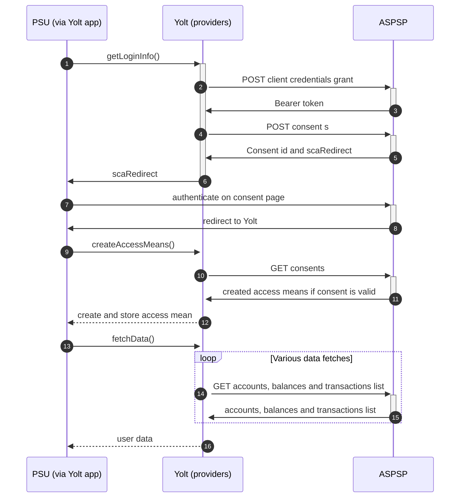

## Raiffeisen Meine Bank (AIS)

[Current open problems on our end][1]

Raiffeisen Bank International AG (RBI) regards Austria, where it is a leading corporate and investment bank, as well as
Central and Eastern Europe (CEE) as its home market. 13 markets of the region are covered by subsidiary banks.

## BIP overview

|                                       |                                                                                          |
|---------------------------------------|------------------------------------------------------------------------------------------|
| **Country of origin**                 | Austria                                                                                  |
| **Site Id**                           | 1da633b1-e54e-4d59-824f-03f31296e199                                                     |
| **Standard**                          | [NextGenPSD2 1.3.8][2]                                                                   |
| **Contact**                           | [Ticketing system][3]: https://developer.raiffeisen.at/en/contact/technical-support.html |
| **Developer Portal**                  | [Developer portal][4] : https://developer.raiffeisen.at/en/home.html                     |
| **Account SubTypes**                  | Current                                                                                  |
| **IP Whitelisting**                   | No                                                                                       |
| **AIS Standard version**              | v1 (based od NextGenPSD2 1.3.8)                                                          |
| **Auto-onboarding**                   | Yes                                                                                      |
| **Requires PSU IP address**           | Yes                                                                                      |
| **Type of certificate**               | QWACK                                                                                    |
| **Signing algorithms used**           | No signing                                                                               |
| **Mutual TLS Authentication Support** | Yes                                                                                      |
| **Repository**                        | https://git.yolt.io/providers/monorepo-group                                             |

## Links - sandbox

|                    |                                                     |
|--------------------|-----------------------------------------------------|
| **Base URL**       | https://sandbox.raiffeisen.at/api/psd2-xs2a/rest/v1 |
| **Token Endpoint** | https://sso.raiffeisen.at/as/token.oauth2           |  

## Links - production

|                           |                                                   |
|---------------------------|---------------------------------------------------|
| **Base URL**              | https://psd2.raiffeisen.at/api/psd2-xs2a/rest/v1/ |
| **Token Endpoint**        | https://sso-psd2.raiffeisen.at/as/token.oauth2    |  
| **Registration Endpoint** | https://production.bank.com/register              |  

## Client configuration overview

|                              |                                               |
|------------------------------|-----------------------------------------------|
| **transport_certificate_id** | Id of transport certificate in HSM            |
| **transport_certificate**    | Transport certificate                         |
| **client_id**                | Client id received after dynamic registration |

## Registration details

You will have to call the registration endpoint (on developer portal you can find _first-contact endpoint_) once to
receive a Client-ID. This step also ensures that your eIDAS certificate is valid.
You can send this request multiple times - as long as your certificate's subject DN does not change, you will receive
the same Client-ID.

## Multiple Registration

As long as your certificate's subject DN does not change, you will receive the same Client-ID, so multiple registration
isn't allowed

## Connection Overview

Client token is required to get access to all bank's endpoints. Token is valid for 10 minutes.

The _getLoginInfo_ method is used to get login url for user. _consent_ endpoint is called to create consent resource on
bank side. In respond SCA url will be received. Using this URL, user
is redirected to login domain to fill his credentials.

In _createAccessMeans_ method _consent_ endpoint is use to check its status. If it's valid, then access means is
created, otherwise exception will be thrown.

In _onUserSiteDelete_ user consent can be deleted.

in _fetchData_ method all available information are collected and mapped to Yolt model. Accounts, balances, booked and
pending transaction can be fetched.
Important information is that it is allowed to fetch as long transaction history as you want (it depends on the banking
product) if you are using one-off consent, otherwise only 90 days is available.

Simplified sequence diagram:

## Sandbox overview

Access to sandbox is easy. On developer portal you can find client id and client secret. It is well described on
developer portal [here][5]

## Consent validity rules

Consent validity rules are implemented.

## User Site deletion

There's `onUserSiteDelete` method implemented by this provider.

## Business and technical decisions

## External links

* [Current open problems on our end][1]
* [NextGenPSD2 1.3.8][2]
* [Ticketing system] [3]
* [Developer portal][4]
* [Sandbox access][5]

[1]: <https://yolt.atlassian.net/issues/?jql=project%20%3D%20%22C4PO%22%20AND%20component%20%3D%20RAIFFEISEN_AT%20AND%20status%20!%3D%20Done%20AND%20Resolution%20%3D%20Unresolved%20ORDER%20BY%20status>

[2]: <https://www.berlin-group.org/nextgenpsd2-downloads>

[3]: <https://developer.raiffeisen.at/en/contact/technical-support.html>

[4]: <https://developer.raiffeisen.at/en/home.html>

[5]: <https://api-dashboard.raiffeisen.at/web/#!/oauth-flow>