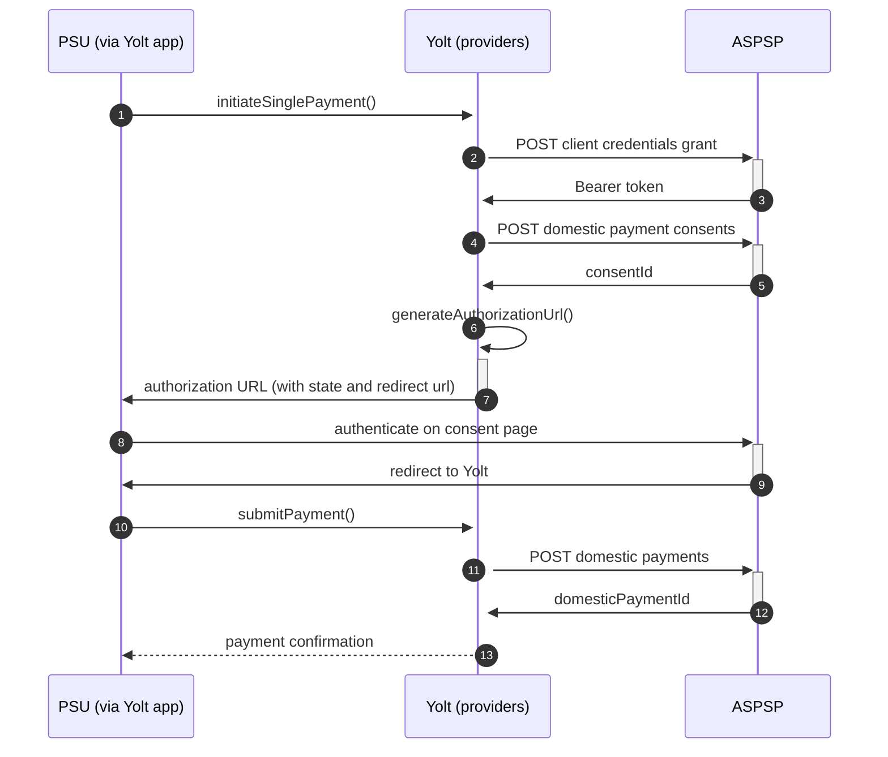

## AIB (PIS)
[Current open problems on our end][1]

Allied Irish Bank (GB) is a bank operating in the United Kingdom as a subsidiary of Allied Irish Banks (legally registered in the UK as AIB Group (UK) plc)

## BIP overview 

|                                       |                                                                                                                                                                                       |
|---------------------------------------|---------------------------------------------------------------------------------------------------------------------------------------------------------------------------------------|
| **Country of origin**                 | United Kingdom                                                                                                                                                                        | 
| **Site Id**                           | 5806ae85-7ee6-48a5-98ea-0f464b9b71cb                                                                                                                                                  |
| **Standard**                          | [Open Banking Standard][2]                                                                                                                                                            |
| **Contact**                           | E-mail: api@aib.ie   Contact persons: Corlene.X.Galligan@aib.ie, Keith.X.Harrington@aib.ie   Ticketing system: https://openbanking.atlassian.net/servicedesk/customer/portal/1 |
| **Developer Portal**                  | https://developer.aibgb.co.uk/                                                                                                                                                        | 
| **Account SubTypes**                  | Current, Savings, Credit Cards                                                                                                                                                        |
| **IP Whitelisting**                   | No                                                                                                                                                                                    |
| **PISP Standard version**             | 3.1.1                                                                                                                                                                                 |
| **Dynamic registration version**      | 3.2                                                                                                                                                                                   |
| **Auto-onboarding**                   | No                                                                                                                                                                                    |
| **Requires PSU IP address**           | No                                                                                                                                                                                    |
| **Type of certificate**               | OBSEAL/OBWAC                                                                                                                                                                          |
| **Signing algorithms used**           | PS256                                                                                                                                                                                 |
| **Mutual TLS Authentication Support** | Yes                                                                                                                                                                                   |
| **Repository**                        | https://git.yolt.io/providers/open-banking                                                                                                                                            |

## Links - sandbox

|                    |                                                           |
|--------------------|-----------------------------------------------------------|
| **Base URL**       | https://sandbox.aibgb.co.uk/v2/sandbox/open-banking/v3.1/ |
| **Token Endpoint** | https://sandbox.aibgb.co.uk/security/v2/oauth/token/      |  

## Links - production 

|                           |                                                         |
|---------------------------|---------------------------------------------------------|
| **Base URL**              | https://apis.aibgb.co.uk/api/open-banking               |
| **Authorization URL**     | https://onlinebanking.aibgb.co.uk/inet/gb/tpplogin.htm  | 
| **Token Endpoint**        | https://apis.aibgb.co.uk/security/v2/oauth/token        |
| **Registration Endpoint** | https://apis.aibgb.co.uk/api/open-banking/v3.2/register |  

## Client configuration overview

|                                   |                                                                         |
|-----------------------------------|-------------------------------------------------------------------------|
| **Client id**                     | Unique identifier received during registration process                  | 
| **Client secret**                 | Secret value received during registration process                       | 
| **Institution id**                | Unique identifier of the financial institution assigned by Open Banking |
| **Private signing key header id** | Open Banking signing certificate key id                                 |
| **Signing key id**                | OBSEAL signing key id                                                   |
| **Transport key id**              | OBWAC transport key id                                                  |
| **Transport certificate**         | OBWAC transport certificate                                             |
| **Organization id**               | TPP's organization id                                                   |
| **Software id**                   | Id of Software Statement Assertion                                      |

## Registration details

Bank has been registered by dynamic registration API. Autoonboarding has been implemented. However, due to problem with
DCR (AIB group requires separate SSA for each brand) we decided to remove autoonboarding code. Future registration
should be performed via [developer portal][3]. To perform it application name is needed (it is displayed on consent
page) and SSA (All the form fields will be filled based on it). After successful registration, client id and client
secret will be displayed in portal.

According to developer portal following certificates are needed:
1. OBWAC. This is the certificate to use in the MTLS network level connection at runtime.
2. A recognised certificate capable of creating a digital signature. The digital signature is required during the OIDC client authentication using the private_key_jwt client authentication method. This certificate can be an OBSEAL certificate signed by a recognised public Certificate Authority.

## Multiple Registration

We don't know about any registration limits.

## Connection Overview

AIB(GB) follow Open Banking standard. It means that flow is similar to other banks. Due to that fact,
Open Banking DTOs are used in implementation, and code relay mostly on our generic Open Banking implementation.

The _createPayment_ method is used to create payment on bank's side. Thanks that we are sure that payment data are compliant
with requirements and standards. First of all we call _token_ endpoint with `payments` scope to get required Bearer token.
Next, payment is created (as request body) based on user's data and all information is sent to the bank to create payment.
As a result we receive `consentId` which is required in next step.

The _generateAuthorizationUrl_ method is used to generate login consent for user. Using `consentId` authorization URL is
prepared based on _authorize_ endpoint by filling it with necessary parameters. Using this URL, user is redirected to
login domain to fill his credentials and confirm payment.

In _confirmPayment_ method allows to confirm payment. Using the `consentId` with the same token and values at during first
call request body is prepared. After the call, from the bank `domesticPaymentId` is returned.

Simplified sequence diagram:

## Sandbox overview

During implementation we didn't use sandbox, so we don't have knowledge about it.

## Business and technical decisions

02.03.2022 Due to agreements with yts-core it was decided that we want to treat payment as completed once money has been
deducted from debtor account. According to OB documentation `AcceptedSettlementCompleted` is proper status. For
reference see https://yolt.atlassian.net/browse/C4PO-9754

**Payment Flow Additional Information**

|                                                                                                        |                             |
|--------------------------------------------------------------------------------------------------------|-----------------------------|
| **When exactly is the payment executed ( executed-on-submit/executed-on-consent)?**                    | execute-on-submit           |
| **it is possible to initiate a payment having no debtor account**                                      | YES                         |
| **At which payment status we can be sure that the money was transferred from the debtor to creditor?** | AcceptedSettlementCompleted |

Domestic payment fields validation is done based on guidelines given by AIB(GB) [developer portal - supplementary-specification-information][3]

## External links

* [Current open problems on our end][1]
* [Open Banking Standard][2]
* [developer portal][3]
* [developer portal - supplementary-specification-information][4]

[1]: <https://yolt.atlassian.net/issues/?jql=project%20%3D%20C4PO%20AND%20component%20%3D%20AIB%20AND%20status%20!%3D%20Done%20AND%20Resolution%20%3D%20Unresolved%20ORDER%20BY%20status>

[2]: <https://standards.openbanking.org.uk/>

[3]: <https://developer.aibgb.co.uk/>

[4]: <https://developer.aibgb.co.uk/supplementary-specification-information-gb/>
