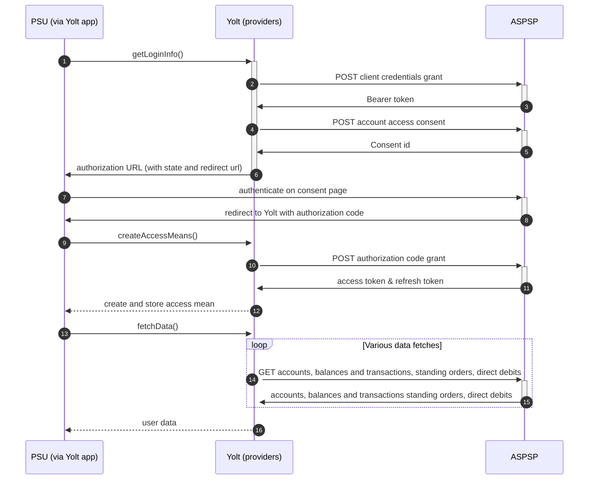

## AIB IE (AIS)
[Current open problems on our end][1]

Allied Irish Bank (IE) is a bank operating in the Ireland. Part of an AIB group

## BIP overview 

|                                       |                                                                                                                                                                                       |
|---------------------------------------|---------------------------------------------------------------------------------------------------------------------------------------------------------------------------------------|
| **Country of origin**                 | United Kingdom                                                                                                                                                                        | 
| **Site Id**                           | 0851b69c-87bc-40b4-845c-f879708ba89f                                                                                                                                                  |
| **Standard**                          | [Open Banking Standard][2]                                                                                                                                                            |
| **Contact**                           | E-mail: api@aib.ie   Contact persons: Corlene.X.Galligan@aib.ie, Keith.X.Harrington@aib.ie   Ticketing system: https://openbanking.atlassian.net/servicedesk/customer/portal/1 |
| **Developer Portal**                  | https://developer.aib.ie/                                                                                                                                                             | 
| **Account SubTypes**                  | Current, Savings, Credit Cards                                                                                                                                                        |
| **IP Whitelisting**                   | No                                                                                                                                                                                    |
| **AIS Standard version**              | 3.1.4                                                                                                                                                                                 |
| **Dynamic registration version**      | 3.2                                                                                                                                                                                   |
| **Auto-onboarding**                   | No                                                                                                                                                                                    |
| **Requires PSU IP address**           | No                                                                                                                                                                                    |
| **Type of certificate**               | QWAC/QSEAL (eIDAS)                                                                                                                                                                    |
| **Signing algorithms used**           | PS256                                                                                                                                                                                 |
| **Mutual TLS Authentication Support** | Yes                                                                                                                                                                                   |
| **Repository**                        | https://git.yolt.io/providers/open-banking                                                                                                                                            |

## Links - sandbox

|                    |                                                         |
|--------------------|---------------------------------------------------------|
| **Base URL**       | https://sandbox.aib.ie/v2/sandbox/v2/open-banking/v3.1/ |
| **Token Endpoint** | https://sandbox.aib.ie/security/v2/oauth/token          |  

## Links - production 

|                           |                                                   |
|---------------------------|---------------------------------------------------|
| **Base URL**              | https://api.aib.ie/api/open-banking               | 
| **Token Endpoint**        | https://api.aib.ie/security/v2/oauth/token        |
| **Registration Endpoint** | https://api.aib.ie/api/open-banking/v3.2/register |  

## Client configuration overview

|                                   |                                                                         |
|-----------------------------------|-------------------------------------------------------------------------|
| **Client id**                     | Unique identifier received during registration process                  | 
| **Client secret**                 | Secret value received during registration process                       | 
| **Institution id**                | Unique identifier of the financial institution assigned by Open Banking |
| **Private signing key header id** | Open Banking signing certificate key id                                 |
| **Signing key id**                | OBSEAL signing key id                                                   |
| **Transport key id**              | OBWAC transport key id                                                  |
| **Transport certificate**         | OBWAC transport certificate                                             |

## Registration details

Bank has been registered by dynamic registration API. Autoonboarding has been implemented. However, due to problem with
DCR (AIB group requires separate SSA for each brand) we decided to remove autoonboarding code. Future registration
should be performed via [developer portal][3]. To perform it application name is needed (it is displayed on consent
page) and SSA (All the form fields will be filled based on it). After successful registration, client id and client
secret will be displayed in portal.

According to developer portal following certificates are needed:
1. OBWAC. This is the certificate to use in the MTLS network level connection at runtime.
2. A recognised certificate capable of creating a digital signature. The digital signature is required during the OIDC client authentication using the private_key_jwt client authentication method. This certificate can be an OBSEAL certificate signed by a recognised public Certificate Authority.

## Multiple Registration

We don't know about any registration limits, however during second registration, for AIB IE we encountered confirmed bug in API which forced us to register AIB IE manually. There was no situation, when such knowledge was needed, so we will have to
ask about that when there will be such case.

## Connection Overview

All banks in AIB group follows Open Banking standard. It means that flow is similar to other banks. Due to that fact,
Open Banking DTOs are used in implementation, and code relay mostly on our generic Open Banking implementation.

The _getLoginInfo_ method is used to generate login consent for user. First of all we call _token_ endpoint to get Bearer
token. Next _account-access-consents_ endpoint is called to create consent on bank side. Received `consentId` is used to
prepare authorization URL based on _authorize_ endpoint by filling it with necessary parameters. Using this URL, user 
is redirected to login domain to fill his credentials.

In _createAccessMeans_ method `code` is used to call for token. This token will be used to authenticate user
in next calls. In response there is also `refresh_token` returned, because consent is valid for 90 days, and `access_token` 
only for 5 minutes (299 seconds to be exact). It means that refresh token flow is supported and has to be implemented too. _refreshAccessMeans_
allows to perform this operation. For a given consent, the refresh token is the same, but we always map both tokens to
access means value.

As in other Open Banking banks, AIB group also allows for consent removal. It is done by generic code in _onUserSiteDelete_
method. Stored earlier `consentId` is used to perform this operation.

The most complex step is data fetching. AIB group allows to collect information for accounts, balances and 
transactions, direct debits and standing orders. The most important thing is that for Credit 
Cards those additional information is not collected.

Important information is that this bank support pagination for transactions. It returns both `BOOKED` and
`PENDING` transactions.

**Consent validity rules** are implemented for AIS.

Simplified sequence diagram:

   
## Sandbox overview

Sandbox has not been used previously. 

## User Site deletion
There's `onUserSiteDelete` method implemented by this provider, however, only in a best effort manner.

## Business and technical decisions

We map _OPENINGAVAILABLE_ as current balance and _INTERIMAVAILABLE_ as available one.

AIB group uses non-standard refresh access token flow.
In contrast to default generic method we send not only _grant_type_ and _refresh_token_ parameters but also _redirect_uri_ and _scope_ parameters.

If bank does not server account name we assume fallback value **"AIB Account"**.

We use client_secret_basic authentication method after a few attempts of using private_key_jwt (fapi compliant method).

**Payment Flow Additional Information**

|                                                                                                        |                             |
|--------------------------------------------------------------------------------------------------------|-----------------------------|
| **When exactly is the payment executed ( executed-on-submit/executed-on-consent)?**                    | execute-on-submit           |
| **it is possible to initiate a payment having no debtor account**                                      | YES                         |
| **At which payment status we can be sure that the money was transferred from the debtor to creditor?** | AcceptedSettlementCompleted |

## External links

* [Current open problems on our end][1]
* [Open Banking Standard][2]

[1]: <https://yolt.atlassian.net/issues/?jql=project%20%3D%20C4PO%20AND%20component%20%3D%20AIB_IE%20AND%20status%20!%3D%20Done%20AND%20Resolution%20%3D%20Unresolved%20ORDER%20BY%20status>

[2]: <https://standards.openbanking.org.uk/>

[3]: <https://developer.aib.ie/>