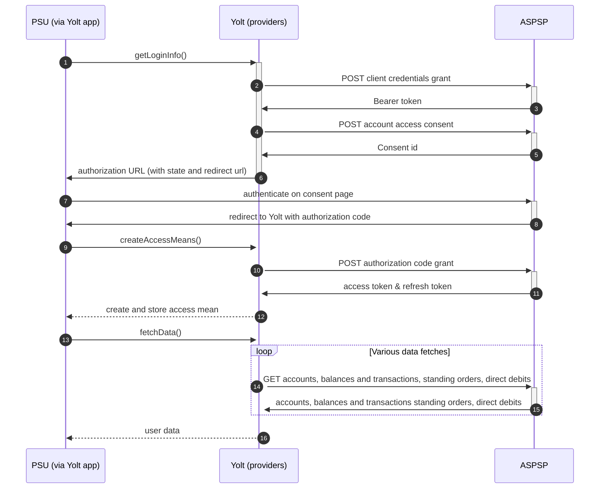

## Virgin Money (Merged API) (AIS)

[Current open problems on our end][1]

## BIP overview

|                                       |                                                        |
|---------------------------------------|--------------------------------------------------------|
| **Country of origin**                 | United Kingdom                                         |
| **Site Id**                           | 75457be7-96d3-4fc1-98a2-98ded940b563                   |
| **Standard**                          | Open Banking                                           |
| **Contact**                           | Through email: openbanking@devmail.americanexpress.com |
| **Developer Portal**                  | https://developer.americanexpress.com/                 |
| **Account SubTypes**                  | CreditCard                                             |
| **IP Whitelisting**                   | No                                                     |
| **AIS Standard version**              | OB 3.1.8                                               |
| **Auto-onboarding**                   | No                                                     |
| **Requires PSU IP address**           | No                                                     |
| **Type of certificate**               | OBWAC                                                  |
| **Signing algorithms used**           | No signing                                             |
| **Mutual TLS Authentication Support** | Yes                                                    |

## Links - sandbox

|                                       |                                                                                |
|---------------------------------------|--------------------------------------------------------------------------------|
| **Base URL**                          | https://openamex-sandbox.americanexpress.com/open-banking/                     |
| **Client Credential Token Endpoint ** | https://api.qa2s.americanexpress.com/oauth/v1/token/cc/access                  |
| **User Access Token Endpoint  **      | https://api.qa2s.americanexpress.com/apiplatform/v8/oauth/token/bearer         |
| **User Refresh Token Endpoint  **     | https://api.qa2s.americanexpress.com/apiplatform/v8/oauth/token_refresh/bearer |
| **Authorization url**                 | Will be provided after registration                                            |

## Links - production

|                                      |                                                                                    |
|--------------------------------------|------------------------------------------------------------------------------------|
| **Base URL**                         | https://openamex.americanexpress.com/open-banking/                                 |
| **Client Credential Token Endpoint** | https://apigateway2s.americanexpress.com/oauth/v1/token/cc/access                  |
| **User Access Token Endpoint**       | https://apigateway2s.americanexpress.com/apiplatform/v8/oauth/token/bearer         |
| **User Refresh Token Endpoint**      | https://apigateway2s.americanexpress.com/apiplatform/v8/oauth/token_refresh/bearer |
| **Authorization url**                | Will be provided after registration                                                |

## Client configuration overview

|                           |                                                        |
|---------------------------|--------------------------------------------------------|
| **Transport key id**      | OBWAC certificate id on our side (HSM)                 |
| **Transport certificate** | OBWAC certificate                                      |
| **Client id**             | Unique identifier received during registration process |
| **Client secret**         | Unique secret received during registration process     | 

## Registration details

Bank support only manual registration. To get access to production api it is needed to get access to sandbox first. To
do it pre-production certificate should be sent to bank by filling form on their developer portal. After that it is
possible to request access to production api in the same way as to sandbox - filling form on developer portal with
production transport certificate.

## Connection Overview

Bank follows Open Banking standard. It means that flow is similar to other banks. Due to that fact, Open Banking DTOs
are used in implementation, and code relay mostly on our generic Open Banking implementation. There is a lot of
difference un authorization flow, but it was fitted in OB generic implementation.

The _getLoginInfo_ method is used to generate login consent for user. First of all we call _token_ endpoint to get
Bearer token. Next _account-access-consents_ endpoint is called to create consent on bank side. Received `consentId` is
used to prepare authorization URL based on _authorize_ endpoint by filling it with necessary parameters, please note
about well known issue during checking consent validity - it returns 404,400,500 codes depending on situation (_
getloginInfo_, _onUserSiteDelete_) so should not be checked. Using this URL, user is redirected to login domain to fill
his credentials.

In _createAccessMeans_ method `authcode` is taken and used to call for token. This token will be used to authenticate
user in next calls. In response there is also `refresh_token` returned, because consent is valid for 90 days,
and `access_token`
only for 24 hours. It means that refresh token flow is supported and has to be implemented too. _refreshAccessMeans_
allows to perform this operation. For a given consent, the refresh token is the same, but we always map both tokens to
access means value.

As in other Open Banking banks, here consent removal is allowed. It is done by generic code in _onUserSiteDelete_
method. Stored earlier `consentId` is used to perform this operation.

The most complex step is data fetching. Bank allows to collect information about accounts, balances and transactions.
Important information is that this bank support pagination for transactions. It returns both `BOOKED` and `PENDING`
transactions.

Simplified sequence diagram:

## Sandbox overview

Amex has a sandbox, but it wasn't used during implementation.

## User Site deletion

`onUserSiteDelete` method implemented by this provider

## Business and technical decisions

## External links

* [Current open problems on our end][1]

[1]: <https://yolt.atlassian.net/issues/?jql=project%20%3D%20%22C4PO%22%20AND%20component%20%3D%20VIRGIN_MONEY_MERGED_APIS%20AND%20status%20!%3D%20Done%20AND%20Resolution%20%3D%20Unresolved%20ORDER%20BY%20status>