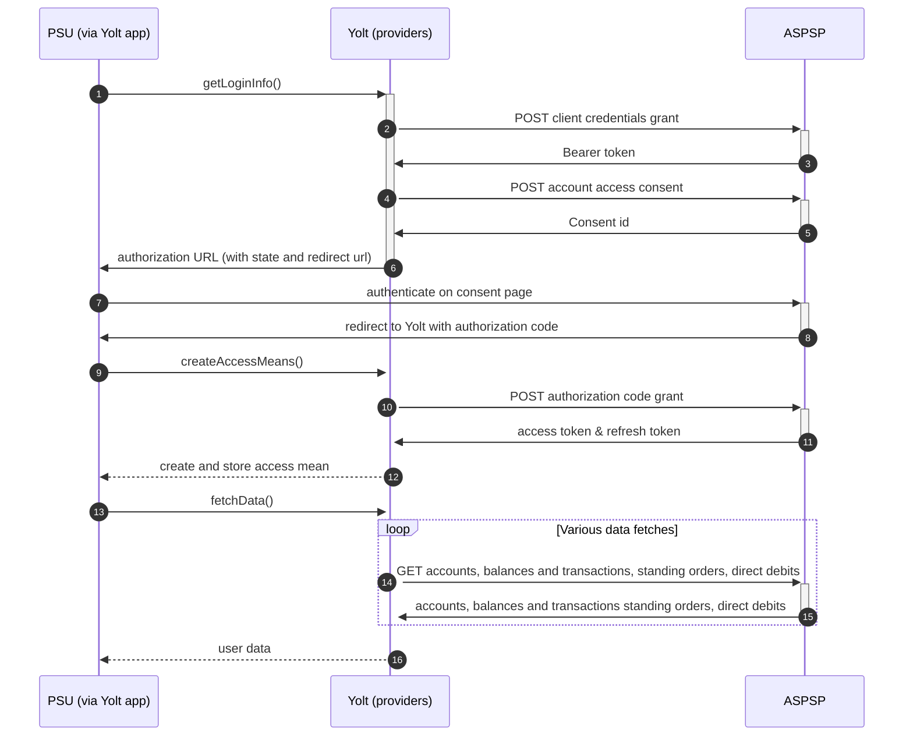

# Bank of Ireland (AIS)
[Current open problems on our end][1]

Bank of Ireland Group is a commercial bank operation in Ireland and one of the traditional 'Big Four' Irish banks. 
Historically the premier banking organisation in Ireland, the Bank occupies a unique position in Irish banking history. 
At the core of the modern-day group is the old Bank of Ireland, the ancient institution established by Royal Charter in 
1783.

## BIP overview 

|                                       |                                                                                                                                                                                              |
|---------------------------------------|----------------------------------------------------------------------------------------------------------------------------------------------------------------------------------------------|
| **Country of origin**                 | United Kingdom                                                                                                                                                                               | 
| **Site Id**                           | ac75d67d-5ede-4972-94a8-3b8481fa2145                                                                                                                                                         |
| **Standard**                          | [Open Banking Standard][2]                                                                                                                                                                   |
| **Contact**                           | E-mail: TPPsupport@boi.com   Ticketing system: https://www.bankofireland.com/api/developer/contact/ |
| **Developer Portal**                  | https://developer.bankofireland.com/#!/                                                                                                                                                      | 
| **Account SubTypes**                  | Current, Savings, Credit Cards                                                                                                                                                               |
| **IP Whitelisting**                   | No                                                                                                                                                                                           |
| **AIS Standard version**              | 3.0.0                                                                                                                                                                                        |
| **Auto-onboarding**                   | Yes                                                                                                                                                                                          |
| **Requires PSU IP address**           | No                                                                                                                                                                                           |
| **Type of certificate**               | eIDAS (QWAC, QSEAL), OBIE (OBWAC, OBSEAL) or OB legacy certificates required                                                                                                                 |
| **Signing algorithms used**           | PS256                                                                                                                                                                                        |
| **Mutual TLS Authentication Support** | Yes                                                                                                                                                                                          |
| **Repository**                        | https://git.yolt.io/providers/open-banking                                                                                                                                                   |

## Links - sandbox

|                           |                                                                                       |
|---------------------------|---------------------------------------------------------------------------------------|
| **Well-known Endpoint**   | https://auth-sandbox.bankofireland.com/oauth/as/b365/.well-known/openid-configuration |
| **Base URL**              | https://auth-sandbox.bankofireland.com                                                |
| **Authorization URL**     | https://auth-sandbox.bankofireland.com/oauth/as/b365/authorization.oauth2             | 
| **Token Endpoint**        | https://api-sandbox.bankofireland.com/oauth/as/token.oauth2                           |
| **Registration Endpoint** | https://api-sandbox.bankofireland.com/1/api/open-banking/v3.3/register                |    

## Links - production 

|                           |                                                                                     |
|---------------------------|-------------------------------------------------------------------------------------|
| **Well-known Endpoint**   | https://auth.obapi.bankofireland.com/oauth/as/b365/.well-known/openid-configuration |
| **Base URL**              | https://api.obapi.bankofireland.com/1/api/open-banking/                             |
| **Authorization URL**     | https://auth.obapi.bankofireland.com/oauth/as/b365/authorization.oauth2             | 
| **Token Endpoint**        | https://api.obapi.bankofireland.com/oauth/as/token.oauth2                           |
| **Registration Endpoint** | https://api.obapi.bankofireland.com/1/api/open-banking/v3.3/register                |  

## Client configuration overview

|                                  |                                                                         |
|----------------------------------|-------------------------------------------------------------------------|
| **Institution id**               | Unique identifier of the financial institution assigned by Open Banking |
| **Client id**                    | Unique identifier received during registration process                  | 
| **Client secret**                | Unique secret received during registration process                      |
| **Signing key header id**        | OBSeal certificate key id                                               |
| **Signing key id**               | OBSeal key id                                                           |
| **Transport certificate**        | OBWAC certificate                                                       |
| **Transport key id**             | OBWAC key id                                                            |
| **Software statement assertion** | SSA required during dynamic registration - tls_client_auth method       |

## Registration details

Bank of Ireland group requires dynamic registration to be performed before TPP will be able to use their PSD2 API. It can 
be done by calling proper _/register_ endpoint. As a result we receive `clientId`, which is required to perform further 
steps.
All registration requirements and possible configuration are described on well-known endpoint. [Documentation][3] for the
endpoint can be find on bank's developer portal
Additionally in this bank we are not subscribed to any particular API version. It means that we have access to all APIs 
versions and it depends on bank, which version is used right now. Thanks that we don't have to remember to switch when 
new version is released.
For Business and Retail accounts are supported by different authorization endpoints, but on the same registration.
For more information look at [Getting started][4] section.

## Multiple Registration

We've got confirmation from the bank that each request creates new registration and they do not support read/update/delete requests. 
In sandbox environment we've got error using the same request twice, so it looks like there is only one request per SSA (not confirmed).
Please be aware that you have only one chance for registration and in case of problems (not gathered client id) you will need to contact bank
for registration removal and try again.

## Connection Overview

Bank of Ireland follows Open Banking 3.0 standard. It means that flow is similar to other banks. Due to that fact,
Open Banking DTOs are used in implementation, and code relay mostly on our generic Open Banking implementation.

The _getLoginInfo_ method is used to generate login consent for user. First of all we call _token_ endpoint to get Bearer
token. Next _account-access-consents_ endpoint is called to create consent on bank side. Received `consentId` is used to
prepare authorization URL based on _authorize_ endpoint by filling it with necessary parameters. Using this URL, user 
is redirected to login domain to fill his credentials.

In _createAccessMeans_ method `code` is used to call for token. This token will be used to authenticate user
in next calls. In response there is also `refresh_token` returned, because consent is valid for 90 days, and `access_token` 
only for 5 minutes. It means that refresh token flow is supported and has to be implemented too. _refreshAccessMeans_
allows to perform this operation. For a given consent, the refresh token is the same, but we always map both tokens to
access means value. There can be a situation when refresh token is missing. Due to that fact we prepared logic to use old
one when such case occurs.

As in other Open Banking banks, Bank of Ireland also allows for consent removal. It is done by generic code in _
onUserSiteDelete_
method. Stored earlier `consentId` is used to perform this operation.

The most complex step is data fetching. Bank of Ireland allows to collect information not only about accounts, balances
and transactions, but also for standing orders. The most important thing is that for Credit Cards
those additional information are not collected. For direct-debits empty list is returned by providers.

There is no consent window implemented.

Party and parties endpoint aren't implemented by bank.

**Consent validity rules** are implemented for AIS.

Important information is that this bank support pagination for transactions. It returns both `BOOKED` and
`PENDING` transactions.

Simplified sequence diagram:

   
## Sandbox overview

The Sandbox contains mock data for the purpose of testing API connectivity. The Sandbox interface and authentication 
flows are created to represent the production environment to allow users to progress the development and testing of 
application.
To use sandbox TPP has to register on their portal and perform proper registration call to get access. During implementation
we didn't use sandbox, so we don't have knowledge about it.

## User Site deletion
There's `onUserSiteDelete` method implemented by this provider, however, only in a best effort manner.

## Business and technical decisions

During implementation we made following business decisions:

Bank of Ireland supports only `EXPECTED` balance for Current and Savings accounts, so the same value is mapped for both
Current and Available balances. For Credit Cards `INTERIMBOOKED` and `INTERIMAVAILABLE` types are available. First one
is
mapped for Current balance, second one for Available balance.

During implementation we found that transaction amount is sent in UK format. The sign in the extended model is
determined
by CREDIT / DEBIT indicator.

In the mid Dec, 2020 we have encountered sudden, very poor consent rate - it was due to the fact that BOI had become
FAPI compliant
without notifying us about that. To fix that we needed to make BOI connection FAPI compliant,
so `FapiCompliantDefaultJwtClaimsProducer`
had been introduced for the configuration of `AuthenticationService` bean (`FapiCompliantDefaultJwtClaimsProducer`
extends
authorization request token with new mandatory claim 'exp').

Bank's support asked us to add 'OID.' suffix to tls_client_auth_subject_dn before part with number.number.number.number

C4PO-9877 SCA exemption. We will receive a Refresh Token when calling for an Access Token using grant_type::
authorization_code which can be used each time you call for a new Access Token using grant_type::refresh_token. You will
not receive a new refresh token each time you call for an Access Token when using grant_type::refresh_token.
This change will be live at 08.10.2022.

**Payment Flow Additional Information**

|                                                                                                        |                             |
|--------------------------------------------------------------------------------------------------------|-----------------------------|
| **When exactly is the payment executed ( executed-on-submit/executed-on-consent)?**                    | execute-on-submit           |
| **it is possible to initiate a payment having no debtor account**                                      | YES                         |
| **At which payment status we can be sure that the money was transferred from the debtor to creditor?** | AcceptedSettlementCompleted |

## External links
* [Current open problems on our end][1]
* [Open Banking Standard][2]

[1]: <https://yolt.atlassian.net/issues/?jql=project%20%3D%20C4PO%20AND%20component%20%3D%20BANK_OF_IRELAND%20AND%20status%20!%3D%20Done%20AND%20Resolution%20%3D%20Unresolved%20ORDER%20BY%20status>
[2]: <https://standards.openbanking.org.uk/>
[3]: <https://eu1.anypoint.mulesoft.com/exchange/portals/boi-sandbox/46c770d4-ee02-4f34-9970-b7df46521ad2/dynamic-client-registration/>
[4]: <https://eu1.anypoint.mulesoft.com/exchange/portals/boi-sandbox/pages/Getting%20Started/>