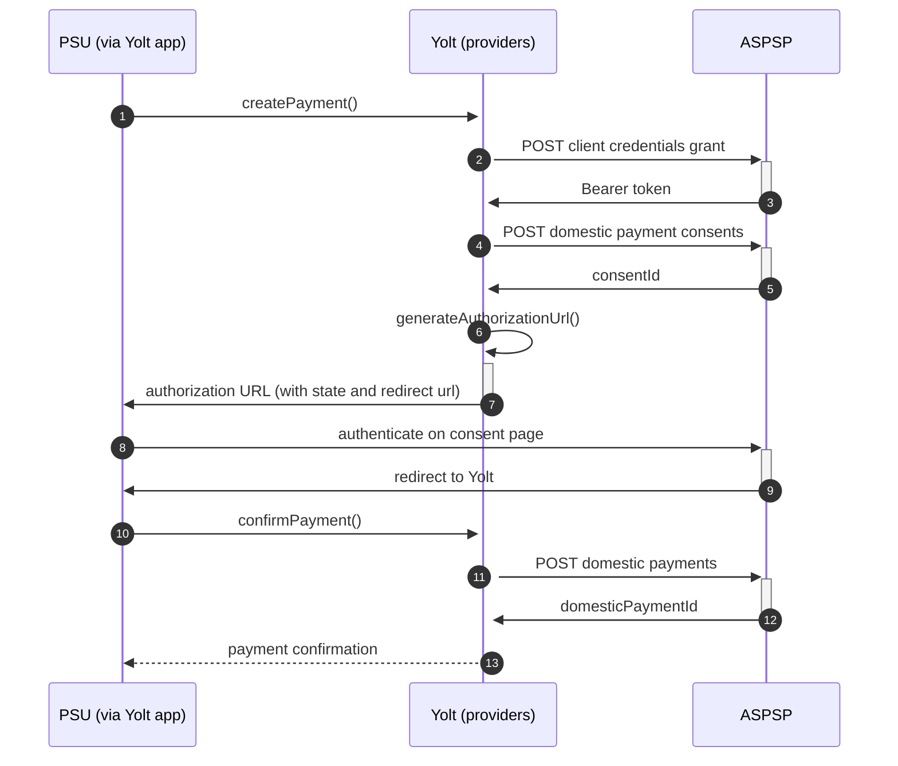

## Bank Of Ireland (PIS)

[Current open problems on our end][1]

Bank of Ireland Group is a commercial bank operation in Ireland and one of the traditional 'Big Four' Irish banks.
Historically the premier banking organisation in Ireland, the Bank occupies a unique position in Irish banking history.
At the core of the modern-day group is the old Bank of Ireland, the ancient institution established by Royal Charter in

1783.

## BIP overview

|                                       |                                                                                                                                                                                              |
|---------------------------------------|----------------------------------------------------------------------------------------------------------------------------------------------------------------------------------------------|
| **Country of origin**                 | United Kingdom                                                                                                                                                                               | 
| **Site Id**                           | ac75d67d-5ede-4972-94a8-3b8481fa2145                                                                                                                                                         |
| **Standard**                          | [Open Banking Standard][2]                                                                                                                                                                   |
| **Contact**                           | E-mail: TPPsupport@boi.com   Ticketing system: https://www.bankofireland.com/api/developer/contact/ |
| **Developer Portal**                  | https://developer.bankofireland.com/#!/                                                                                                                                                      | 
| **Account SubTypes**                  | Current, Savings, Credit Cards                                                                                                                                                               |
| **IP Whitelisting**                   | No                                                                                                                                                                                           |
| **PISP Standard version**             | 3.0.0                                                                                                                                                                                        |
| **Auto-onboarding**                   | Yes                                                                                                                                                                                          |
| **Requires PSU IP address**           | No                                                                                                                                                                                           |
| **Type of certificate**               | eIDAS (QWAC, QSEAL) or Open Banking (OBWAC, OBSEAL) certificates required                                                                                                                    |
| **Signing algorithms used**           | PS256                                                                                                                                                                                        |
| **Mutual TLS Authentication Support** | Yes                                                                                                                                                                                          |
| **Repository**                        | https://git.yolt.io/providers/open-banking                                                                                                                                                   |

## Links - sandbox

|                           |                                                                                       |
|---------------------------|---------------------------------------------------------------------------------------|
| **Well-known Endpoint**   | https://auth-sandbox.bankofireland.com/oauth/as/b365/.well-known/openid-configuration |
| **Base URL**              | https://auth-sandbox.bankofireland.com                                                |
| **Authorization URL**     | https://auth-sandbox.bankofireland.com/oauth/as/b365/authorization.oauth2             | 
| **Token Endpoint**        | https://api-sandbox.bankofireland.com/oauth/as/token.oauth2                           |
| **Registration Endpoint** | https://api-sandbox.bankofireland.com/1/api/open-banking/v3.3/register                |    

## Links - production

|                           |                                                                                     |
|---------------------------|-------------------------------------------------------------------------------------|
| **Well-known Endpoint**   | https://auth.obapi.bankofireland.com/oauth/as/b365/.well-known/openid-configuration |
| **Base URL**              | https://api.obapi.bankofireland.com/1/api/open-banking/                             |
| **Authorization URL**     | https://auth.obapi.bankofireland.com/oauth/as/b365/authorization.oauth2             | 
| **Token Endpoint**        | https://api.obapi.bankofireland.com/oauth/as/token.oauth2                           |
| **Registration Endpoint** | https://api.obapi.bankofireland.com/1/api/open-banking/v3.3/register                |  

## Client configuration overview

|                                  |                                                                         |
|----------------------------------|-------------------------------------------------------------------------|
| **Institution id**               | Unique identifier of the financial institution assigned by Open Banking |
| **Client id**                    | Unique identifier received during registration process                  | 
| **Client secret**                | Unique secret received during registration process                      |
| **Signing key header id**        | OBSeal certificate key id                                               |
| **Signing key id**               | OBSeal key id                                                           |
| **Transport certificate**        | OBWAC certificate                                                       |
| **Transport key id**             | OBWAC key id                                                            |
| **Software statement assertion** | SSA required during dynamic registration - tls_client_auth method       |

## Registration details

Bank of Ireland group requires dynamic registration to be performed before TPP will be able to use their PSD2 API. It
can be done by calling proper _/register_ endpoint. As a result we receive `clientId`, which is required to perform
further steps. All registration requirements and possible configuration are described on well-known
endpoint. [Documentation][3] for the endpoint can be find on bank's developer portal. Additionally in this bank we are
not subscribed to any particular API version. It means that we have access to all APIs versions and it depends on bank,
which version is used right now. Thanks that we don't have to remember to switch when new version is released. For
Business and Retail accounts are supported by different authorization endpoints, but on the same registration. For more
information look at [Getting started][4] section.

## Multiple Registration

We've got confirmation from the bank that each request creates new registration and they do not support
read/update/delete requests. In sandbox environment we've got error using the same request twice, so it looks like there
is only one request per SSA (not confirmed). Please be aware that you have only one chance for registration and in case
of problems (not gathered client id) you will need to contact bank for registration removal and try again.

## Connection Overview

All banks in Bank of Ireland group follows Open Banking standard. It means that flow is similar to other banks. Due to
that fact, Open Banking DTOs are used in implementation, and code relay mostly on our generic Open Banking
implementation.

The _createPayment_ method is used to create payment on bank's side. Thanks that we are sure that payment data are
compliant with requirements and standards. First of all we call _token_ endpoint with `payments` scope to get required
Bearer token. Next, payment is created (as request body) based on user's data and all information is sent to the bank to
create payment. As a result we receive `consentId` which is required in next step.

The _generateAuthorizationUrl_ method is used to generate login consent for user. Using `consentId` authorization URL is
prepared based on _authorize_ endpoint by filling it with necessary parameters. Using this URL, user is redirected to
login domain to fill his credentials and confirm payment.

In _confirmPayment_ method allows to confirm payment. Using the `consentId` with the same token and values at during
first call request body is prepared. After the call, from the bank `domesticPaymentId` is returned.

Simplified sequence diagram:

**Consent validity rules**

Consent validity rules are implemented for empty for now. It will be implemented during productionization

## Sandbox overview

The Sandbox contains mock data for the purpose of testing API connectivity. The Sandbox interface and authentication
flows are created to represent the production environment to allow users to progress the development and testing of
application. To use sandbox TPP has to register on their portal and perform proper registration call to get access.
During implementation we didn't use sandbox, so we don't have knowledge about it.

## Business and technical decisions

08.02.2022 Due to lack of testers working on this bank was finished on `Toogle testing` status. 02.03.2022 Due to
agreements with yts-core it was decided that we want to treat payment as completed once money has been deducted from
debtor account. According to OB documentation `AcceptedSettlementCompleted` is proper status. For reference
see https://yolt.atlassian.net/browse/C4PO-9754

**Payment Flow Additional Information**

|                                                                                                        |                             |
|--------------------------------------------------------------------------------------------------------|-----------------------------|
| **When exactly is the payment executed ( executed-on-submit/executed-on-consent)?**                    | execute-on-submit           |
| **it is possible to initiate a payment having no debtor account**                                      | YES                         |
| **At which payment status we can be sure that the money was transferred from the debtor to creditor?** | AcceptedSettlementCompleted |

## External links

* [Current open problems on our end][1]
* [Open Banking Standard][2]

[1]: <https://yolt.atlassian.net/issues/?jql=project%20%3D%20C4PO%20AND%20component%20%3D%20BANK_OF_IRELAND%20AND%20status%20!%3D%20Done%20AND%20Resolution%20%3D%20Unresolved%20ORDER%20BY%20status>

[2]: <https://standards.openbanking.org.uk/>

[3]: <https://eu1.anypoint.mulesoft.com/exchange/portals/boi-sandbox/46c770d4-ee02-4f34-9970-b7df46521ad2/dynamic-client-registration/>

[4]: <https://eu1.anypoint.mulesoft.com/exchange/portals/boi-sandbox/pages/Getting%20Started/>