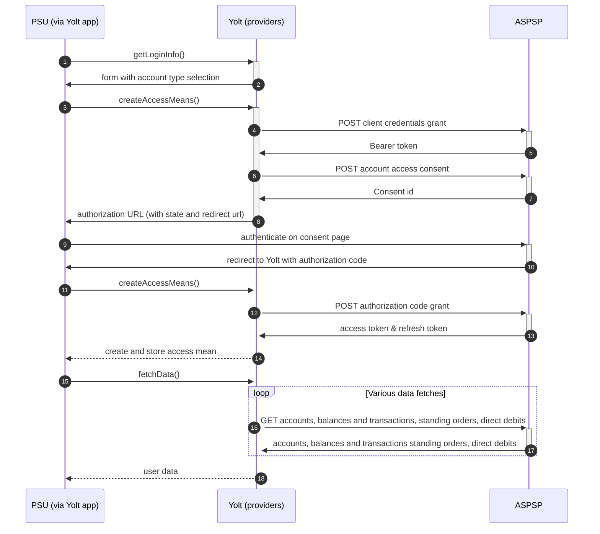

## Barclays & Barclaycard (AIS)
[Current open problems on our end][1]

Barclays is a British multinational investment bank and financial services company, headquartered in London, England. 
Apart from investment banking, Barclays is organised into four core businesses: personal banking, corporate banking, 
wealth management, and investment management. Barclaycard is a brand for credit cards of Barclays PLC. As of 2010, 
Barclays had over ten million customers in the United Kingdom.

## BIP overview 

|                                       |                                                                                                                                                                                         |
|---------------------------------------|-----------------------------------------------------------------------------------------------------------------------------------------------------------------------------------------|
| **Country of origin**                 | United Kingdom                                                                                                                                                                          | 
| **Site Id**                           | d28b4598-efcf-41c8-8522-08b2744e551a                                                                                                                                                    |
| **Standard**                          | [Open Banking Standard][2]                                                                                                                                                              |
| **Contact**                           | E-mail: BarclaysOpenBankingQueries@barclays.com   Ticketing system: https://openbanking.atlassian.net/servicedesk/customer/portal/1 |
| **Developer Portal**                  | https://developer.barclays.com/open-banking                                                                                                                                             | 
| **Account SubTypes**                  | Current, Savings, Credit Cards                                                                                                                                                          |
| **IP Whitelisting**                   | No                                                                                                                                                                                      |
| **AIS Standard version**              | 3.1                                                                                                                                                                                     |
| **Auto-onboarding**                   | No                                                                                                                                                                                      |
| **Requires PSU IP address**           | No                                                                                                                                                                                      |
| **Type of certificate**               | eIDAS (QWAC, QSEAL), OBIE (OBWAC, OBSEAL) or OB legacy certificates required                                                                                                            |
| **Signing algorithms used**           | PS256                                                                                                                                                                                   |
| **Mutual TLS Authentication Support** | Yes                                                                                                                                                                                     |
| **Repository**                        | https://git.yolt.io/providers/open-banking                                                                                                                                              |

## Links - sandbox

|                         |                                                                     |
|-------------------------|---------------------------------------------------------------------|
| **Well-known Endpoint** | https://token.sandbox.barclays.com/.well-known/openid-configuration |
| **Base URL**            | https://sandbox.api.barclays/open-banking/v3.1/sandbox/aisp         |
| **Authorization URL**   | https://token.sandbox.barclays.com/oauth/auz/authorize              | 
| **Token Endpoint**      | https://token.sandbox.barclays.com/oauth/oauth20/token              |  

## Links - production 

|                                      |                                                                                   |
|--------------------------------------|-----------------------------------------------------------------------------------|
| **Barclays Well-known Endpoint**     | https://oauth.tiaa.barclays.com/BarclaysPersonal/.well-known/openid-configuration |
| **Barclay Card Well-known Endpoint** | https://oauth.tiaa.barclays.com/BarclaycardUK/.well-known/openid-configuration    |
| **Base URL**                         | https://telesto.api.barclays/open-banking                                         |
| **Barclays Authorization URL**       | https://oauth.tiaa.barclays.com/BarclaysPersonal/as/authorization.oauth2          |
| **Barclay Card Authorization URL**   | https://oauth.tiaa.barclays.com/BarclaycardUK/as/authorization.oauth2             |  
| **Token Endpoint**                   | https://token.tiaa.barclays.com/as/token.oauth2                                   |
| **Registration Endpoint**            | https://oauth.tiaa.barclays.com/BarclaysPersonal/.well-known/openid-configuration |  

## Client configuration overview

|                                   |                                                                         |
|-----------------------------------|-------------------------------------------------------------------------|
| **Client id**                     | Unique identifier received during registration process                  |
| **Client secret**                 | Unique secret received during registration process                      |  
| **Institution id**                | Unique identifier of the financial institution assigned by Open Banking |
| **Private signing key header id** | Open Banking signing certificate key id                                 |
| **Transport certificate**         | Open Banking transport certificate                                      |
| **Organization id**               | TPP's organization id                                                   |
| **Software id**                   | TPP's Open Banking software version                                     |
| **Signing key id**                | Open Banking signing key id                                             |
| **Transport key id**              | Open Banking transport key id                                           |

## Registration details

Barclays has two different possible registration types. Dynamic registration is dedicated for TPPs with eIDAS certificates.
Such registration can be done by calling proper _/register_ endpoint described in [documentation][3]. As a result we receive `clientId`, 
which is required to perform further steps. Due to the fact that our auto-onboarding logic wasn't ready when this bank 
was connected and we didn't have eIDAS certificates this process wasn't implemented as auto-onboarding.

We are registered manually on bank's developer portal. To login you have to create new account or use your Open Banking
account. There you can create proper application with public certificates. As a result you will receive `clientId` which
will be used in `private_key_jwt` authentication method. 

Additionally there we are not subscribed to any particular API version. It means that we have access to all _v3.1_ versions
and it depends on bank, which version is used right now. Thanks that we don't have to remember to switch when new version
is released.
Business and Retail accounts are available by one registration, but you have to use different authorization endpoints to
create consent.

## Multiple Registration

We don't know about any registration limits. There was no situation, when such knowledge was needed, so we will have to
ask about that when there will be such case.

## Connection Overview

Both Barclays and Barclaycard follow Open Banking standard. It means that flow is similar to other banks. Due to that fact,
Open Banking DTOs are used in implementation, and code relay mostly on our generic Open Banking implementation.

The _getLoginInfo_ method is different that generic version. Due to the fact that for Credit Cards (Barclaycard) there is
separate authorization endpoint required, we have to ask user which account he wants to add, so proper form step is generated.

In _createAccessMeans_ method there is verification if it is a first call of this method (user has to fill consent) or
it is second call (consent has been already filled). For first situation there is a logic which does what normal 
_getLoginInfo_ method is responsible for. It means that login consent for user is generated. First of all we call _token_ 
endpoint to get Bearer token. Next _account-access-consents_ endpoint is called to create consent on bank side. 
Received `consentId` is used to prepare authorization URL based on _authorize_ endpoint by filling it with necessary 
parameters. Using this URL, user is redirected to login domain to fill his credentials.
When the method is called again `code` is used to call for token. This token will be used to authenticate user
in next calls. In response there is also `refresh_token` returned, because consent is valid for 90 days, and `access_token` 
only for 30 minutes. It means that refresh token flow is supported and has to be implemented too. _refreshAccessMeans_
allows to perform this operation. For a given consent, the refresh token is the same, but we always map both tokens to
access means value.

As in other Open Banking banks, Barclays also allows for consent removal. It is done by generic code in _onUserSiteDelete_
method. Stored earlier `consentId` is used to perform this operation.

The most complex step is data fetching. Barclays allows to collect information not only about accounts, balances and 
transactions, but also for direct debits and standing orders. The most important thing is that for Credit 
Cards those additional information are not collected.
In the bank there is no consent window and fetching data time value is taken from _site-management_.
Important information is that this bank support pagination for transactions. It returns both `BOOKED` and
`PENDING` transactions.

**Consent validity rules**

Barclays AIS uses dynamic flow, thus we are unable to determine consent validity rules for AIS.

Simplified sequence diagram:

**Standard Error Codes**

During investigation of the [C4PO-9198][4], the bank sent us file with FAQ where we can find a lot of valuable information.
One of them is the information about errors which we receive frequently. The FAQ file has been attached to the aforementioned ticket.  

| Error Code                                                                                                                                                                                       | Description                                                                                                                                                                                                                                                                                                                                                                                                                                                                  |
|--------------------------------------------------------------------------------------------------------------------------------------------------------------------------------------------------|------------------------------------------------------------------------------------------------------------------------------------------------------------------------------------------------------------------------------------------------------------------------------------------------------------------------------------------------------------------------------------------------------------------------------------------------------------------------------|
| 400: ‘Account request could not be completed due to invalid data’ accompanied with a 400 error code. The Third Party Provider receives this message after selecting an account for data sharing. | This is a valid rejection, as the account may be closed, not in scope or may have a flag or marker that impacts the customer’s ability to use Open Banking. These may include insolvency, deceased and fraud flags. Some of these flags may only be applied on a temporary basis and the customer should contact Barclays directly for more information.                                                                                                                     |
| 500: The Third Party Provider is receiving error code 500 when trying to fetch data from their Barclays account.                                                                                 | Occasionally we conduct planned maintenance. When that is the case, we notify both OBIE and the Third Party Provider community in advance. Third Party Providers may experience a ‘500’ error during these periods. If a Third Party Provider experiences isolated or repeated 500 errors unrelated to planned maintenance, please let us know (see page 20 for details). Its likely we know already as we monitor the service closely, but always helpful to hear from you. |

## Sandbox overview

The Sandbox contains mock data for the purpose of testing API connectivity. The Sandbox interface and authentication 
flows are created to represent the production environment to allow users to progress the development and testing of 
application.
To use sandbox you have to perform similar registration as for production environment. During implementation process
we tried to use the sandbox, but there it wasn't working, so we decided to skip this step. Due to that fact we don't 
have any further information about it. 

## User Site deletion
There's `onUserSiteDelete` method implemented by this provider, however, only in a best effort manner.

## Business and technical decisions

During implementation we made following business decisions:

Barclays support three balance types: `EXPECTED`, `CLOSINGBOOKED` and `INTERIMAVAILABLE`. For both Current balance and
Available balance we try to map `EXPECTED`. If it is missing for Current balance `CLOSINGBOOKED` and for Available balance
`INTERIMAVAILABLE` will be used. Mapping for Barclaycard is different. We always use `INTERIMCLEARED` as Current balance,
but for mapping Available balance for Credit cards is more complicated. It can be _null_ or calculated using credit line.

Format of `transactionsFetchStartTime` used on fetch data step is different that generic one. We have to convert it as
a string.

In Barclays we treat consent deletion as optional logic. That's we we implemented custom error handler not to stop the flow
on other than Forbidden errors. 

The bank is currently using `private_key_jwt` authentication method. This was changed in the task - 
https://yolt.atlassian.net/browse/C4PO-4704. In the task attachments there can be found a document containing example 
requests with the use of private jwt key.

The private jwt key implementation is different from generic one in the following way:
- client credentials token additionally requires client ID parameter
- access token additionally requires redirect URL parameter
- for access and refresh tokens the scope parameter is optional, and it was advised from Barclays to not use it,
so we are not adding it.
- when creating the login URL the issuer value in the JWT claim should be set to our client ID value
- the "response_type" parameter in the JWT claim for login URL must be set to "code id_token".

26 JAN 2021:
- we override transactions `dateTime` mapping in order to use `valueDateTime` or `bookingDateTime` depending on
  which one is present in the bank's response. 

15 NOV 2021 C4PO-8320:
After contact with bank we decided to filter accounts after message: "Accounts request could not be processed due to invalid data."
and error code: "UK.OBIE.Field.Unexpected" from endpoint transactions.
  
## External links
* [Current open problems on our end][1]
* [Open Banking Standard][2]
* [Dynamic Client Registration][3]

[1]: <https://yolt.atlassian.net/issues/?jql=project%20%3D%20C4PO%20AND%20component%20%3D%20BARCLAYS%20AND%20status%20!%3D%20Done%20AND%20Resolution%20%3D%20Unresolved%20ORDER%20BY%20status>
[2]: <https://standards.openbanking.org.uk/>
[3]: <https://developer.barclays.com/apis/dynamic-client-registration/ace18310-2523-49f0-a66d-4c6e37aae59f.bdn/documentation>
[4]: <https://yolt.atlassian.net/browse/C4PO-9198>