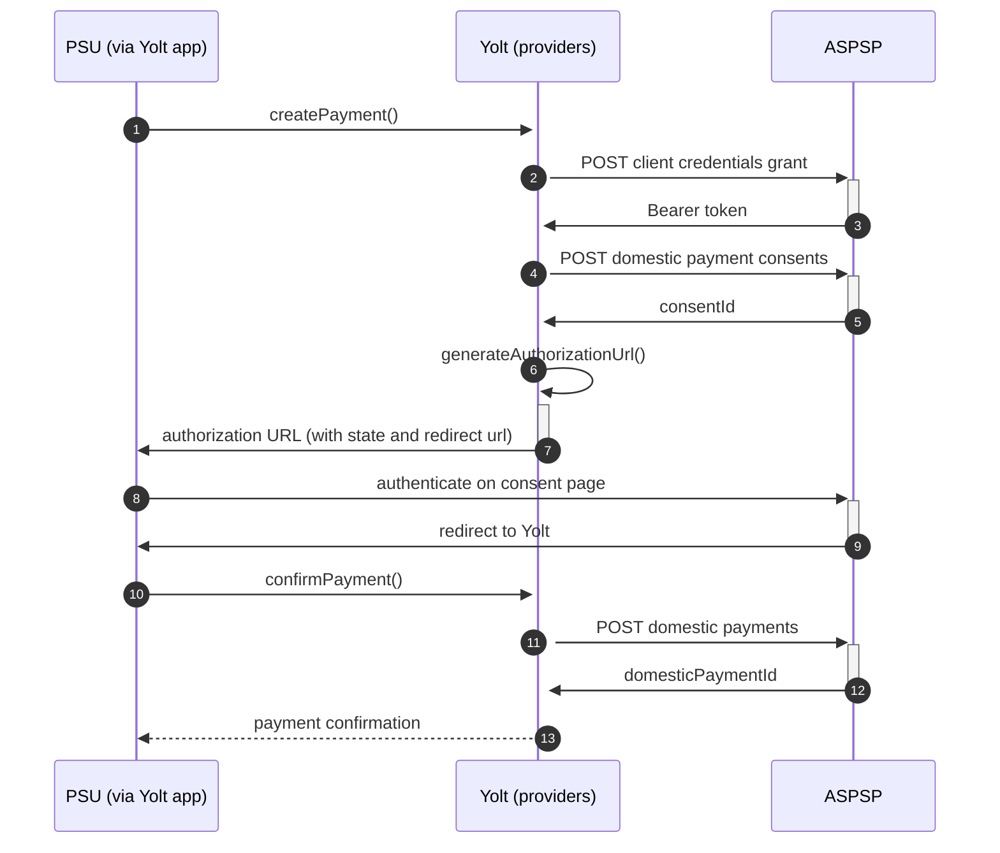

## Barclays & Barclaycard (PIS)
[Current open problems on our end][1]

Barclays is a British multinational investment bank and financial services company, headquartered in London, England. 
Apart from investment banking, Barclays is organised into four core businesses: personal banking, corporate banking, 
wealth management, and investment management. Barclaycard is a brand for credit cards of Barclays PLC. As of 2010, 
Barclays had over ten million customers in the United Kingdom.

## BIP overview 

|                                       |                                                                                                                                                                                         |
|---------------------------------------|-----------------------------------------------------------------------------------------------------------------------------------------------------------------------------------------|
| **Country of origin**                 | United Kingdom                                                                                                                                                                          | 
| **Site Id**                           | d28b4598-efcf-41c8-8522-08b2744e551a                                                                                                                                                    |
| **Standard**                          | [Open Banking Standard][2]                                                                                                                                                              |
| **Contact**                           | E-mail: BarclaysOpenBankingQueries@barclays.com   Ticketing system: https://openbanking.atlassian.net/servicedesk/customer/portal/1 |
| **Developer Portal**                  | https://developer.barclays.com/open-banking                                                                                                                                             | 
| **IP Whitelisting**                   | No                                                                                                                                                                                      |
| **PISP Standard version**             | 3.1                                                                                                                                                                                     |
| **Auto-onboarding**                   | No                                                                                                                                                                                      |
| **Requires PSU IP address**           | No                                                                                                                                                                                      |
| **Type of certificate**               | eIDAS (QWAC, QSEAL), OBIE (OBWAC, OBSEAL) or OB legacy certificates required                                                                                                            |
| **Signing algorithms used**           | PS256                                                                                                                                                                                   |
| **Mutual TLS Authentication Support** | Yes                                                                                                                                                                                     |
| **Repository**                        | https://git.yolt.io/providers/open-banking                                                                                                                                              |

## Links - sandbox

|                         |                                                                     |
|-------------------------|---------------------------------------------------------------------|
| **Well-known Endpoint** | https://token.sandbox.barclays.com/.well-known/openid-configuration |
| **Base URL**            | https://sandbox.api.barclays/open-banking/v3.1/sandbox/pisp         |
| **Authorization URL**   | https://token.sandbox.barclays.com/oauth/auz/authorize              | 
| **Token Endpoint**      | https://token.sandbox.barclays.com/oauth/oauth20/token              |

## Links - production 

|                                      |                                                                                   |
|--------------------------------------|-----------------------------------------------------------------------------------|
| **Barclays Well-known Endpoint**     | https://oauth.tiaa.barclays.com/BarclaysPersonal/.well-known/openid-configuration |
| **Barclay Card Well-known Endpoint** | https://oauth.tiaa.barclays.com/BarclaycardUK/.well-known/openid-configuration    |
| **Base URL**                         | https://telesto.api.barclays/open-banking                                         |
| **Barclays Authorization URL**       | https://oauth.tiaa.barclays.com/BarclaysPersonal/as/authorization.oauth2          |
| **Barclay Card Authorization URL**   | https://oauth.tiaa.barclays.com/BarclaycardUK/as/authorization.oauth2             |  
| **Token Endpoint**                   | https://token.tiaa.barclays.com/as/token.oauth2                                   |
| **Registration Endpoint**            | https://telesto.api.barclays/open-banking/v1.0                                    |  

## Client configuration overview

|                                   |                                                                         |
|-----------------------------------|-------------------------------------------------------------------------|
| **Client id**                     | Unique identifier received during registration process                  |
| **Client secret**                 | Unique secret received during registration process                      |  
| **Institution id**                | Unique identifier of the financial institution assigned by Open Banking |
| **Private signing key header id** | Open Banking signing certificate key id                                 |
| **Transport certificate**         | Open Banking transport certificate                                      |
| **Organization id**               | TPP's organization id                                                   |
| **Software id**                   | TPP's Open Banking software version                                     |
| **Signing key id**                | Open Banking signing key id                                             |
| **Transport key id**              | Open Banking transport key id                                           |

## Registration details

Barclays has two different possible registration types. Dynamic registration is dedicated for TPPs with eIDAS certificates.
Such registration can be done by calling proper _/register_ endpoint described in [documentation][3]. As a result we receive `clientId`, 
which is required to perform further steps. Due to the fact that our auto-onboarding logic wasn't ready when this bank 
was connected and we didn't have eIDAS certificates this process wasn't implemented as auto-onboarding.

We are registered manually on bank's developer portal. To login you have to create new account or use your Open Banking
account. There you can create proper application with public certificates. As a result you will receive `clientId` which
will be used in `private_key_jwt` authentication method. 

Additionally there we are not subscribed to any particular API version. It means that we have access to all _v3.1_ versions
and it depends on bank, which version is used right now. Thanks that we don't have to remember to switch when new version
is released.
Business and Retail accounts are available by one registration, but you have to use different authorization endpoints to
create consent.

## Multiple Registration

We don't know about any registration limits. There was no situation, when such knowledge was needed, so we will have to
ask about that when there will be such case.

## Connection Overview

Both Barclays and Barclaycard follow Open Banking standard. It means that flow is similar to other banks. Due to that fact,
Open Banking DTOs are used in implementation, and code relay mostly on our generic Open Banking implementation.

The _createPayment_ method is used to create payment on bank's side. Thanks that we are sure that payment data are compliant
with requirements and standards. First of all we call _token_ endpoint with `payments` scope to get required Bearer token.
Next, payment is created (as request body) based on user's data and all information is sent to the bank to create payment.
As a result we receive `consentId` which is required in next step.

The _generateAuthorizationUrl_ method is used to generate login consent for user. Using `consentId` authorization URL is
prepared based on _authorize_ endpoint by filling it with necessary parameters. Using this URL, user is redirected to 
login domain to fill his credentials and confirm payment.

In _confirmPayment_ method allows to confirm payment. Using the `consentId` with the same token and values at during first 
call request body is prepared. After the call, from the bank `domesticPaymentId` is returned.

Simplified sequence diagram:

**Consent validity rules**

Barclays PIS consent page is an SPA, thus we are unable to determine consent validity rules for PIS.
   
## Sandbox overview

The Sandbox contains mock data for the purpose of testing API connectivity. The Sandbox interface and authentication 
flows are created to represent the production environment to allow users to progress the development and testing of 
application.
To use sandbox you have to perform similar registration as for production environment. During implementation process
we tried to use the sandbox, but there it wasn't working, so we decided to skip this step. Due to that fact we don't 
have any further information about it. 
  
## Business and technical decisions

During implementation we made following business decisions:

Bank requires `SortCodeAccountNumber` value to be in camel case format. We prepared mapper to convert value used in our 
model to value which is compliant with documentation.
Both `creditor` and `debtor` data are used to avoid situation that user can choose other account on consent step. 

08.03.2021 Barclays confirmed that do not support IBAN domestic payments. They do for international, but through different endpoint 
that we do not support so far.

10.03.2021 Barclays confirmed that they have lenght limit for creditor and debtor name so we will throw exception when 
creditor and debtor name is longer 18 characters.

06.09.2021 YTS core requested a change to allow initiating and create payments without debtor to give user an
opportunity to choose account which is going to be a payment source on consent page. C4PO-9033

14.12.2021 According to mail from bank in C4PO-9361, field reference is not required and pattern to valid references in
payment initialization is:
pattern: ^(?!
\s)([a-zA-Z0-9-. '()£="_,&@#\/;&+\u00C0\u00C1\u00C2\u00C3\u00C4\u00C5\u00C6\u00C7\u00C8\u00C9\u00CA\u00CB\u00CC\u00CD\u00CE\u00CF\u00D0\u00D1\u00D2\u00D3\u00D4\u00D5\u00D6\u00D8\u00D9\u00DA\u00DB\u00DC\u00DD\u00DE\u00DF\u00E0\u00E1\u00E2\u00E3\u00E4\u00E5\u00E6\u00E7\u00E8\u00E9\u00EA\u00EB\u00EC\u00ED\u00EE\u00EF\u00F0\u00F1\u00F2\u00F3\u00F4\u00F5\u00F6\u00F8\u00F9\u00FA\u00FB\u00FC\u00FD\u00FE\u00FF]
{1,35})$

    example: FRESCO-037

02.03.2022 Due to agreements with yts-core it was decided that we want to treat payment as completed once money has been
deducted from debtor account. According to OB documentation `AcceptedSettlementCompleted` is proper status. For
reference see https://yolt.atlassian.net/browse/C4PO-9754

**Payment Flow Additional Information**

|                                                                                                        |                             |
|--------------------------------------------------------------------------------------------------------|-----------------------------|
| **When exactly is the payment executed ( executed-on-submit/executed-on-consent)?**                    | execute-on-submit           |
| **it is possible to initiate a payment having no debtor account**                                      | NO                          |
| **At which payment status we can be sure that the money was transferred from the debtor to creditor?** | AcceptedSettlementCompleted |

## External links
* [Current open problems on our end][1]
* [Open Banking Standard][2]

[1]: <https://yolt.atlassian.net/issues/?jql=project%20%3D%20C4PO%20AND%20component%20%3D%20BARCLAYS%20AND%20status%20!%3D%20Done%20AND%20Resolution%20%3D%20Unresolved%20ORDER%20BY%20status>
[2]: <https://standards.openbanking.org.uk/>
[3]: <https://developer.barclays.com/apis/dynamic-client-registration/ace18310-2523-49f0-a66d-4c6e37aae59f.bdn/documentation>