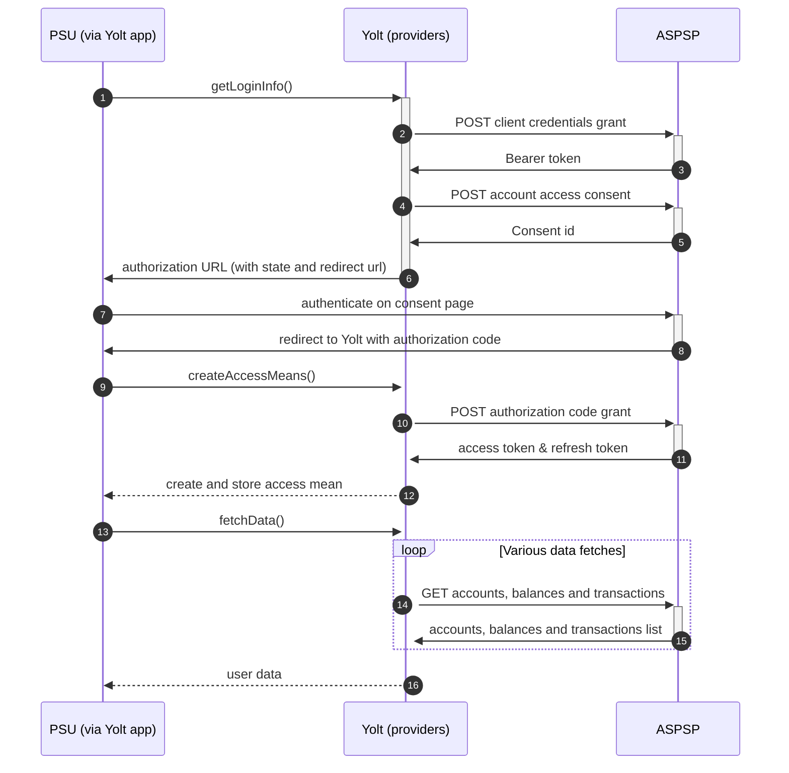

# Capital One (AIS)
[Current open problems on our end][1]

Capital One Financial Corporation is an American bank holding company specializing in credit cards, auto loans, banking,
and savings accounts, headquartered in McLean, Virginia with operations primarily in the United States. It is on the 
list of the largest banks in the United States and has developed a reputation for being a technology-focused bank.

## BIP overview 

|                                       |                                                         |
|---------------------------------------|---------------------------------------------------------|
| **Country of origin**                 | United Kingdom                                          | 
| **Site Id**                           | 66f23a12-dc98-4c6c-814b-16056d2f237b                    |
| **Standard**                          | [Open Banking Standard][2]                              |
| **Contact**                           | E-mail: ukdevelopersupport@capitalone.com               |
| **Developer Portal**                  | https://developer.capitalone.co.uk/apis                 | 
| **Account SubTypes**                  | Credit Cards                                            |
| **IP Whitelisting**                   | No                                                      |
| **AIS Standard version**              | 3.1.2                                                   |
| **Auto-onboarding**                   | Yes                                                     |
| **Requires PSU IP address**           | Yes                                                     |
| **Type of certificate**               | OBIE (OBWAC, OBSEAL) or OB legacy certificates required |
| **Signing algorithms used**           | PS256                                                   |
| **Mutual TLS Authentication Support** | Yes                                                     |
| **Repository**                        | https://git.yolt.io/providers/open-banking              |

## Links - sandbox

|                           |                                                                                    |
|---------------------------|------------------------------------------------------------------------------------|
| **Well-known Endpoint**   | https://auth-ui-obsbox.capitalone.co.uk/.well-known/openid-configuration           |
| **Base URL**              | https://auth-ui-obsbox.capitalone.co.uk                                            |
| **Authorization URL**     | https://auth-ui-obsbox.capitalone.co.uk/auth                                       | 
| **Token Endpoint**        | https://auth-obsbox.capitalone.co.uk:4201/token                                    |
| **Registration Endpoint** | https://api-obsbox.capitalone.co.uk:4501/dynamic-client-registration/v3.1/register |    

## Links - production 

|                           |                                                                        |
|---------------------------|------------------------------------------------------------------------|
| **Well-known Endpoint**   | https://integrations.capitalone.co.uk/.well-known/openid-configuration |
| **Base URL**              | https://open-banking.capitalone.co.uk/open-banking                     |
| **Authorization URL**     | https://myaccount-data.capitalone.co.uk/authorize                      | 
| **Token Endpoint**        | https://open-banking.capitalone.co.uk/open-banking/oauth/token         |
| **Registration Endpoint** | https://open-banking.capitalone.co.uk/open-banking/oauth/register      |  

## Client configuration overview

|                                  |                                                                                |
|----------------------------------|--------------------------------------------------------------------------------|
| **Institution id**               | Unique identifier of the financial institution (bank) assigned by Open Banking |
| **Client id**                    | Unique identifier received during registration process                         |
| **Signing key header id**        | OBSeal certificate key id                                                      |
| **Transport certificate**        | OBWAC certificate                                                              |
| **Software id**                  | Id of Software Statement Assertion                                             |
| **Signing key id**               | OBSEAL key id                                                                  |
| **Transport key id**             | OBWAC key id                                                                   |
| **Software statement assertion** | SSA required during dynamic registration - tls_client_auth method              |
| **Registration access token**    | authorization token received during registration process                       |

## Registration details

Capital One requires dynamic registration to be performed before TPP will be able to use their PSD2 API. It can 
be done by proper _/register_ endpoint. During this call we have to use the same values as for future authentication means 
(including certificates) and as a result we receive `clientId`, which is required to perform further 
steps.
All registration requirements and possible configuration are described on well-known endpoint. [Documentation][3] for the
endpoint can be find on bank's developer portal
Additionally in this bank we are not subscribed to any particular API version. It means that we have access to all APIs 
versions and it depends on bank, which version is used right now. Thanks that we don't have to remember to switch when 
new version is released.
Important information is that bank supports also PUT and DELETE methods on registration endpoint, but for both 
`registration_access_token`, which is returned during POST step, is required. We store it as authentication mean.   
Bank supports only retail accounts.
For more information look at [Implementation guide][4] section.

## Multiple Registration

We don't know about any registration limits. There was no situation, when such knowledge was needed, so we will have to
ask about that when there will be such case.

## Connection Overview

Capital One follows Open Banking 3.1 standard. It means that flow is similar to other banks. Due to that fact,
Open Banking DTOs are used in implementation, and code relay mostly on our generic Open Banking implementation.

The _getLoginInfo_ method is used to generate login consent for user. First we call _token_ endpoint to get Bearer
token. Next _account-access-consents_ endpoint is called to create consent on bank side. Received `consentId` is used to
prepare authorization URL based on _authorize_ endpoint by filling it with necessary parameters. Using this URL, user 
is redirected to login domain to fill his credentials.

In _createAccessMeans_ method `code` is taken and used to call for token. This token will be used to authenticate user
in next calls. In response there is also `refresh_token` returned, because consent is valid for 90 days, and `access_token` 
only for 30 minutes. It means that refresh token flow is supported and has to be implemented too. _refreshAccessMeans_
allows to perform this operation. For a given consent, the refresh token is the same, but we always map both tokens to
access means value. There can be a situation when refresh token is missing. Due to that fact we prepared logic to use old
one when such case occurs.

As in other Open Banking banks, Capital One also allows for consent removal. It is done by generic code in _onUserSiteDelete_
method. Stored earlier `consentId` is used to perform this operation.

The most complex step is data fetching. Due to the fact that Capital One supports only credit cards, it allows collecting 
information only about accounts, balances and transactions. There is no endpoint for direct debits and 
standing orders. For those data empty list is returned by provider.

There is no consent window implemented. 
**Consent validity rules** are set to EMPTY_RULES_SET for Capital One bank due to error page shares same HTML code as a correct one.

Important information is that this bank doesn't support pagination for transactions. It returns both `BOOKED` and
`PENDING` transactions.

Simplified sequence diagram:

   
## Sandbox overview

The Sandbox contains mock data for the purpose of testing API connectivity. The Sandbox interface and authentication 
flows are created to represent the production environment to allow users to progress the development and testing of 
application.
To use sandbox TPP has to register on their portal and perform proper registration call to get access. During the implementation
we didn't use sandbox, so we don't have knowledge about it.

## User Site deletion
There's `onUserSiteDelete` method implemented by this provider, however, only in a best effort manner.

## Business and technical decisions

During the implementation we made following business decisions:

Capital One supports only `OPENINGBOOKED` balance for Current and Savings accounts, so the same value is mapped for both
Current and Available balances.

As a consequence of the fact that the bank doesn't send account name, we decided to introduce fallback: `Capital One Account`

During the implementation we found that list of permissions requested during consent generation step has to be limited.
Generic implementation was overwritten to send only allowed values.

Based on the documentation we found that the bank requires `x-fapi-customer-ip-address` header to be sent for fetch data
endpoints. Due to that fact, proper custom FetchDataService and RestClient were implemented.

During FCA migration we discovered that using token from old registration trigger 400 error code in response with
message
`Token was issued to a different client`. To protect us in the future and force user to relogin once again, we
introduced
custom error handler throwing TokenInvalidException instead of returning the error to users.

C4PO-9879 To satisfy 90-days re-authentication exemption Capital One introduced: as a TPP integrating with Capital One
UK, you should ensure that you are always capturing and storing the refresh_token from each request, rather than only
capturing the initial refresh_token on a first time request for a given customer.
This is in line with the Oauth standard recommendation. Only the most recent refresh token will ever be valid.
It will be released at 31.09.2022

## External links

* [Current open problems on our end][1]
* [Open Banking Standard][2]

[1]: <https://yolt.atlassian.net/issues/?jql=project%20%3D%20%22C4PO%22%20AND%20component%20%3D%20%22CAPITAL_ONE%22%20AND%20status%20!%3D%20Done%20AND%20Resolution%20%3D%20Unresolved%20ORDER%20BY%20status>

[2]: <https://standards.openbanking.org.uk/>

[3]: <https://developer.capitalone.co.uk/api/open-banking/index.html#registration/>

[4]: <https://openbanking.atlassian.net/wiki/spaces/AD/pages/1020921087/Implementation+Guide+Capital+One/>