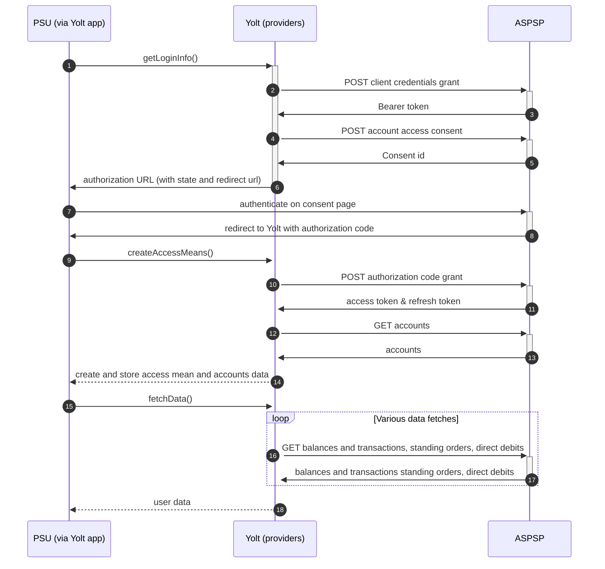

# Clydesdale Bank (AIS)
[Current open problems on our end][1]

Clydesdale Bank is a trading name used by Clydesdale Bank plc for its retail banking operations in Scotland.
In June 2018, it was announced that Clydesdale Bank's holding company CYBG would acquire Virgin Money in an all-stock deal, 
and that the Clydesdale Bank, Yorkshire Bank and B brands would be phased out in favour of retaining Virgin Money's brand. 
CYBG plc's other banking businesses, B, Virgin Money and Yorkshire Bank currently operate as trading divisions of 
Clydesdale Bank plc under its banking licence.

## BIP overview 

|                                       |                                                                              |
|---------------------------------------|------------------------------------------------------------------------------|
| **Country of origin**                 | United Kingdom                                                               | 
| **Site Id**                           | c12259dd-4803-4e28-a060-8d696902e802                                         |
| **Standard**                          | [Open Banking Standard][2]                                                   |
| **Contact**                           | E-mail: OpenBankingResponse@cybg.com                                         |
| **Developer Portal**                  | https://developer.virginmoney.com                                            | 
| **Account SubTypes**                  | Current, Savings, Credit Cards                                               |
| **IP Whitelisting**                   | No                                                                           |
| **AIS Standard version**              | 3.1.2                                                                        |
| **Auto-onboarding**                   | Yes                                                                          |
| **Requires PSU IP address**           | No                                                                           |
| **Type of certificate**               | eIDAS (QWAC, QSEAL), OBIE (OBWAC, OBSEAL) or OB legacy certificates required |
| **Signing algorithms used**           | PS256                                                                        |
| **Mutual TLS Authentication Support** | Yes                                                                          |
| **Repository**                        | https://git.yolt.io/providers/open-banking                                   |

## Links - sandbox

|                           |                                                                                                |
|---------------------------|------------------------------------------------------------------------------------------------|
| **Well-known Endpoint**   | https://cb.sandbox-api-nc.cybservices.co.uk/open-banking/v3.0/.well-known/openid-configuration |
| **Base URL**              | https://cb.sandbox-api-nc.cybservices.co.uk/open-banking                                       |
| **Authorization URL**     | https://cb.sandbox-api-nc.cybservices.co.uk/authorize                                          | 
| **Token Endpoint**        | https://cb.sandbox-api-nc.cybservices.co.uk/open-banking/v3.0/oauth2/token                     |
| **Registration Endpoint** | https://cb.sandbox-api-nc.cybservices.co.uk/open-banking/v3.2/register                         |    

## Links - production 

|                           |                                                                                        |
|---------------------------|----------------------------------------------------------------------------------------|
| **Well-known Endpoint**   | https://cb.api-nc.cybservices.co.uk/open-banking/v3.0/.well-known/openid-configuration |
| **Base URL**              | https://cb.api-nc.cybservices.co.uk/open-banking                                       |
| **Authorization URL**     | https://consent-management.ib.cbonline.co.uk/cb/                                       | 
| **Token Endpoint**        | https://cb.api-nc.cybservices.co.uk/open-banking/v3.0/oauth2/token                     |
| **Registration Endpoint** | https://cb.api-nc.cybservices.co.uk/open-banking/v3.2/register                         |  

## Client configuration overview

|                                  |                                                                                |
|----------------------------------|--------------------------------------------------------------------------------|
| **Institution id**               | Unique identifier of the financial institution (bank) assigned by Open Banking |
| **Client id**                    | Unique identifier received during registration process                         | 
| **Client secret**                | Unique secret received during registration process                             | 
| **Software id**                  | Id of Software Statement Assertion                                             |
| **Signing key header id**        | OBSEAL certificate key id                                                      |
| **Transport certificate**        | OBWAC certificate                                                              |
| **Transport key id**             | OBWAC key id                                                                   |
| **Signing key id**               | OBSEAL key id                                                                  |
| **Software statement assertion** | SSA required during dynamic registration - tls_client_auth method              |
## Registration details

CYBG group requires dynamic registration to be performed before TPP will be able to use their PSD2 API. It can 
be done by proper _/register_ endpoint. During this call we have to use the same values as for future authentication means 
(including certificates) and as a result we receive `clientId` and `clientSecret`, which are required to perform further 
steps.
All registration requirements and possible configuration are described on well-known endpoint. [Documentation][3] for the
endpoint can be find on bank's developer portal
Additionally in this bank we are not subscribed to any particular API version. It means that we have access to all APIs 
versions and it depends on bank, which version is used right now. Thanks that we don't have to remember to switch when 
new version is released.
For Business and Retail accounts are supported by the same authorization endpoints on the same registration.
For more information look at [FAQ][4] section.

## Multiple Registration

We don't know about any registration limits. There was no situation, when such knowledge was needed, so we will have to
ask about that when there will be such case.

## Connection Overview

CYBG group follows Open Banking 3.1 standard. It means that flow is similar to other banks. Due to that fact,
Open Banking DTOs are used in implementation, and code relay mostly on our generic Open Banking implementation.

The _getLoginInfo_ method is used to generate login consent for user. First of all we call _token_ endpoint to get Bearer
token. Next _account-access-consents_ endpoint is called to create consent on bank side. Received `consentId` is used to
prepare authorization URL based on _authorize_ endpoint by filling it with necessary parameters. Using this URL, user 
is redirected to login domain to fill his credentials.

In _createAccessMeans_ method `code` is used to call for token. This token will be used to authenticate user
in next calls. In response there is also `refresh_token` returned, because consent is valid for 90 days, and `access_token` 
only for one hour. It means that refresh token flow is supported and has to be implemented too. Compared to other OB 
banks, _createAccessMeans_ method is different in CYBG group. During that step information from `/account` endpoint is 
collected and stored in returned state. It is done like this, due to the fact that accounts can be called only in 5 
minutes after consent step, so this logic had to be removed from typical fetch data step, which is called during refresh flow.

_refreshAccessMeans_ allows to perform this operation. For a given consent, the refresh token is the same, but we always 
map both tokens to access means value. There can be a situation when refresh token is missing. Due to that fact we 
prepared logic to use old one when such case occurs.

As in other Open Banking banks, CYBG group also allows for consent removal. It is done by generic code in _onUserSiteDelete_
method. Stored earlier `consentId` is used to perform this operation.

The most complex step is data fetching. CYBG group allows to collect information not only about balances and 
transactions, but also for standing orders for previously collected accounts. The most important thing 
is that for Credit Cards and Savings those additional information are not collected.

Consent window is implemented for 5 minutes.
**Consent validity rules** are implemented for Clydesdale bank AIS.

Important information is that this bank support pagination for transactions. It returns both `BOOKED` and
`PENDING` transactions.

Simplified sequence diagram:

   
## Sandbox overview

The Sandbox contains mock data for the purpose of testing API connectivity. The Sandbox interface and authentication 
flows are created to represent the production environment to allow users to progress the development and testing of 
application.
To use sandbox TPP has to register on their portal and perform proper registration call to get access. During implementation
we didn't use sandbox, so we don't have knowledge about it.

## User Site deletion
There's `onUserSiteDelete` method implemented by this provider, however, only in a best effort manner.

## Business and technical decisions

During implementation step we made following business decisions:

Due to the fact that some savings accounts don't have privileges to collect beneficiaries and direct debits we decided 
not to get such data for this account type. Decision was approved by Leon. If there will be similar problem in the future 
with other resources or account types, we will have to extend this fix.

CYBG group supports only `INTERIMBOOKED` and `INTERIMAVAILABLE` balances for all accounts, so first one was mapped to
Current and second one to Available balances.

During implementation we found that scope parameter is required for `/token` endpoint, so generic implementation was
overwritten.

## External links
* [Current open problems on our end][1]
* [Open Banking Standard][2]

[1]: <https://yolt.atlassian.net/issues/?jql=project%20%3D%20%22C4PO%22%20AND%20component%20%3D%20CLYDESDALE_BANK%20AND%20status%20!%3D%20Done%20AND%20Resolution%20%3D%20Unresolved%20ORDER%20BY%20status>
[2]: <https://standards.openbanking.org.uk/>
[3]: <https://developer.virginmoney.com/merged-apis/our-apis/registration-and-token/dynamic-registration/v/3.2//>
[4]: <https://developer.virginmoney.com/merged-apis/frequently-asked-questions//>