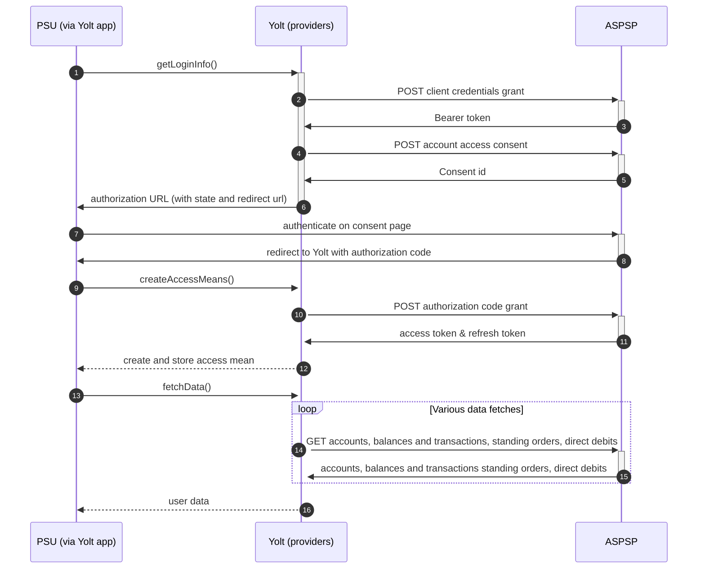

## Danskebank (AIS)
[Current open problems on our end][1]

Danske Bank A/S is a Danish bank. It was founded 5 October 1871 as Den Danske Landmandsbank, 
Hypothek- og Vexelbank i Kjøbenhavn (The Danish Farmers' Bank, Mortgage and Exchange Bank 
of Copenhagen). Headquartered in Copenhagen, it is the largest bank in Denmark and a major 
retail bank in the northern European region with over 5 million retail customers.

## BIP overview 

|                                       |                                                                                                                                                                                                                                                                                                                                |
|---------------------------------------|--------------------------------------------------------------------------------------------------------------------------------------------------------------------------------------------------------------------------------------------------------------------------------------------------------------------------------|
| **Country of origin**                 | Denmark                                                                                                                                                                                                                                                                                                                        | 
| **Site Id**                           | 3651edaa-d36e-48cb-8cc3-94bb1fbe8f76                                                                                                                                                                                                                                                                                           |
| **Standard**                          | [Open Banking Standard][2]                                                                                                                                                                                                                                                                                                     |
| **Contact**                           | Aurelija Mikutaite (Project manager): aumi@danskebank.lt, David Michael Scott	(Project manager / Contact Person): scot@danskebank.co.uk, Audrius Pliksnys: audrius.pliksnys@danskebank.lt, Lauryna Kieriene: lauryna.kieriene@danskebank.lt, Ticketing system: https://openbanking.atlassian.net/servicedesk/customer/portal/1 |
| **Developer Portal**                  | https://developers.danskebank.com/                                                                                                                                                                                                                                                                                             | 
| **Account SubTypes**                  | Current, Savings, Credit Cards                                                                                                                                                                                                                                                                                                 |
| **IP Whitelisting**                   | No                                                                                                                                                                                                                                                                                                                             |
| **AIS Standard version**              | 3.1.6                                                                                                                                                                                                                                                                                                                          |
| **Auto-onboarding**                   | Yes                                                                                                                                                                                                                                                                                                                            |
| **Requires PSU IP address**           | No                                                                                                                                                                                                                                                                                                                             |
| **Type of certificate**               | OBIE (OBWAC, OBSEAL) or OB legacy certificates required                                                                                                                                                                                                                                                                        |
| **Signing algorithms used**           | PS256                                                                                                                                                                                                                                                                                                                          |
| **Mutual TLS Authentication Support** | Yes                                                                                                                                                                                                                                                                                                                            |
| **Repository**                        | https://git.yolt.io/providers/open-banking                                                                                                                                                                                                                                                                                     |

## Links - sandbox

|                           |                                                                                                       |
|---------------------------|-------------------------------------------------------------------------------------------------------|
| **Well-known Endpoint**   | https://sandbox-obp-auth.danskebank.com/sandbox-open-banking/private/.well-known/openid-configuration |
| **Authorization URL**     | https://sandbox-obp-auth.danskebank.com/sandbox-open-banking/private/oauth2/authorize                 |
| **Base URL**              | https://sandbox-obp-api.danskebank.com/sandbox-open-banking/                                          |
| **Registration Endpoint** | https://sandbox-obp-api.danskebank.com/sandbox-open-banking/v1.0/thirdparty/psd2/register             | 
| **Token Endpoint**        | https://sandbox-obp-api.danskebank.com/sandbox-open-banking/private/oauth2/token                      |  

## Links - production 

|                           |                                                                                      |
|---------------------------|--------------------------------------------------------------------------------------|
| **Well-known Endpoint**   | https://obp-api.danskebank.com/open-banking/private/.well-known/openid-configuration |
| **Authorization URL**     | https://obp-auth.danskebank.com/open-banking/private/oauth2/authorize                | 
| **Base URL**              | https://obp-api.danskebank.com/open-banking/v1.1/                                    |
| **Registration Endpoint** | https://obp-api.danskebank.com/open-banking/v1.0/thirdparty/register                 |  
| **Token Endpoint**        | https://obp-api.danskebank.com/open-banking/private/oauth2/token                     |

## Client configuration overview

|                                  |                                                                         |
|----------------------------------|-------------------------------------------------------------------------|
| **Institution id**               | Unique identifier of the financial institution assigned by Open Banking |
| **Client id**                    | Unique identifier received during registration process                  |
| **Software id**                  | TPP's Open Banking software version                                     |  
| **Signing key header id**        | Open Banking signing certificate key id                                 |
| **Transport certificate**        | Open Banking transport certificate                                      |
| **Signing key id**               | Open Banking signing key id                                             |
| **Transport key id**             | Open Banking transport key id                                           |
| **Software statement assertion** | SSA required during dynamic registration - tls_client_auth method       |

## Registration details

Danske supports dynamic registration.
Proper _/register_ endpoint described in [documentation][4]. During this call we have to 
use the same values as for future authentication means (including certificates) and as a result we receive `clientId` 
and `clientSecret`, which are required to perform further steps. 

We are registered with OBWac/OBSeal certificates.

## Multiple Registration

We don't know about any registration limits. There was no situation, when such knowledge was needed, so we will have to
ask about that when there will be such case.

## Connection Overview

Danske bank follows Open Banking standard. It means that flow is similar to other banks. Due to that fact,
Open Banking DTOs are used in implementation, and code relay mostly on our generic Open Banking implementation.

The _getLoginInfo_ method is used to generate login consent for user. First of all we call _token_ endpoint to get Bearer
token. Next _account-access-consents_ endpoint is called to create consent on bank side. Received `consentId` is used to
prepare authorization URL based on _authorize_ endpoint by filling it with necessary parameters. Using this URL, user 
is redirected to login domain to fill his credentials.

In _createAccessMeans_ method `code` is used to call for token. This token will be used to authenticate user
in next calls. In response there is also `refresh_token` returned, because consent is valid for 90 days, and `access_token`
only for 60 minutes. It means that refresh token flow is supported and has to be implemented too. _refreshAccessMeans_
allows to perform this operation. For a given consent, the refresh token is the same, but we always map both tokens to
access means value.

As in other Open Banking banks, Danske also allows for consent removal. It is done by generic code in 
_onUserSiteDelete_ method. Stored earlier `consentId` is used to perform this operation.

The most complex step is data fetching. Danske Group allows to collect information not only about accounts, balances and 
transactions, but also for standing orders and direct debits.

There is no consent window implemented in Danske bank.
**Consent validity rules** are implemented for Danske bank AIS. 

Important information is that this bank support pagination for transactions. It returns both `BOOKED` and
`PENDING` transactions.

Simplified sequence diagram:

   
## Sandbox overview

The Sandbox contains mock data for the purpose of testing API connectivity. The Sandbox interface and authentication 
flows are created to represent the production environment to allow users to progress the development and testing of 
application.
To use sandbox you have to perform similar dynamic registration as for production environment. 
Sandbox is not in use during live-maintenance phase. Due to that fact we don't 
have any further information about it. 

## User Site deletion
There's `onUserSiteDelete` method implemented by this provider, however, only in a best effort manner.

## Business and technical decisions

During implementation we made following business decisions:

Danske `INTERIMAVAILABLE` balance is mapped to `Available Balance`, 
`INTERIMBOOKED` is mapped to `Current Balance` 

**Payment Flow Additional Information**

|                                                                                                        |                             |
|--------------------------------------------------------------------------------------------------------|-----------------------------|
| **When exactly is the payment executed ( executed-on-submit/executed-on-consent)?**                    | execute-on-submit           |
| **it is possible to initiate a payment having no debtor account**                                      | YES                         |
| **At which payment status we can be sure that the money was transferred from the debtor to creditor?** | AcceptedSettlementCompleted |

## External links
* [Current open problems on our end][1]
* [Open Banking Standard][2]
* [Danske Developer portal][3]
* [Danske API documentation][4]

[1]: <https://yolt.atlassian.net/issues/?jql=project%20%3D%20%22C4PO%22%20AND%20component%20%3D%20DANSKEBANK%20AND%20status%20!%3D%20Done%20AND%20Resolution%20%3D%20Unresolved%20ORDER%20BY%20status>
[2]: <https://standards.openbanking.org.uk/>
[3]: <https://developers.danskebank.com/>
[4]: <https://developers.danskebank.com/documentation>