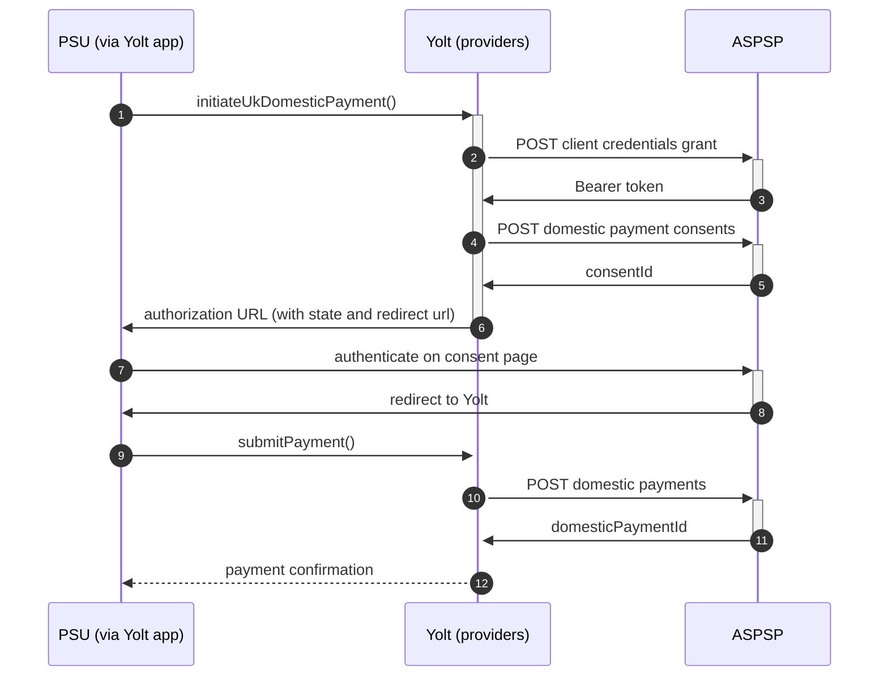

## Danskebank (PIS)

[Current open problems on our end][1]

Danske Bank A/S is a Danish bank. It was founded 5 October 1871 as Den Danske Landmandsbank, Hypothek- og Vexelbank i
Kjøbenhavn (The Danish Farmers' Bank, Mortgage and Exchange Bank of Copenhagen). Headquartered in Copenhagen, it is the
largest bank in Denmark and a major retail bank in the northern European region with over 5 million retail customers.

## BIP overview

|                                       |                                                                                                                                                                                                                                                                                                                                   |
|---------------------------------------|-----------------------------------------------------------------------------------------------------------------------------------------------------------------------------------------------------------------------------------------------------------------------------------------------------------------------------------|
| **Country of origin**                 | Denmark                                                                                                                                                                                                                                                                                                                           | 
| **Site Id**                           | 3651edaa-d36e-48cb-8cc3-94bb1fbe8f76                                                                                                                                                                                                                                                                                              |
| **Standard**                          | [Open Banking Standard][2]                                                                                                                                                                                                                                                                                                        |
| **Contact**                           | Aurelija Mikutaite (Project manager): aumi@danskebank.lt, David Michael Scott    (Project manager / Contact Person): scot@danskebank.co.uk, Audrius Pliksnys: audrius.pliksnys@danskebank.lt, Lauryna Kieriene: lauryna.kieriene@danskebank.lt, Ticketing system: https://openbanking.atlassian.net/servicedesk/customer/portal/1 |
| **Developer Portal**                  | https://developers.danskebank.com/                                                                                                                                                                                                                                                                                                | 
| **IP Whitelisting**                   | No                                                                                                                                                                                                                                                                                                                                |
| **PIS Standard version**              | 3.1.8                                                                                                                                                                                                                                                                                                                             |
| **Auto-onboarding**                   | Yes                                                                                                                                                                                                                                                                                                                               |
| **Requires PSU IP address**           | No                                                                                                                                                                                                                                                                                                                                |
| **Type of certificate**               | OBIE (OBWAC, OBSEAL) or OB legacy certificates required                                                                                                                                                                                                                                                                           |
| **Signing algorithms used**           | PS256                                                                                                                                                                                                                                                                                                                             |
| **Mutual TLS Authentication Support** | Yes                                                                                                                                                                                                                                                                                                                               |
| **Repository**                        | https://git.yolt.io/providers/open-banking                                                                                                                                                                                                                                                                                        |

## Links - sandbox

|                           |                                                                                                       |
|---------------------------|-------------------------------------------------------------------------------------------------------|
| **Well-known Endpoint**   | https://sandbox-obp-auth.danskebank.com/sandbox-open-banking/private/.well-known/openid-configuration |
| **Authorization URL**     | https://sandbox-obp-auth.danskebank.com/sandbox-open-banking/private/oauth2/authorize                 |
| **Base URL**              | https://sandbox-obp-api.danskebank.com/sandbox-open-banking/                                          |
| **Registration Endpoint** | https://sandbox-obp-api.danskebank.com/sandbox-open-banking/v1.0/thirdparty/psd2/register             | 
| **Token Endpoint**        | https://sandbox-obp-api.danskebank.com/sandbox-open-banking/private/oauth2/token                      |  

## Links - production

|                           |                                                                                      |
|---------------------------|--------------------------------------------------------------------------------------|
| **Well-known Endpoint**   | https://obp-api.danskebank.com/open-banking/private/.well-known/openid-configuration |
| **Authorization URL**     | https://obp-auth.danskebank.com/open-banking/private/oauth2/authorize                | 
| **Base URL**              | https://obp-api.danskebank.com/open-banking/v1.1/                                    |
| **Registration Endpoint** | https://obp-api.danskebank.com/open-banking/v1.0/thirdparty/register                 |  
| **Token Endpoint**        | https://obp-api.danskebank.com/open-banking/private/oauth2/token                     |

## Client configuration overview

|                                  |                                                                         |
|----------------------------------|-------------------------------------------------------------------------|
| **Institution id**               | Unique identifier of the financial institution assigned by Open Banking |
| **Client id**                    | Unique identifier received during registration process                  |
| **Software id**                  | TPP's Open Banking software version                                     |  
| **Signing key header id**        | Open Banking signing certificate key id                                 |
| **Transport certificate**        | Open Banking transport certificate                                      |
| **Signing key id**               | Open Banking signing key id                                             |
| **Transport key id**             | Open Banking transport key id                                           |
| **Software statement assertion** | SSA required during dynamic registration - tls_client_auth method       |
| **Organization id**              | TPP's organization id used in signature calculation                     |

## Registration details

Danske supports dynamic registration. Proper _/register_ endpoint described in [documentation][4].

## Multiple Registration

We don't know about any registration limits. There was no situation, when such knowledge was needed, so we will have to
ask about that when there will be such case.

## Connection Overview

Simplified sequence diagram:

**Consent validity rules**

Danske requires endToEndIdentification to be maximum 31-chars-long. The generic request in our consent-testing mechanism uses 35-chars-long one. Because of that, Danske is blacklisted.

## Sandbox overview

According to the documentation, there is a sandbox environment with the Payment Initiation Service, but it hasn't been
tested by us, as we do not have proper certificates we could use on our local machines.

## Business and technical decisions

During implementation we made following business decisions:

`RemittanceInformation.reference` is not required, but we still have so called `DynamicField` for that which is
optional.

02.03.2022 Due to agreements with yts-core it was decided that we want to treat payment as completed once money has been
deducted from debtor account. According to OB documentation `AcceptedSettlementCompleted` is proper status. For
reference see https://yolt.atlassian.net/browse/C4PO-9754

**Payment Flow Additional Information**

|                                                                                                        |                             |
|--------------------------------------------------------------------------------------------------------|-----------------------------|
| **When exactly is the payment executed ( executed-on-submit/executed-on-consent)?**                    | execute-on-submit           |
| **it is possible to initiate a payment having no debtor account**                                      | YES                         |
| **At which payment status we can be sure that the money was transferred from the debtor to creditor?** | AcceptedSettlementCompleted |

## External links

* [Current open problems on our end][1]
* [Open Banking Standard][2]
* [Danske Developer portal][3]
* [Danske API documentation][4]

[1]: <https://yolt.atlassian.net/issues/?jql=project%20%3D%20%22C4PO%22%20AND%20component%20%3D%20DANSKEBANK%20AND%20status%20!%3D%20Done%20AND%20Resolution%20%3D%20Unresolved%20ORDER%20BY%20status>

[2]: <https://standards.openbanking.org.uk/>

[3]: <https://developers.danskebank.com/>

[4]: <https://developers.danskebank.com/documentation>
