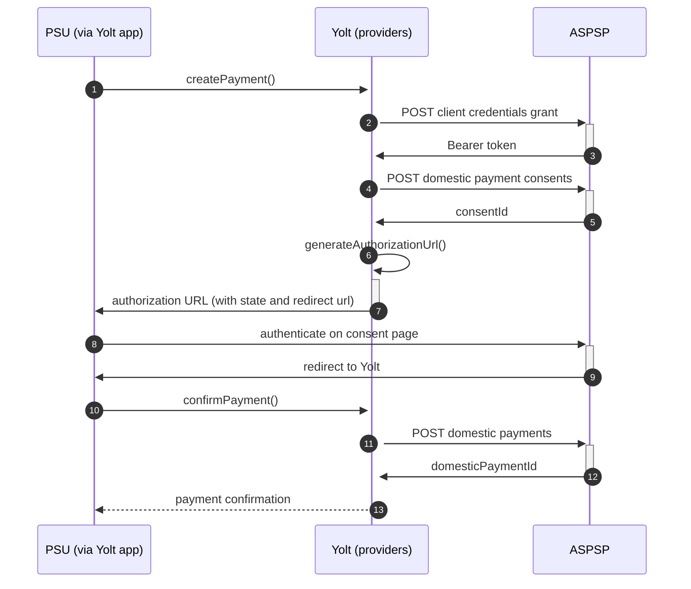

## First Direct (PIS)
[Current open problems on our end][1]

First Direct is a telephone and internet based retail bank division of HSBC Bank based in the United Kingdom. First Direct 
has headquarters in Leeds, England, and has 1.45 million customers.

## BIP overview 

|                                       |                                                                                                                                                                                       |
|---------------------------------------|---------------------------------------------------------------------------------------------------------------------------------------------------------------------------------------|
| **Country of origin**                 | United Kingdom                                                                                                                                                                        | 
| **Site Id**                           | dda2651f-9518-409b-9b5e-6e0d1ccd0112                                                                                                                                                  |
| **Standard**                          | [Open Banking Standard][2]                                                                                                                                                            |
| **Contact**                           | E-mail: Openbankingsupport@hsbc.com Ticketing system: https://openbanking.atlassian.net/servicedesk/customer/portal/1 |
| **Developer Portal**                  | https://developer.hsbc.com/#/apiCatalogue                                                                                                                                             | 
| **Account SubTypes**                  | Current, Savings, Credit Cards                                                                                                                                                        |
| **IP Whitelisting**                   | No                                                                                                                                                                                    |
| **PISP Standard version**             | 3.1.6                                                                                                                                                                                 |
| **Auto-onboarding**                   | Yes                                                                                                                                                                                   |
| **Requires PSU IP address**           | No                                                                                                                                                                                    |
| **Type of certificate**               | eIDAS (QWAC, QSEAL) or Open Banking (OBWAC, OBSEAL) certificates required                                                                                                             |
| **Signing algorithms used**           | PS256                                                                                                                                                                                 |
| **Mutual TLS Authentication Support** | Yes                                                                                                                                                                                   |
| **Repository**                        | https://git.yolt.io/providers/open-banking                                                                                                                                            |

## Links - sandbox

|                       |                                                         |
|-----------------------|---------------------------------------------------------|
| **Base URL**          | http://sandbox.hsbc.com/psd2/obie                       |
| **Authorization URL** | https://sandbox.hsbc.com/psd2/obie/v3.1/authorize       | 
| **Token Endpoint**    | https://sandbox.hsbc.com/psd2/obie/v3.1/as/token.oauth2 |  

## Links - production 

|                           |                                                                       |
|---------------------------|-----------------------------------------------------------------------|
| **Base URL**              | https://api.ob.firstdirect.com/obie/open-banking                      |
| **Authorization URL**     | https://ob.firstdirect.com/obie/open-banking/v1.1/oauth2/authorize    | 
| **Token Endpoint**        | https://api.ob.firstdirect.com/obie/open-banking/v1.1/oauth2/token    |
| **Registration Endpoint** | https://api.ob.firstdirect.com/obie/open-banking/v3.2/oauth2/register |  

## Client configuration overview

|                                   |                                                        |
|-----------------------------------|--------------------------------------------------------|
| **Client id**                     | Unique identifier received during registration process | 
| **Institution id**                | Unique identifier of the bank assigned by Open Banking |
| **Software Statement Assertion**  | TPP's Open Banking Software Statement Assertion        |
| **Software id**                   | TPP's Open Banking software version                    |
| **Private signing key header id** | Open Banking signing certificate key id                |
| **Signing key id**                | OBSEAL key id                                          |
| **Transport key id**              | OBWAC key id                                           |
| **Transport certificate**         | OBWAC certificate                                      |

## Registration details

HSBC group requires dynamic registration to be performed before TPP will be able to use their PSD2 API. It can be done
by calling proper _/register_ endpoint. As a result we receive `clientId`, which is required to perform further steps. This process was
implemented as auto-onboarding mechanism based on [documentation][3] sent us via email.
For banks registered in United Kingdom Open Banking certificates are required, but for other TPPs also eIDAS certificates
are allowed.
All banks in group support only `private_key_jwt`as authentication method.
Additionally there we are not subscribed to any particular API version. It means that we have access to all _v3.1_ versions
and it depends on bank, which version is used right now. Thanks that we don't have to remember to switch when new version
is released.
For Business and Retail accounts in HSBC there are two separate registrations required.

## Multiple Registration

We don't know about any registration limits. There was no situation, when such knowledge was needed, so we will have to
ask about that when there will be such case.

## Connection Overview

All banks in HSBC group follows Open Banking standard. It means that flow is similar to other banks. Due to that fact,
Open Banking DTOs are used in implementation, and code relay mostly on our generic Open Banking implementation.

The _createPayment_ method is used to create payment on bank's side. Thanks that we are sure that payment data are compliant
with requirements and standards. First of all we call _token_ endpoint with `payments` scope to get required Bearer token.
Next, payment is created (as request body) based on user's data and all information is sent to the bank to create payment.
As a result we receive `consentId` which is required in next step.

The _generateAuthorizationUrl_ method is used to generate login consent for user. Using `consentId` authorization URL is
prepared based on _authorize_ endpoint by filling it with necessary parameters. Using this URL, user is redirected to 
login domain to fill his credentials and confirm payment.

In _confirmPayment_ method allows to confirm payment. Using the `consentId` with the same token and values at during first 
call request body is prepared. After the call, from the bank `domesticPaymentId` is returned.

Simplified sequence diagram:

**Consent validity rules**

First Direct PIS consent page is an SPA, thus we are unable to determine consent validity rules for PIS.
   
## Sandbox overview

The Sandbox contains mock data for the purpose of testing API connectivity. The Sandbox interface and authentication 
flows are created to represent the production environment to allow users to progress the development and testing of 
application.
Everyone can access the sandbox using certificates generated on bank's developer portal. For all banks in group
there is the same sandbox, but it wasn't used during implementation process, so we don't have any further information 
about it. 
  
## Business and technical decisions

During implementation we made following business decisions:

Bank requires `SortCodeAccountNumber` value to be in camel case format. We prepared mapper to convert value used in our 
model to value which is compliant with documentation.

For this bank `Reference` field in `RemittanceInformation` is required. What is more it has to be identifier with
maximum length of 18 characters and only following characters are allowed: `a-z A-Z 0-9 / . , - : ? , + ( ) / &`. Due to
the fact that request from the app has only `Unstructured` field filled, we decided to use this value as `Reference`. We
are not allowed to change any data, so we accept that if user uses wrong data, payments will be rejected.

For ukDomesticPayment provider we map straightforward `Reference` to `RemittanceInformation.Reference`
and `Unstructured` to `RemittanceInformation.Unstructured`.

HSBC group has specific _Signature_ header requirements. `http://openbanking.org.uk/iss` claim value has to be filled
with some certificate identity information. Due to that fact dedicated `HsbcGroupCertificateIdentityExtractor` was
implemented and used in custom payload signer implementation.

According to documentation First Direct is using only AcceptedSettlementCompleted, AcceptedSettlementInProcess, Pending,
Rejected payment statuses. It was decided to map AcceptedSettlementCompleted into Completed, even that OB standard
documentation specifies AcceptedCreditSettlementCompleted as a final one.

02.03.2022 Due to agreements with yts-core it was decided that we want to treat payment as completed once money has been
deducted from debtor account. According to OB documentation `AcceptedSettlementCompleted` is proper status. For
reference see https://yolt.atlassian.net/browse/C4PO-9754

**Payment Flow Additional Information**

|                                                                                                        |                             |
|--------------------------------------------------------------------------------------------------------|-----------------------------|
| **When exactly is the payment executed ( executed-on-submit/executed-on-consent)?**                    | execute-on-submit           |
| **it is possible to initiate a payment having no debtor account**                                      | YES                         |
| **At which payment status we can be sure that the money was transferred from the debtor to creditor?** | AcceptedSettlementCompleted |

## External links
* [Current open problems on our end][1]
* [Open Banking Standard][2]

[1]: <https://yolt.atlassian.net/issues/?jql=project%20%3D%20%22C4PO%22%20AND%20component%20%3D%20FIRST_DIRECT%20AND%20status%20!%3D%20Done%20AND%20Resolution%20%3D%20Unresolved%20ORDER%20BY%20status>
[2]: <https://standards.openbanking.org.uk/>
[3]: <https://developer.hsbc.com/assets/docs/HSBC%20Open%20Banking%20TPP%20Implementation%20Guide%20(v3.1).pdf>