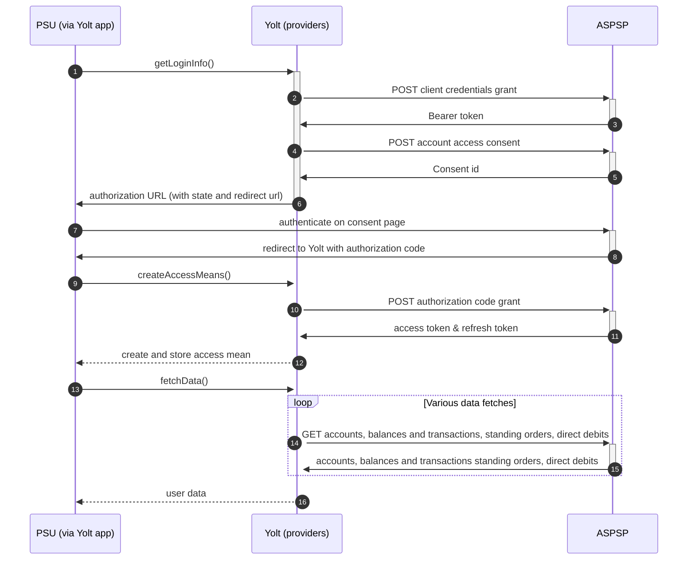

## Marks and Spencer (AIS)
[Current open problems on our end][1]

Marks & Spencer, trading as M&S Bank, is a retail bank operating in the United Kingdom. It was formed as the financial 
services division of the British retailer Marks & Spencer Group (M&S) in 1985, and has been operated by HSBC Bank since 
it was sold in 2004.

## BIP overview 

|                                       |                                                                                                                                                                                      |
|---------------------------------------|--------------------------------------------------------------------------------------------------------------------------------------------------------------------------------------|
| **Country of origin**                 | United Kingdom                                                                                                                                                                       | 
| **Site Id**                           | 8e96ad29-fd1c-40cb-b28f-826b022f2763                                                                                                                                                 |
| **Standard**                          | [Open Banking Standard][2]                                                                                                                                                           |
| **Contact**                           | E-mail: Openbankingsupport@hsbc.com Ticketing system: https://openbanking.atlassian.net/servicedesk/customer/portal/1 |
| **Developer Portal**                  | https://developer.hsbc.com/#/apiCatalogue                                                                                                                                            | 
| **Account SubTypes**                  | Current, Savings, Credit Cards                                                                                                                                                       |
| **IP Whitelisting**                   | No                                                                                                                                                                                   |
| **AIS Standard version**              | 3.1.6                                                                                                                                                                                |
| **Auto-onboarding**                   | Yes                                                                                                                                                                                  |
| **Requires PSU IP address**           | No                                                                                                                                                                                   |
| **Type of certificate**               | eIDAS (QWAC, QSEAL) or Open Banking (OBWAC, OBSEAL) certificates required                                                                                                            |
| **Signing algorithms used**           | PS256                                                                                                                                                                                |
| **Mutual TLS Authentication Support** | Yes                                                                                                                                                                                  |
| **Repository**                        | https://git.yolt.io/providers/open-banking                                                                                                                                           |

## Links - sandbox

|                       |                                                         |
|-----------------------|---------------------------------------------------------|
| **Base URL**          | http://sandbox.hsbc.com/psd2/obie                       |
| **Authorization URL** | https://sandbox.hsbc.com/psd2/obie/v3.1/authorize       | 
| **Token Endpoint**    | https://sandbox.hsbc.com/psd2/obie/v3.1/as/token.oauth2 |  

## Links - production 

|                           |                                                                     |
|---------------------------|---------------------------------------------------------------------|
| **Base URL**              | https://api.ob.mandsbank.com/obie/open-banking                      |
| **Authorization URL**     | https://ob.mandsbank.com/obie/open-banking/v1.1/oauth2/authorize    | 
| **Token Endpoint**        | https://api.ob.mandsbank.com/obie/open-banking/v1.1/oauth2/token    |
| **Registration Endpoint** | https://api.ob.mandsbank.com/obie/open-banking/v3.2/oauth2/register |  

## Client configuration overview

|                                   |                                                        |
|-----------------------------------|--------------------------------------------------------|
| **Client id**                     | Unique identifier received during registration process | 
| **Institution id**                | Unique identifier of the bank assigned by Open Banking |
| **Software Statement Assertion**  | TPP's Open Banking Software Statement Assertion        |
| **Software id**                   | TPP's Open Banking software version                    |
| **Private signing key header id** | Open Banking signing certificate key id                |
| **Signing key id**                | OBSEAL key id                                          |
| **Transport key id**              | OBWAC key id                                           |
| **Transport certificate**         | OBWAC certificate                                      |

## Registration details

HSBC group requires dynamic registration to be performed before TPP will be able to use their PSD2 API. It can be done
by calling proper _/register_ endpoint. As a result we receive `clientId`, which is required to perform further steps. This process was
implemented as auto-onboarding mechanism based on [documentation][3] sent us via email.
For banks registered in United Kingdom Open Banking certificates are required, but for other TPPs also eIDAS certificates
are allowed.
All banks in group support only `private_key_jwt` as authentication method.
Additionally there we are not subscribed to any particular API version. It means that we have access to all _v3.1_ versions
and it depends on bank, which version is used right now. Thanks that we don't have to remember to switch when new version
is released.
For Business and Retail accounts in HSBC there are two separate registrations required.

## Multiple Registration

We don't know about any registration limits. There was no situation, when such knowledge was needed, so we will have to
ask about that when there will be such case.

## User Site deletion
There's `onUserSiteDelete` method implemented by this provider, however, only in a best effort manner.

## Connection Overview

All banks in HSBC group follows Open Banking standard. It means that flow is similar to other banks. Due to that fact,
Open Banking DTOs are used in implementation, and code relay mostly on our generic Open Banking implementation.

The _getLoginInfo_ method is used to generate login consent for user. First of all we call _token_ endpoint to get Bearer
token. Next _account-access-consents_ endpoint is called to create consent on bank side. Received `consentId` is used to
prepare authorization URL based on _authorize_ endpoint by filling it with necessary parameters. Using this URL, user 
is redirected to login domain to fill his credentials.

In _createAccessMeans_ method `code` is used to call for token. This token will be used to authenticate user
in next calls. In response there is also `refresh_token` returned, because consent is valid for 90 days, and `access_token` 
only for 5 minutes. It means that refresh token flow is supported and has to be implemented too. _refreshAccessMeans_
allows to perform this operation. For a given consent, the refresh token is the same, but we always map both tokens to
access means value.

As in other Open Banking banks, HSBC group also allows for consent removal. It is done by generic code in _onUserSiteDelete_
method. Stored earlier `consentId` is used to perform this operation.

The most complex step is data fetching. HSBC group allows to collect information not only about accounts, balances and 
transactions, but also for direct debits and standing orders. The most important thing is that for Credit 
Cards those additional information are not collected. What is more in HSBC group standing orders and direct debits are
are turned off for Savings.
In all banks consent window is implemented. Due to that fact we limit max transaction fetch data time to 89 days when
endpoint is called after 5 minutes from consent step.
**Consent validity rules** are implemented for M&S AIS.
Important information is that this bank support pagination for transactions. It returns both `BOOKED` and
`PENDING` transactions.

Simplified sequence diagram:

   
## Sandbox overview

The Sandbox contains mock data for the purpose of testing API connectivity. The Sandbox interface and authentication 
flows are created to represent the production environment to allow users to progress the development and testing of 
application.
Everyone can access the sandbox using certificates generated on bank's developer portal. For all banks in group
there is the same sandbox, but it wasn't used during implementation process, so we don't have any further information 
about it. 
  
## Business and technical decisions

During implementation we made following business decisions:

HSBC bank support only `INTERIMBOOKED` and `INTERIMAVAILABLE` balances. First one is mapped for Current balance, second 
one for Available balance.

During implementation we found that some Credit Cards accounts are identified by PAN instead of IBAN. Due to that fact
to avoid duplications (because of the fact that Yolt can't map PAN identifiers so `accountId` is missing), we decided to
use `Identification` field value directly. 

To be compliant with FAPI requirements and HSBC group documentation we decided to remove `b64` claim from JWT used for
user's authorization. It means that payload is encoded in Base64 before signing.

According to information from bank "HSBC group has extended the validity period for AIS access tokens from 5 minutes to 60 minutes" We changed the consent window duration to 60 minutes.
  
## External links
* [Current open problems on our end][1]
* [Open Banking Standard][2]

[1]: <https://yolt.atlassian.net/issues/?jql=project%20%3D%20%22C4PO%22%20AND%20component%20%3D%20MARKS_AND_SPENCER%20AND%20status%20!%3D%20Done%20AND%20Resolution%20%3D%20Unresolved%20ORDER%20BY%20status>
[2]: <https://standards.openbanking.org.uk/>
[3]: <https://developer.hsbc.com/assets/docs/HSBC%20Open%20Banking%20TPP%20Implementation%20Guide%20(v3.1).pdf>