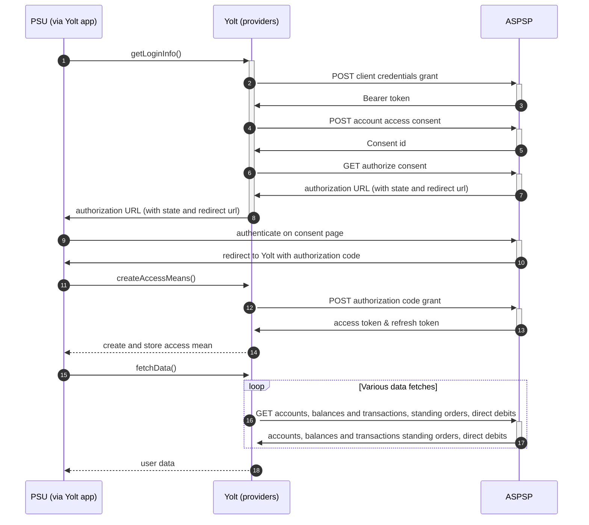

## KBC IE (AIS)

## BIP

|                                       |                                                        |
|---------------------------------------|--------------------------------------------------------|
| **Country of origin**                 | IE                                                     | 
| **Site Id**                           | 65b20bd5-b898-4b68-b401-6fb11e9ab8a1                   |
| **Standard**                          | OpenBanking                                            |
| **Contact**                           | E-mail: apidevelopersupport@kbc.ie                     |
| **Developer Portal**                  | https://www.kbc.ie/psd2-developer-portal               |
| **Account SubTypes**                  | Current, Credits , for Business Accounts CURRENT ONLY! |
| **IP Whitelisting**                   | NO                                                     |
| **AIS Standard version**              | 1.0 (bases on OB v.3.1)                                |
| **PISP Standard version**             | 1.0 (bases on OB v.3.1)                                |
| **Auto Onboarding**                   | yes                                                    |
| **Requires PSU IP address**           | yes                                                    |
| **Type of certificate**               | eIDAS qwac/qseal                                       |
| **Signing algorithms used**           | RS256                                                  |
| **Mutual TLS Authentication Support** | yes                                                    |
| **Repository**                        | https://git.yolt.io/providers/open-banking             |

## Links - sandbox

|                         |                                                                                                  |
|-------------------------|--------------------------------------------------------------------------------------------------|
| **Well-known endpoint** | kbc.openbankingapitesting.com:8582/openid-connect-server-webapp/.well-known/openid-configuration |
| **Base URL**            | kbc.openbankingapitesting.com                                                                    | 

## Links - production

|                         |                                                                   |
|-------------------------|-------------------------------------------------------------------|
| **Well-known endpoint** | ie.openapi.kbc-group.com/psd2-ie/.well-known/openid-configuration | 
| **Base URL**            | openapi.ie.kbc-group.com/psd2-ie/open-banking/v1.0/aisp           | 

# Client configuration overview

|                             |                                                                                                                |
|-----------------------------|----------------------------------------------------------------------------------------------------------------|
| **Client id**               | Unique identifier received during registration process                                                         |
| **Client secret**           | Unique secret received during registration process                                                             |
| **JWKS Endpoint URL**       | Public URL of JWKS containing transport certificate used                                                       |
| **Institution id**          | Unique identifier of the bank                                                                                  |
| **Software id**             | Unique identifier of the TPP                                                                                   |
| **Client name**             | USer friendly name of the client. This will be displayed to the KBC customer in the consent authorization flow |
| **Client description**      | A short description of a client                                                                                |
| **Signing certificate**     | QSEAL certificate                                                                                              |
| **Signing key id**          | QSEAL key id from HSM                                                                                          |
| **Transport key id**        | QWAC key id from HSM                                                                                           |
| **Transport certificate**   | QWAC certificate                                                                                               |
| **Business contact name**   | Name of the business contact person, which has to be used during onboarding process                            |
| **Business contact email**  | Email of the business contact person, which has to be used during onboarding process                           |
| **Business contact phone**  | Phone number of the business contact person, which has to be used during onboarding process                    |
| **Technical contact name**  | Name of the technical contact person, which has to be used during onboarding process                           |
| **Technical contact email** | Email of the technical contact person, which has to be used during onboarding process                          |
| **Technical contact phone** | Phone number of the technical contact person, which has to be used during onboarding process                   |

## Registration details

KBC IE requires dynamic registration to be performed before TPP will be able to use their PSD2 API. It can be done by
calling proper _/register_ endpoint. As a result we receive `clientId` and `clientSecret`, which are required to perform
further steps. This process was implemented as auto-onboarding mechanism based on [documentation][2] available on bank's
developer portal. We have to remember that Ireland is not in the United Kingdom, so eIDAS certificates are required to
perform registration. The bank supports `client_secret_post` as authentication method. During registration process we
are not subscribed to any particular API version. It means that we have access to all _v1.0_ versions, so it depends on
bank, which version is used right now. Thanks that we don't have to remember to switch when new version is released.
Most important thing is that registration endpoint in this bank has different specification than other open-banking
providers.

## Multiple Registration

We don't know about any registration limits. There was no situation, when such knowledge was needed, so we will have to
ask about that when there will be such case.

## Connection Overview

KBC IE follows Open Banking standard. It means that flow is similar to other banks. Due to that fact, Open Banking DTOs
are used in implementation, and code relay mostly on our generic Open Banking implementation.

The _getLoginInfo_ method is used to generate login consent for user. At the beginning we call _token_ endpoint to get
Bearer token. Next _account-access-consents_ endpoint is called to create consent on bank side. Received `consentId` is
used during the call to authorize consent endpoint (_auth-code-url_). This endpoint is responsible for creating the
authorization URL based on _authorize_ endpoint and necessary parameters. Using this URL, user is redirected to the
login domain to fill his credentials.

In _createAccessMeans_ method `code` is used to call for token. This token will be used to authenticate user in next
calls. In response there is no `refresh_token` returned, because both consent access token are valid for 90 days. It
means that refresh token flow is not supported and doesn't have to be implemented. On _refreshAccessMeans_
step only `TokenInvalidException` is thrown to force user to perform authorization process from the beginning.

As in other Open Banking banks, KBC IE also allows for consent removal. It is done by generic code in _onUserSiteDelete_
method. Stored earlier `consentId` is used to perform this operation.

The most complex step is data fetching. KBC IE allows for getting information not only about accounts, balances and
transactions, but also for direct debits and standing orders. The most important thing is that for Credit
Cards those additional information are not collected. Consent window is not implemented. There is also no limit on
maximum transaction fetch data time. Important information is that this bank support pagination for transactions. It
returns both `BOOKED` and
`PENDING` transactions. simplified sequence diagram:

## Sandbox overview

The Sandbox contains mock data for the purpose of testing API connectivity. The Sandbox interface and authentication
flows are created to represent the production environment to allow users to progress the development and testing of
application. Everyone can access the sandbox. You need to perform request with csr's for signing and transport and you
will receive crt's which should be used to interacting with sandbox. Sandbox wasn't used during implementation process,
so we don't have any further information about it.

## Business and technical decisions

## External links

* [Current open problems on our end][1]
* [Autoonboarding documentation] [2]

[1]: <https://yolt.atlassian.net/issues/?jql=project%20%3D%20%22C4PO%22%20AND%20component%20%3D%20%20AND%20status%20!%3D%20Done%20AND%20Resolution%20%3D%20Unresolved%20ORDER%20BY%20status%20%3D%20KBC%20IE>

[2]: <https://www.kbc.ie/psd2-developer-portal/apis/dynamic-registration>
