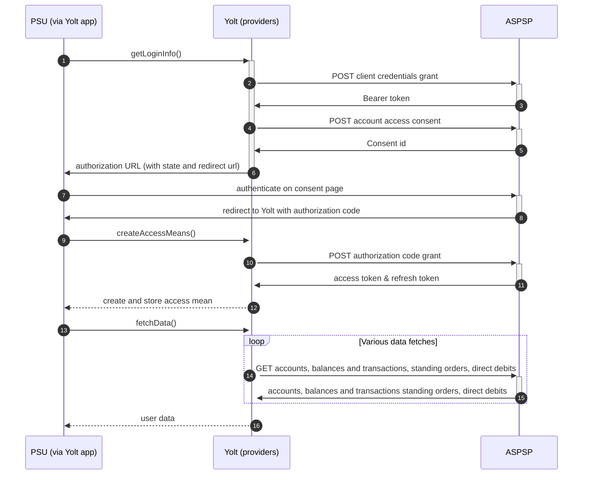

## Lloyds (AIS)
[Current open problems on our end][1]

Lloyds Bank is a British retail and commercial bank with branches across England and Wales. It has traditionally been 
considered one of the "Big Four" clearing banks. The bank was founded in Birmingham in 1765. It expanded during the 
nineteenth and twentieth centuries and took over a number of smaller banking companies. In 1995 it merged with the 
Trustee Savings Bank and traded as Lloyds TSB Bank plc between 1999 and 2013. It has its operational headquarters in 
London and other offices in Wales and Scotland. It also operates a number of office complex, brand headquarters and data 
centres in Yorkshire including Leeds, Sheffield and Halifax.

## BIP overview 

|                                       |                                                                                                                                                                                                                      |
|---------------------------------------|----------------------------------------------------------------------------------------------------------------------------------------------------------------------------------------------------------------------|
| **Country of origin**                 | United Kingdom                                                                                                                                                                                                       | 
| **Site Id**                           | 36130c5f-9024-4a89-91fc-be31fac2f9ec                                                                                                                                                                                 |
| **Standard**                          | [Open Banking Standard][2]                                                                                                                                                                                           |
| **Contact**                           | E-mail: OBResponseteam@lloydsbanking.com Ticketing system: https://openbanking.atlassian.net/servicedesk/customer/portal/1 |
| **Developer Portal**                  | https://developer.lloydsbanking.com/                                                                                                                                                                                 | 
| **Account SubTypes**                  | Current, Savings, Credit Cards                                                                                                                                                                                       |
| **IP Whitelisting**                   | No                                                                                                                                                                                                                   |
| **AIS Standard version**              | 3.1.6                                                                                                                                                                                                                |
| **Auto-onboarding**                   | No                                                                                                                                                                                                                   |
| **Requires PSU IP address**           | No                                                                                                                                                                                                                   |
| **Type of certificate**               | OBIE (OBWAC, OBSEAL) or OB legacy certificates required                                                                                                                                                              |
| **Signing algorithms used**           | PS256                                                                                                                                                                                                                |
| **Mutual TLS Authentication Support** | Yes                                                                                                                                                                                                                  |
| **Repository**                        | https://git.yolt.io/providers/open-banking                                                                                                                                                                           |

## Links - sandbox

|                       |                                                                      |
|-----------------------|----------------------------------------------------------------------|
| **Base URL**          | https://matls.rs.aspsp.sandbox.lloydsbanking.com/openbanking         |
| **Authorization URL** | https://as.aspsp.sandbox.lloydsbanking.com/oauth2/authorize          | 
| **Token Endpoint**    | https://matls.as.aspsp.sandbox.lloydsbanking.com/oauth2/access_token |  

## Links - production 

|                           |                                                                                                      |
|---------------------------|------------------------------------------------------------------------------------------------------|
| **Well-known Endpoint**   | https://authorise-api.lloydsbank.co.uk/prod01/channel/lyds/personal/.well-known/openid-configuration |
| **Base URL**              | https://secure-api.lloydsbank.com/prod01/lbg/lyds/open-banking                                       |
| **Authorization URL**     | https://authorise-api.lloydsbank.co.uk/prod01/lbg/lyds/personal/oidc-api/v1.1/authorize              | 
| **Token Endpoint**        | https://secure-api.lloydsbank.com/prod01/lbg/lyds/mtls-token-api/v1.1/token                          |
| **Registration Endpoint** | https://secure-api.lloydsbank.com/prod01/lbg/dcr-api/v1.0/register                                   |  

## Client configuration overview

|                           |                                                                         |
|---------------------------|-------------------------------------------------------------------------|
| **Institution id**        | Unique identifier of the financial institution assigned by Open Banking |
| **Client id**             | Unique identifier received during registration process                  |
| **Signing key header id** | Open Banking signing certificate key id                                 |
| **Transport certificate** | Open Banking transport certificate                                      |
| **Signing key id**        | Open Banking signing key id                                             |
| **Transport key id**      | Open Banking transport key id                                           |

AIS and PIS for all banks in Lloyds Banking Group are registered on different SSAs and certificates, so client configuration
for those scopes are different.

## Registration details

Lloyds Group has two different possible registration types. Dynamic and manual registrations. First one can be done by 
proper _/register_ endpoint described in [documentation][3]. During this call we have to 
use the same values as for future authentication means (including certificates) and as a result we receive `clientId`,
which is required to perform further steps. Due to the fact that our auto-onboarding logic wasn't 
ready when this bank was connected this process wasn't implemented as auto-onboarding.

We are registered manually on bank's developer portal. To login you have to use your Open Banking account. There you can 
create proper application with public certificates. As a result you will receive `clientId` which
will be used in `client_credentials_grant` authentication method. 

Additionally there we are not subscribed to any particular API version. It means that we have access to all _v3.1_ versions
and it depends on bank, which version is used right now. Thanks that we don't have to remember to switch when new version
is released.
Business and Retail accounts are available on the same registration, but different authorization endpoints
will be used during consent step.

We are registered with OBWac/OBSeal certificates.

## Multiple Registration

We don't know about any registration limits. There was no situation, when such knowledge was needed, so we will have to
ask about that when there will be such case.

## Connection Overview

All banks in Lloyds Group follow Open Banking standard. It means that flow is similar to other banks. Due to that fact,
Open Banking DTOs are used in implementation, and code relay mostly on our generic Open Banking implementation.

The _getLoginInfo_ method is used to generate login consent for user. First of all we call _token_ endpoint to get Bearer
token. Next _account-access-consents_ endpoint is called to create consent on bank side. Received `consentId` is used to
prepare authorization URL based on _authorize_ endpoint by filling it with necessary parameters. Using this URL, user 
is redirected to login domain to fill his credentials.

In _createAccessMeans_ method `code` is used to call for token. This token will be used to authenticate user
in next calls. In response there is no `refresh_token` returned, because banks don't support this grant type. Consent 
and access token are valid for 90 days. It means that _refreshAccessMeans_ method returns `TokenInvalidException` to force
users to perform relogin when connection is expired.

As in other Open Banking banks, Lloyds Banking Group also allows for consent removal. It is done by generic code in 
_onUserSiteDelete_ method. Stored earlier `consentId` is used to perform this operation.

The most complex step is data fetching. Lloyds Group allows to collect information not only about accounts, balances and 
transactions, but also for standing orders and direct debits. The most important thing is that for Credit 
Cards those additional information are not collected.

There is consent window implemented and its value is 45 minutes. 
**Consent validity rules** are implemented for Lloyds AIS.

Important information is that this bank support pagination for transactions. It returns both `BOOKED` and
`PENDING` transactions.

Simplified sequence diagram:

   
## Sandbox overview

The Sandbox contains mock data for the purpose of testing API connectivity. The Sandbox interface and authentication 
flows are created to represent the production environment to allow users to progress the development and testing of 
application.
To use sandbox you have to perform similar manual registration as for production environment. To do this you have to login
using Open Banking account. During implementation process we didn't use the sandbox. Due to that fact we don't 
have any further information about it. 

## User Site deletion
There's `onUserSiteDelete` method implemented by this provider, however, only in a best effort manner.

## Business and technical decisions

During implementation we made following business decisions:

Lloyds supports two balance types: `INTERIMBOOKED` and `INTERIMAVAILABLE`. First one is used as Current balance and
second one as Available balance. For credit cards there are the same types, so no additional logic was required.

Due to the fact that `accountId` returned by the bank is not immutable, we prepared fix. In such case `accountIdentification`
is used instead.

Transaction amount is sent in UK format, so proper logic was implemented for this mapping.

Format of `transactionsFetchStartTime` used on fetch data step is different that generic one. We have to convert it to
`ISO_OFFSET_DATE_TIME`.

In Lloyds Group we treat consent deletion as optional logic. That's we we implemented custom error handler not to stop the flow
on other than Bad Request and Not Found errors. For those cases no error is returned, because it means that consent was
already removed.

Due to the fact that there was a problem with pagination, we decided to use custom `DefaultUriBuilderFactory`
configuration. For all banks only values will be encoded and path will not be changed. 

Token endpoint is specific for this group of banks. It requires additional parameters (grant_type, scope) to be sent.

Regarding FAPI standard requirements bank suggested to migrate to new mTLS endpoint. The
`MutualTlsLloydsBankingGroupOAuth2Client` class contains proper `Oauth2Client` implementation and is used across
all banks in the Lloyds Banking Group.

Additionally regarding FAPI requirements proper `nonce` claim is required. Lloyds Group supports only first 8 chars from state 
for `nonce`. Also `issuer` and `audience` are required.

For all calls additional header is required `x-lbg-channel`. 
  
## External links
* [Current open problems on our end][1]
* [Open Banking Standard][2]

[1]: <https://yolt.atlassian.net/issues/?jql=project%20%3D%20%22C4PO%22%20AND%20component%20%3D%20LLOYDS_BANK%20AND%20status%20!%3D%20Done%20AND%20Resolution%20%3D%20Unresolved%20ORDER%20BY%20status>
[2]: <https://standards.openbanking.org.uk/>
[3]: <https://developer.lloydsbanking.com/dcr-api>