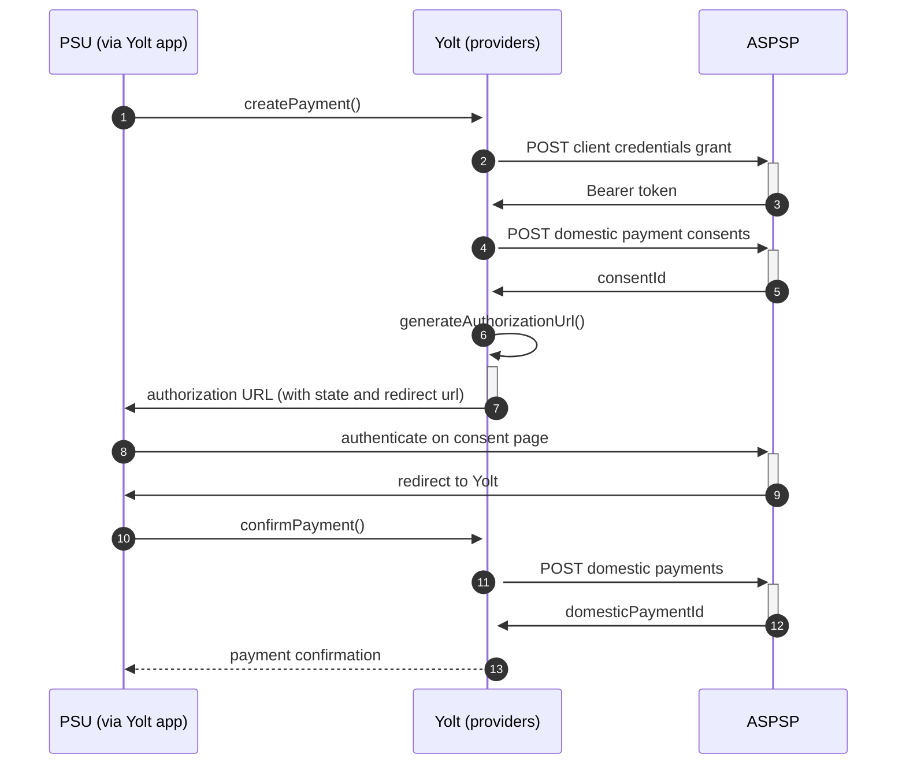

## Mbna Credit Card (PIS)

[Current open problems on our end][1]

MBNA Corporation was a bank holding company and parent company of wholly owned subsidiary MBNA America Bank, N.A.,
headquartered in Wilmington, Delaware, prior to being acquired by Bank of America in 2006. On December 20, 2016, Lloyds
Banking Group announced that it would purchase MBNA's UK portfolio from Bank of America

## BIP overview

|                                       |                                                                                                                                                                                                                     |
|---------------------------------------|---------------------------------------------------------------------------------------------------------------------------------------------------------------------------------------------------------------------|
| **Country of origin**                 | United Kingdom                                                                                                                                                                                                      | 
| **Site Id**                           | ece99bd9-c67d-4d65-b8ed-110562390cc3                                                                                                                                                                                |
| **Standard**                          | [Open Banking Standard][2]                                                                                                                                                                                          |
| **Contact**                           | E-mail: OBResponseteam@lloydsbanking.com Ticketing system: https://openbanking.atlassian.net/servicedesk/customer/portal/1 |
| **Developer Portal**                  | https://developer.lloydsbanking.com/                                                                                                                                                                                | 
| **IP Whitelisting**                   | No                                                                                                                                                                                                                  |
| **PISP Standard version**             | 3.1.6                                                                                                                                                                                                               |
| **Auto-onboarding**                   | No                                                                                                                                                                                                                  |
| **Requires PSU IP address**           | No                                                                                                                                                                                                                  |
| **Type of certificate**               | OBIE (OBWAC, OBSEAL) or OB legacy certificates required                                                                                                                                                             |
| **Signing algorithms used**           | PS256                                                                                                                                                                                                               |
| **Mutual TLS Authentication Support** | Yes                                                                                                                                                                                                                 |
| **Repository**                        | https://git.yolt.io/providers/open-banking                                                                                                                                                                          |

## Links - sandbox

|                       |                                                                      |
|-----------------------|----------------------------------------------------------------------|
| **Base URL**          | https://matls.rs.aspsp.sandbox.lloydsbanking.com/openbanking         |
| **Authorization URL** | https://as.aspsp.sandbox.lloydsbanking.com/oauth2/authorize          | 
| **Token Endpoint**    | https://matls.as.aspsp.sandbox.lloydsbanking.com/oauth2/access_token |   

## Links - production

|                           |                                                                                               |
|---------------------------|-----------------------------------------------------------------------------------------------|
| **Well-known Endpoint**   | https://authorise-api.mbna.co.uk/prod01/channel/mbn/personal/.well-known/openid-configuration |
| **Base URL**              | https://secure-api.mbna.co.uk/prod01/lbg/mbn/open-banking                                     |
| **Authorization URL**     | https://authorise-api.mbna.co.uk/prod01/lbg/mbn/personal/oidc-api/v1.1/authorize              | 
| **Token Endpoint**        | https://secure-api.mbna.co.uk/prod01/lbg/mbn/mtls-token-api/v1.1/token                        |
| **Registration Endpoint** | https://secure-api.mbna.co.uk/prod01/lbg/dcr-api/v1.0/register                                |  

## Client configuration overview

|                           |                                                                         |
|---------------------------|-------------------------------------------------------------------------|
| **Institution id**        | Unique identifier of the financial institution assigned by Open Banking |
| **Client id**             | Unique identifier received during registration process                  |
| **Signing key header id** | Open Banking signing certificate key id                                 |
| **Transport certificate** | Open Banking transport certificate                                      |
| **Signing key id**        | Open Banking signing key id                                             |
| **Transport key id**      | Open Banking transport key id                                           |

AIS and PIS for all banks in Lloyds Banking Group are registered on different SSAs and certificates, so client
configuration for those scopes are different.

## Registration details

Lloyds Group has two different possible registration types. Dynamic and manual registrations. First one can be done by
proper _/register_ endpoint described in [documentation][3]. During this call we have to use the same values as for
future authentication means (including certificates) and as a result we receive `clientId`, which is required to perform
further steps. Due to the fact that our auto-onboarding logic wasn't ready when this bank was connected this process
wasn't implemented as auto-onboarding.

We are registered manually on bank's developer portal. To login you have to use your Open Banking account. There you can
create proper application with public certificates. As a result you will receive `clientId` which will be used
in `client_credentials_grant` authentication method.

Additionally there we are not subscribed to any particular API version. It means that we have access to all _v3.1_
versions and it depends on bank, which version is used right now. Thanks that we don't have to remember to switch when
new version is released. Only Retail accounts are available in this bank.

We are registered with OBWac/OBSeal certificates.

## Multiple Registration

We don't know about any registration limits. There was no situation, when such knowledge was needed, so we will have to
ask about that when there will be such case.

## Connection Overview

All banks in Lloyds Group follow Open Banking standard. It means that flow is similar to other banks. Due to that fact,
Open Banking DTOs are used in implementation, and code relay mostly on our generic Open Banking implementation.

The _createPayment_ method is used to create payment on bank's side. Thanks that we are sure that payment data are
compliant with requirements and standards. First of all we call _token_ endpoint with `payments` scope to get required
Bearer token. Next, payment is created (as request body) based on user's data and all information is sent to the bank to
create payment. As a result we receive `consentId` which is required in next step.

The _generateAuthorizationUrl_ method is used to generate login consent for user. Using `consentId` authorization URL is
prepared based on _authorize_ endpoint by filling it with necessary parameters. Using this URL, user is redirected to
login domain to fill his credentials and confirm payment.

In _confirmPayment_ method allows to confirm payment. Using the `consentId` with the same token and values at during
first call request body is prepared. After the call, from the bank `domesticPaymentId` is returned.

Simplified sequence diagram:

**Consent validity rules**

MBNA PIS requires much different request than our generic request in consent testing service: Debtor Account with UK.OBIE.PAN schemeName and a correct PAN.
We do not want to adjust this generic request so the MBNA is still blacklisted.

## Sandbox overview

The Sandbox contains mock data for the purpose of testing API connectivity. The Sandbox interface and authentication
flows are created to represent the production environment to allow users to progress the development and testing of
application. To use sandbox you have to perform similar manual registration as for production environment. To do this
you have to login using Open Banking account. During implementation process we didn't use the sandbox. Due to that fact
we don't have any further information about it.

## Business and technical decisions

During implementation we made following business decisions:

Bank requires `SortCodeAccountNumber` value to be in camel case format. We prepared mapper to convert value used in our
model to value which is compliant with documentation.

For this bank `Reference` field in `RemittanceInformation` is send instead of `Unstructured` value.

Additionally regarding FAPI requirements proper `nonce` claim is required. Lloyds Group supports only first 8 chars from
state for `nonce`. This change was introduced in all affected places.

MBNA does **not** support so called "Faster Payments" (`UK.OBIE.FPS`), however they support Balance (`UK.OBIE.BalanceTransfer`)
and Money transfers (`UK.OBIE.MoneyTransfer`). In the implementation we chose the latter.

MBNA requires Debtor Account. Moreover, the Debtor Account's Scheme Name must be set to `UK.OBIE.PAN`. This is something
that was done in `MbnaPaymentInitiationAdjuster.java` class. This "hack" was the only solution to test the payments
since `site-management` does not allow this scheme. Furthermore, the `PAN` value is validated at the bank side.

MBNA has also some kind of lower bound for money transfer amounts. The regular 1.23€ was not allowed (HTTP-400 with an
empty JSON response), while 101.51€ was. We have not heard back from back what the limits are, also the documentation
does not mention it.

02.03.2022 Due to agreements with yts-core it was decided that we want to treat payment as completed once money has been
deducted from debtor account. According to OB documentation `AcceptedSettlementCompleted` is proper status. For
reference see https://yolt.atlassian.net/browse/C4PO-9754

**Payment Flow Additional Information**

|                                                                                                        |                             |
|--------------------------------------------------------------------------------------------------------|-----------------------------|
| **When exactly is the payment executed ( executed-on-submit/executed-on-consent)?**                    | execute-on-submit           |
| **it is possible to initiate a payment having no debtor account**                                      | YES                         |
| **At which payment status we can be sure that the money was transferred from the debtor to creditor?** | AcceptedSettlementCompleted |

## External links

* [Current open problems on our end][1]
* [Open Banking Standard][2]

[1]: <https://yolt.atlassian.net/browse/C4PO-3120?jql=project%20%3D%20%22C4PO%22%20AND%20component%20%3D%20MBNA_CREDIT_CARD%20AND%20status%20!%3D%20Done%20AND%20Resolution%20%3D%20Unresolved%20ORDER%20BY%20status>

[2]: <https://standards.openbanking.org.uk/>
