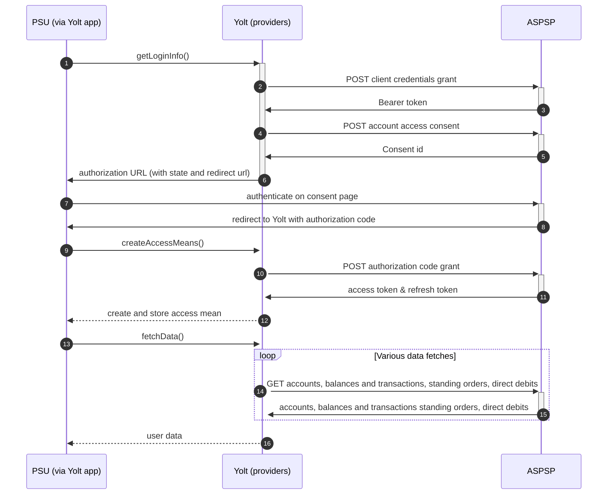

# Monzo (AIS)
[Current open problems on our end][1]

Monzo Bank Ltd is an online bank based in the United Kingdom. Monzo was one of the earliest of a number of new app-based challenger banks in the UK.

## BIP overview 

|                                       |                                                                              |
|---------------------------------------|------------------------------------------------------------------------------|
| **Country of origin**                 | United Kingdom                                                               | 
| **Site Id**                           | 82c16668-4d59-4be8-be91-1d52792f48e3                                         |
| **Standard**                          | [Open Banking Standard][2]                                                   |
| **Contact**                           | E-mail: openbanking@monzo.com                                                |
| **Developer Portal**                  | https://developers.monzo.com/                                                | 
| **Account SubTypes**                  | Current, Savings                                                             |
| **IP Whitelisting**                   | No                                                                           |
| **AIS Standard version**              | 3.1.0                                                                        |
| **Auto-onboarding**                   | Yes                                                                          |
| **Requires PSU IP address**           | No                                                                           |
| **Type of certificate**               | eIDAS (QWAC, QSEAL), OBIE (OBWAC, OBSEAL) or OB legacy certificates required |
| **Signing algorithms used**           | PS256                                                                        |
| **Mutual TLS Authentication Support** | Yes                                                                          |
| **Repository**                        | https://git.yolt.io/providers/open-banking                                   |

## Links - sandbox

|                         |                                                                               |
|-------------------------|-------------------------------------------------------------------------------|
| **Well-known Endpoint** | https://api.s101.nonprod-ffs.io/open-banking/.well-known/openid-configuration |
| **Base URL AIS**        | https://openbanking.s101.nonprod-ffs.io/open-banking/v3.1/aisp                |
| **Authorization URL**   | https://verify-s101.monzo.com/open-banking/authorize                          | 
| **Token Endpoint**      | https://openbanking.s101.nonprod-ffs.io/oauth2/token                          |
| **Monzo Pots**          | https://openbanking.s101.nonprod-ffs.io/open-banking/v3.1/aisp/pots           |

## Links - production 

|                           |                                                                     |
|---------------------------|---------------------------------------------------------------------|
| **Well-known Endpoint**   | https://api.monzo.com/open-banking/.well-known/openid-configuration |
| **Base URL AIS**          | https://openbanking.monzo.com/open-banking/v3.1/aisp                |
| **Authorization URL**     | https://verify.monzo.com/open-banking/authorize                     | 
| **Token Endpoint**        | https://openbanking.monzo.com/oauth2/token                          |
| **Registration Endpoint** | https://openbanking.monzo.com/oauth2/register                       |
| **Monzo Pots**            | https://openbanking.monzo.com/open-banking/v3.1/aisp/pots           |
  
## Client configuration overview

|                                  |                                                                         |
|----------------------------------|-------------------------------------------------------------------------|
| **Institution id**               | Unique identifier of the financial institution assigned by Open Banking |
| **Client id**                    | Unique identifier received during registration process                  |
| **Organization id**              | TPP organization Id                                                     |
| **Signing key header id**        | OBSEAL signing certificate key id                                       |
| **Signing key id**               | OBSEAL signing key id                                                   |
| **Transport certificate**        | OBWAC transport certificate                                             |
| **Transport key id**             | OBWAC transport key id                                                  |  
| **Software id**                  | TPP's Open Banking software version                                     |
| **Software Statement Assertion** | TPP's Open Banking Software Statement Assertion                         |
  
## Registration details

Autoonboarding has been implemented.
All registration requirements and possible configuration are described on well-known endpoint. Documentation for the
endpoint can be found on the bank's developer portal. Additionally, in this bank we are not subscribed to any particular API version. It means that we have access to all APIs versions and it depends on bank, which version is used right now. Thanks that we don't have to remember to switch when new version is released.

## Multiple Registration

Autoonboarding needs to be performed twice for AIS and PIS registration.
  
## Connection Overview

Monzo follows Open Banking 3.0 standard. It means that flow is similar to other banks. Due to that fact,
Open Banking DTOs are used in implementation, and code relay mostly on our generic Open Banking implementation.

The _getLoginInfo_ method is used to generate login consent for user. First of all we call _token_ endpoint to get Bearer
token. Next _account-access-consents_ endpoint is called to create consent on bank side. Received `consentId` is used to
prepare authorization URL based on _authorize_ endpoint by filling it with necessary parameters. Using this URL, user 
is redirected to login domain to fill his credentials.

In _createAccessMeans_ method `code` is used to call for token. This token will be used to authenticate user
in next calls. In response there is also `refresh_token` returned, because consent is valid for 90 days, and `access_token` 
only for 5 minutes. It means that refresh token flow is supported and has to be implemented too. _refreshAccessMeans_
allows to perform this operation. For a given consent, the refresh token is the same, but we always map both tokens to
access means value.

As in other Open Banking banks, Monzo also allows for consent removal. It is done by generic code in _onUserSiteDelete_
method. Stored earlier `consentId` is used to perform this operation.

The most complex step is data fetching. Monzo allows to collect information not only about accounts, balances and 
transactions, but also for standing orders (for every other account but credit card). The most important thing is that for Credit 
Cards those additional information are not collected. For direct-debits empty list is returned by providers.

Consent window is implemented and set to 5 minutes. 

Important information is that this bank support pagination for transactions. It returns both `BOOKED` and
`PENDING` transactions.

Monzo also supports 'pots' which are simply - savings accounts. Users can have multiple pots assigned to them. 
If number of the accounts assigned to a single user exceeds limit, as always, 'Number of accounts in DataProviderResponse exceeded limit.' exception is thrown.

Simplified sequence diagram:

  
## Sandbox overview

The Sandbox contains mock data for the purpose of testing API connectivity. The Sandbox interface and authentication 
flows are created to represent the production environment to allow users to progress the development and testing of 
application.
To use sandbox TPP has to register on their portal and perform proper registration call to get access. During implementation
we didn't use sandbox, so we don't have knowledge about it.  

## User Site deletion
There's `onUserSiteDelete` method implemented by this provider, however, only in a best effort manner.

## Business and technical decisions
Current and available balance are represented by INTERIMAVAILABLE balance type.
Transaction id is mapped to entryReference for ExtendedTransactionDTO.

* 2021.05.26: we were notified by bank that starting from 2021.06.08 they will introduce SCA and together with 
  this change consent window will change its behavior. Until now when exceeding consent window they were narrowing 
  data returned by API to 90 days. Starting from 2021.06.08 they will return HTTP 400. Hence 5 minutes consent window
  is implemented for Monzo. Moreover - Monzo, in opposite to other banks - do not limit additional endpoints
  (/standing-orders, /direct-debits) querying to consent window time frame. However - a business 
  decision was made not to use this feature and treat Monzo as other banks in that matter (limit additional endpoints
  querying only to consent window time frame).
  
  
## External links
* [Current open problems on our end][1]
* [Open Banking Standard][2]

[1]: <https://yolt.atlassian.net/issues/?jql=project%20%3D%20%22C4PO%22%20AND%20component%20%3D%20MONZO%20AND%20status%20!%3D%20Done%20AND%20Resolution%20%3D%20Unresolved%20ORDER%20BY%20status>
[2]: <https://standards.openbanking.org.uk/>
