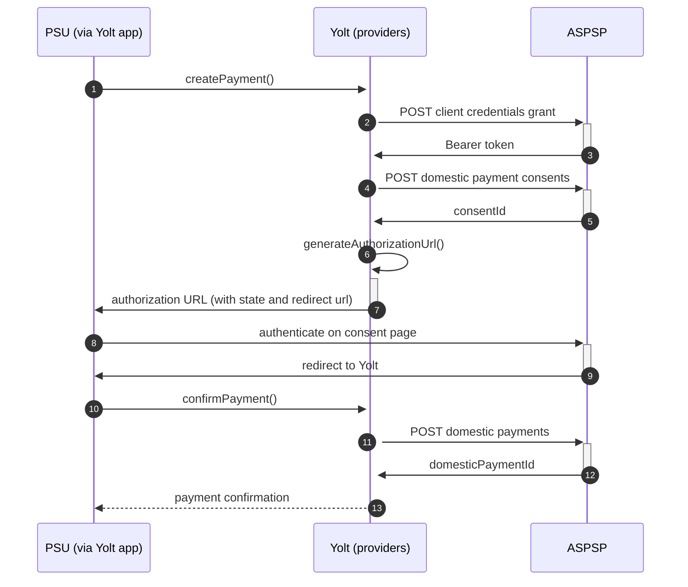

# Monzo (PIS)
[Current open problems on our end][1]

Monzo Bank Ltd is an online bank based in the United Kingdom. Monzo was one of the earliest of a number of new app-based challenger banks in the UK.

## BIP overview 

|                                       |                                                                              |
|---------------------------------------|------------------------------------------------------------------------------|
| **Country of origin**                 | United Kingdom                                                               | 
| **Site Id**                           | 82c16668-4d59-4be8-be91-1d52792f48e3                                         |
| **Standard**                          | [Open Banking Standard][2]                                                   |
| **Contact**                           | E-mail: openbanking@monzo.com                                                |
| **Developer Portal**                  | https://developers.monzo.com/                                                | 
| **IP Whitelisting**                   | No                                                                           |
| **PIS Standard version**              | 3.1.0                                                                        |
| **Auto-onboarding**                   | Yes                                                                          |
| **Requires PSU IP address**           | No                                                                           |
| **Type of certificate**               | eIDAS (QWAC, QSEAL), OBIE (OBWAC, OBSEAL) or OB legacy certificates required |
| **Signing algorithms used**           | PS256                                                                        |
| **Mutual TLS Authentication Support** | Yes                                                                          |
| **Repository**                        | https://git.yolt.io/providers/open-banking                                   |

## Links - sandbox

|                         |                                                                               |
|-------------------------|-------------------------------------------------------------------------------|
| **Well-known Endpoint** | https://api.s101.nonprod-ffs.io/open-banking/.well-known/openid-configuration |
| **Base URL PIS**        | https://openbanking.s101.nonprod-ffs.io/open-banking/v3.1/pisp                |
| **Authorization URL**   | https://verify-s101.monzo.com/open-banking/authorize                          | 
| **Token Endpoint**      | https://openbanking.s101.nonprod-ffs.io/oauth2/token                          |

## Links - production 

|                           |                                                                     |
|---------------------------|---------------------------------------------------------------------|
| **Well-known Endpoint**   | https://api.monzo.com/open-banking/.well-known/openid-configuration |
| **Base URL PIS**          | https://openbanking.monzo.com/open-banking/v3.1/pisp                |
| **Authorization URL**     | https://verify.monzo.com/open-banking/authorize                     | 
| **Token Endpoint**        | https://openbanking.monzo.com/oauth2/token                          |
| **Registration Endpoint** | https://openbanking.monzo.com/oauth2/register                       |

## Client configuration overview

|                                  |                                                                         |
|----------------------------------|-------------------------------------------------------------------------|
| **Institution id**               | Unique identifier of the financial institution assigned by Open Banking |
| **Client id**                    | Unique identifier received during registration process                  |
| **Organization id**              | TPP organization Id                                                     |
| **Signing key header id**        | OBSEAL signing certificate key id                                       |
| **Signing key id**               | OBSEAL signing key id                                                   |
| **Transport certificate**        | OBWAC transport certificate                                             |
| **Transport key id**             | OBWAC transport key id                                                  |  
| **Software-ID**                  | TPP's Open Banking software version                                     | 
| **Software Statement Assertion** | SSA needed for auto-onboarding                                          |
  
## Registration details

Autoonboarding has been implemented.
All registration requirements and possible configuration are described on well-known endpoint. Documentation for the
endpoint can be found on the bank's developer portal. Additionally, in this bank we are not subscribed to any particular API version. It means that we have access to all APIs versions and it depends on bank, which version is used right now. Thanks that we don't have to remember to switch when new version is released.

## Multiple Registration

Autoonboarding needs to be performed twice for AIS and PIS registration.
  
## Connection Overview

Monzo follows Open Banking standard. It means that flow is similar to other banks. Due to that fact,
Open Banking DTOs are used in implementation, and code relay mostly on our generic Open Banking implementation.

The _createPayment_ method is used to create payment on bank's side. Thanks that we are sure that payment data are compliant
with requirements and standards. First of all we call _token_ endpoint with `payments` scope to get required Bearer token.
Next, payment is created (as request body) based on user's data and all information is sent to the bank to create payment.
As a result we receive `consentId` which is required in next step.

The _generateAuthorizationUrl_ method is used to generate login consent for user. Using `consentId` authorization URL is
prepared based on _authorize_ endpoint by filling it with necessary parameters. Using this URL, user is redirected to 
login domain to fill his credentials and confirm payment.

In _confirmPayment_ method allows to confirm payment. Using the `consentId` with the same token and values at during first 
call request body is prepared. After the call, from the bank `domesticPaymentId` is returned.

Simplified sequence diagram:

**Consent validity rules**

Consent validity rules have been implemented for Monzo PIS, however we have to blacklist it from PIS consent testing
as Monzo requires providing of theirs sort code for payment request - our current solution does not support
individual IBAN/SORTCODEACCOUNTNUMBER for a particular bank.

**Payment Flow Additional Information**

|                                                                                                        |                             |
|--------------------------------------------------------------------------------------------------------|-----------------------------|
| **When exactly is the payment executed ( executed-on-submit/executed-on-consent)?**                    | execute-on-submit           |
| **it is possible to initiate a payment having no debtor account**                                      | YES                         |
| **At which payment status we can be sure that the money was transferred from the debtor to creditor?** | AcceptedSettlementCompleted |

## Business and technical decisions

20.12.2021 According to C4PO-9361 Bank requires field reference during payment initialization and bank sent us regex for
it: `^[A-Za-z0-9/\-?:().,'+ #=!"%&*<>;{}@\r\n]+$`. 02.03.2022 Due to agreements with yts-core it was decided that we
want to treat payment as completed once money has been deducted from debtor account. According to OB
documentation `AcceptedSettlementCompleted` is proper status. For reference
see https://yolt.atlassian.net/browse/C4PO-9754

****

## External links
* [Current open problems on our end][1]
* [Open Banking Standard][2]

[1]: <https://yolt.atlassian.net/issues/?jql=project%20%3D%20%22C4PO%22%20AND%20component%20%3D%20MONZO%20AND%20status%20!%3D%20Done%20AND%20Resolution%20%3D%20Unresolved%20ORDER%20BY%20status>
[2]: <https://standards.openbanking.org.uk/>