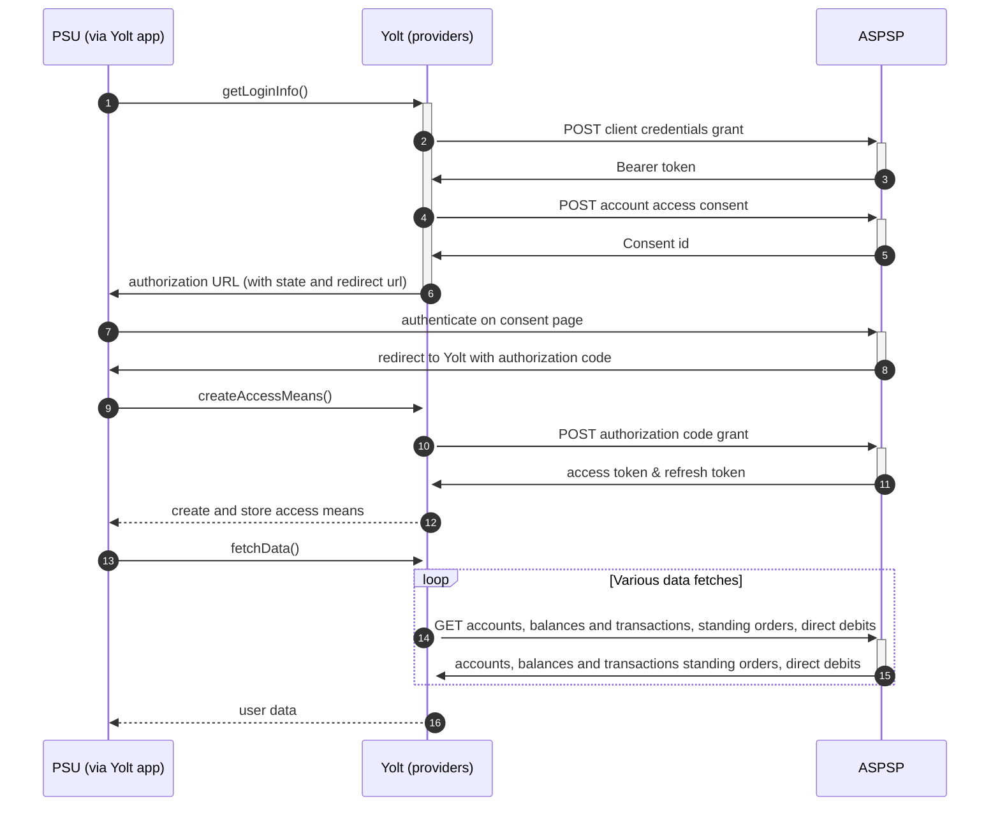

# Nationwide (AIS)
[Current open problems on our end][1]

Nationwide Building Society is a British mutual financial institution, 
the seventh largest cooperative financial institution and the largest building society in the world with over 15 million members.
Its headquarters are in Swindon, England.

## BIP overview 

|                                       |                                                                            |
|---------------------------------------|----------------------------------------------------------------------------|
| **Country of origin**                 | United Kingdom                                                             | 
| **Site Id**                           | 217a893a-5040-4291-a6be-85790c8b65c6                                       |
| **Standard**                          | [Open Banking Standard][2]                                                 |
| **Contact**                           | E-mail: NationwideOpenBanking@nationwide.co.uk                             |
| **Developer Portal**                  | https://www.nationwidedeveloper.co.uk/                                     | 
| **Account SubTypes**                  | Current, Credit Cards                                                      |
| **IP Whitelisting**                   | No                                                                         |
| **AIS Standard version**              | 3.1.2                                                                      |
| **Auto-onboarding**                   | No                                                                         |
| **Requires PSU IP address**           | No                                                                         |
| **Type of certificate**               | eIDAS (QWAC, QSEAL), OBIE (OBWAC, OBSEAL) or OB legacy certificates required |
| **Signing algorithms used**           | PS256                                                                      |
| **Mutual TLS Authentication Support** | Yes                                                                        |
| **Repository**                        | https://git.yolt.io/providers/open-banking                                 |

## Links - sandbox

|                           |                                                                                                    |
|---------------------------|----------------------------------------------------------------------------------------------------|
| **Well-known Endpoint**   | https://obonline.sandbox.nationwideforbusiness.co.uk/open-banking/.well-known/openid-configuration |
| **Base URL**              | https://api.sandbox.nationwideforbusiness.co.uk                                                    |
| **Authorization URL**     | https://obonline.sandbox.nationwideforbusiness.co.uk/open-banking/v1.1/oauth/authorize             | 
| **Token Endpoint**        | https://api.sandbox.nationwideforbusiness.co.uk/open-banking/v1.1/oauth/token                      |
| **Registration Endpoint** | https://api.sandbox.nationwideforbusiness.co.uk/open-banking/v3.2/register                         |    

## Links - production 

|                           |                                                                                 |
|---------------------------|---------------------------------------------------------------------------------|
| **Well-known Endpoint**   | https://obonline.nationwide.co.uk/open-banking/.well-known/openid-configuration |
| **Base URL**              | https://api.nationwide.co.uk/open-banking                                       |
| **Authorization URL**     | https://obonline.nationwide.co.uk/open-banking/oauth/authorize                  | 
| **Token Endpoint**        | https://api.nationwide.co.uk/open-banking/oauth/token                           |
| **Registration Endpoint** | https://api.obtpp.nationwideinterfaces.io/open-banking/register                 |  

Since 2018 Nationwide introduced version less authorization endpoints. Until January 2022 there were still support for
version numbers in following endpoints:

`API
• /open-banking/v1.1/oauth/token
• /open-banking/v1.1/register`

`OBNLINE
• /open-banking/v1.1/oauth/authorize
• /open-banking/v1.1/oauth/userAuthorize
• /open-banking/v1.1/.well-known/openid-configuration`

Now we have to remember that endpoint version can be used only for AIS and PIS APIs. Authorization part has to be version
less.

## Client configuration overview

|                           |                                                        |
|---------------------------|--------------------------------------------------------|
| **Institution id**        | Unique identifier of the bank assigned by Open Banking |
| **Software id**           | TPP's Open Banking software version                    |
| **Organization id**       | YOLT id from OB directory                              | 
| **Client id**             | Unique identifier received during registration process |
| **Signing key id**        | OBSEAL key id                                          |
| **Signing key header id** | Open Banking signing certificate key id                |
| **Transport certificate** | OBWAC certificate                                      |
| **Transport key id**      | OBWAC key id                                           |

## Registration details

Nationwide group requires dynamic registration to be performed before TPP will be able to use their PSD2 API. It can be
done by proper _/register_ endpoint. During this call we have to use the same values as for future authentication means
(including certificates) and as a result we receive `clientId`, which is required to perform further steps. Although
this is a bank that was connected long ago, the auto-onboarding mechanism is implemented. All registration requirements
and possible configuration are described on well-known endpoint. [Documentation][3] for the endpoint can be find on
bank's developer portal Additionally in this bank we are not subscribed to any particular API version. It means that we
have access to all APIs versions and it depends on bank, which version is used right now. Thanks that we don't have to
remember to switch when new version is released.

## Multiple Registration

We don't know about any registration limits. There was no situation, when such knowledge was needed, so we will have to
ask about that when there will be such case.

## Connection Overview

Nationwide follows Open Banking 3.0 standard. It means that flow is similar to other banks. Due to that fact,
Open Banking DTOs are used in implementation, and code relay mostly on our generic Open Banking implementation.

The _getLoginInfo_ method is used to generate login consent for user. First of all we call _token_ endpoint to get Bearer
token. Next _account-access-consents_ endpoint is called to create consent on bank side. Received `consentId` is used to
prepare authorization URL based on _authorize_ endpoint by filling it with necessary parameters. Using this URL, user 
is redirected to login domain to fill his credentials.

In _createAccessMeans_ method `code` is used to call for token. This token will be used to authenticate user
in next calls. In response there is also `refresh_token` returned. Both consent and refresh token are valid for 90 days, 
but `access_token` only for 30 minutes. It means that refresh token flow is supported and has to be implemented too. 
_refreshAccessMeans_ allows to perform this operation. For a given consent, the refresh token is the same and is not
returned during refresh call, so we always map only `access_token` with old `refresh_token` to access means value. 

As in other Open Banking banks, Nationwide also allows for consent removal. It is done by generic code in _onUserSiteDelete_
method. Stored earlier `consentId` is used to perform this operation.

The most complex step is data fetching. Nationwide allows to collect information not only about accounts, balances and 
transactions, but also for and standing orders. The most important thing is that for Credit 
Cards those additional information are not collected. For direct-debits empty list is returned by providers.

There is also 5 minute consent window implemented in generic way.
**Consent validity rules** are implemented for Nationwide bank AIS. 

Important information is that this bank support pagination for transactions. It returns both `BOOKED` and
`PENDING` transactions.

Simplified sequence diagram:

   
## Sandbox overview

The Sandbox contains mock data for the purpose of testing API connectivity. The Sandbox interface and authentication 
flows are created to represent the production environment to allow users to progress the development and testing of 
application.
To use sandbox TPP has to register on their portal and perform proper registration call to get access. During implementation
we didn't use sandbox, so we don't have knowledge about it.

## User Site deletion
There's `onUserSiteDelete` method implemented by this provider, however, only in a best effort manner.

## Business and technical decisions

During implementation we made following business decisions:

Due to the fact that `refresh_token` is not returned during refresh process, we always use old value, but if Nationwide 
at some time decide to pass the refresh token to us again, we still support it.

Nationwide has implemented ACCEPT header additionally to create token.

Nationwide supports `INTERIMBOOKED` and `INTERIMAVAILABLE` balances for Current accounts, so `INTERIMBOOKED` mapped for Current and `INTERIMAVAILABLE` for 
Available. For Credit Cards `CLOSINGAVAILABLE` and `INTERIMAVAILABLE` types are available. First one is 
mapped for Current balance, second one for Available balance, also the bank can sometimes send us `INTERIMCLEARED` instead of `CLOSINGAVAILABLE`.   

Nationwide sends a positive number marked as DEBIT so we need to negate it manually (so it would be positive in the app)

According to bank's reply regarding C4PO-8915 case - Nationwide can return HTTP 400 Bad Request with message "Requested 
resource cannot be found" for users for whom given account has been locked. The advice is that the given member 
will either need to log into the Internet Banking or contact the Nationwide contact centre to resolve.
  
## External links
* [Current open problems on our end][1]
* [Open Banking Standard][2]

[1]: <https://yolt.atlassian.net/issues/?jql=project%20%3D%20%22C4PO%22%20AND%20component%20%3D%20NATIONWIDE%20AND%20status%20!%3D%20Done%20AND%20Resolution%20%3D%20Unresolved%20ORDER%20BY%20status>
[2]: <https://standards.openbanking.org.uk/>
[3]: <https://www.nationwidedeveloper.co.uk/apis/utility-apis/post-register-0>
