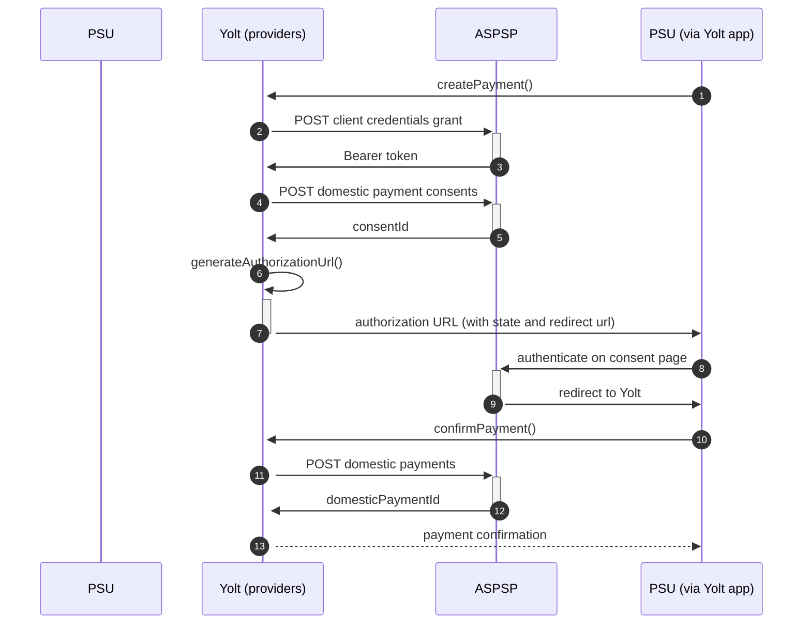

# Nationwide (PIS)
[Current open problems on our end][1]

Nationwide Building Society is a British mutual financial institution, 
the seventh largest cooperative financial institution and the largest building society in the world with over 15 million members.
Its headquarters are in Swindon, England.

## BIP overview 

|                                       |                                                                              |
|---------------------------------------|------------------------------------------------------------------------------|
| **Country of origin**                 | United Kingdom                                                               | 
| **Site Id**                           | 217a893a-5040-4291-a6be-85790c8b65c6                                         |
| **Standard**                          | [Open Banking Standard][2]                                                   |
| **Contact**                           | E-mail: NationwideOpenBanking@nationwide.co.uk                               |
| **Developer Portal**                  | https://www.nationwidedeveloper.co.uk/                                       | 
| **IP Whitelisting**                   | No                                                                           |
| **PIS Standard version**              | 3.1.2                                                                        |
| **Auto-onboarding**                   | No                                                                           |
| **Requires PSU IP address**           | No                                                                           |
| **Type of certificate**               | eIDAS (QWAC, QSEAL), OBIE (OBWAC, OBSEAL) or OB legacy certificates required |
| **Signing algorithms used**           | PS256                                                                        |
| **Mutual TLS Authentication Support** | Yes                                                                          |
| **Repository**                        | https://git.yolt.io/providers/open-banking                                   |

## Links - sandbox

|                           |                                                                                                    |
|---------------------------|----------------------------------------------------------------------------------------------------|
| **Well-known Endpoint**   | https://obonline.sandbox.nationwideforbusiness.co.uk/open-banking/.well-known/openid-configuration |
| **Base URL**              | https://api.sandbox.nationwideforbusiness.co.uk                                                    |
| **Authorization URL**     | https://obonline.sandbox.nationwideforbusiness.co.uk/open-banking/v1.1/oauth/authorize             | 
| **Token Endpoint**        | https://api.sandbox.nationwideforbusiness.co.uk/open-banking/v1.1/oauth/token                      |
| **Registration Endpoint** | https://api.sandbox.nationwideforbusiness.co.uk/open-banking/v3.2/register                         |    

## Links - production 

|                           |                                                                                 |
|---------------------------|---------------------------------------------------------------------------------|
| **Well-known Endpoint**   | https://obonline.nationwide.co.uk/open-banking/.well-known/openid-configuration |
| **Base URL**              | https://api.nationwide.co.uk/open-banking                                       |
| **Authorization URL**     | https://obonline.nationwide.co.uk/open-banking/oauth/authorize                  | 
| **Token Endpoint**        | https://api.nationwide.co.uk/open-banking/oauth/token                           |
| **Registration Endpoint** | https://api.obtpp.nationwideinterfaces.io/open-banking/register                 |  

Since 2018 Nationwide introduced version less authorization endpoints. Until January 2022 there were still support for
version numbers in following endpoints:

`API
• /open-banking/v1.1/oauth/token
• /open-banking/v1.1/register`

`OBNLINE
• /open-banking/v1.1/oauth/authorize
• /open-banking/v1.1/oauth/userAuthorize
• /open-banking/v1.1/.well-known/openid-configuration`

Now we have to remember that endpoint version can be used only for AIS and PIS APIs. Authorization part has to be version
less.

## Client configuration overview

|                           |                                                        |
|---------------------------|--------------------------------------------------------|
| **Institution id**        | Unique identifier of the bank assigned by Open Banking |
| **Software id**           | TPP's Open Banking software version                    |
| **Organization id**       | YOLT id from OB directory                              | 
| **Client id**             | Unique identifier received during registration process |
| **Signing key id**        | OBSEAL key id                                          |
| **Signing key header id** | Open Banking signing certificate key id                |
| **Transport certificate** | OBWAC certificate                                      |
| **Transport key id**      | OBWAC key id                                           |

## Registration details

Nationwide group requires dynamic registration to be performed before TPP will be able to use their PSD2 API. It can be
done by proper _/register_ endpoint. During this call we have to use the same values as for future authentication means
(including certificates) and as a result we receive `clientId`, which is required to perform further steps. Due to the
fact that this is old bank, this process wasn't implemented as auto-onboarding mechanism, because it didn't exist, when
bank was connected. All registration requirements and possible configuration are described on well-known
endpoint. [Documentation][3] for the endpoint can be find on bank's developer portal Additionally in this bank we are
not subscribed to any particular API version. It means that we have access to all APIs versions and it depends on bank,
which version is used right now. Thanks that we don't have to remember to switch when new version is released.

## Multiple Registration

We don't know about any registration limits. There was no situation, when such knowledge was needed, so we will have to
ask about that when there will be such case.

## Connection Overview

All banks in Nationwide group follows Open Banking standard. It means that flow is similar to other banks. Due to that fact,
Open Banking DTOs are used in implementation, and code relay mostly on our generic Open Banking implementation.

The _createPayment_ method is used to create payment on bank's side. Thanks that we are sure that payment data are compliant
with requirements and standards. First of all we call _token_ endpoint with `payments` scope to get required Bearer token.
Next, payment is created (as request body) based on user's data and all information is sent to the bank to create payment.
As a result we receive `consentId` which is required in next step.

The _generateAuthorizationUrl_ method is used to generate login consent for user. Using `consentId` authorization URL is
prepared based on _authorize_ endpoint by filling it with necessary parameters. Using this URL, user is redirected to 
login domain to fill his credentials and confirm payment.

In _confirmPayment_ method allows to confirm payment. Using the `consentId` with the same token and values at during first 
call request body is prepared. After the call, from the bank `domesticPaymentId` is returned.

Simplified sequence diagram:

**Consent validity rules**

Consent validity rules have been implemented for Nationwide PIS.

**Payment Flow Additional Information**

|                                                                                                        |                             |
|--------------------------------------------------------------------------------------------------------|-----------------------------|
| **When exactly is the payment executed ( executed-on-submit/executed-on-consent)?**                    | execute-on-submit           |
| **it is possible to initiate a payment having no debtor account**                                      | YES                         |
| **At which payment status we can be sure that the money was transferred from the debtor to creditor?** | AcceptedSettlementCompleted |

   
## Sandbox overview

The Sandbox contains mock data for the purpose of testing API connectivity. The Sandbox interface and authentication 
flows are created to represent the production environment to allow users to progress the development and testing of 
application.
To use sandbox TPP has to register on their portal and perform proper registration call to get access. During implementation
we didn't use sandbox, so we don't have knowledge about it.

## Business and technical decisions

Nationwide needs to have correct scheme name for debtor account which supports `UK.OBIE.SortCodeAccountNumber`
and `UK.OBIE.IBAN`, also payment context code must contain value `OTHER`

Nationwide will reject requests with B64 header, so we created it's own PIS payload
signer `NationwidePisHttpPayloadSigner`

We must set `ACCEPT` header with value `APPLICATION_JSON` in payment requests

02.03.2022 Due to agreements with yts-core it was decided that we want to treat payment as completed once money has been
deducted from debtor account. According to OB documentation `AcceptedSettlementCompleted` is proper status. For
reference see https://yolt.atlassian.net/browse/C4PO-9754

## External links

* [Current open problems on our end][1]
* [Open Banking Standard][2]

[1]: <https://yolt.atlassian.net/issues/?jql=project%20%3D%20%22C4PO%22%20AND%20component%20%3D%20NATIONWIDE%20AND%20status%20!%3D%20Done%20AND%20Resolution%20%3D%20Unresolved%20ORDER%20BY%20status>

[2]: <https://standards.openbanking.org.uk/>

[3]: <https://www.nationwidedeveloper.co.uk/apis/utility-apis/post-register-0>