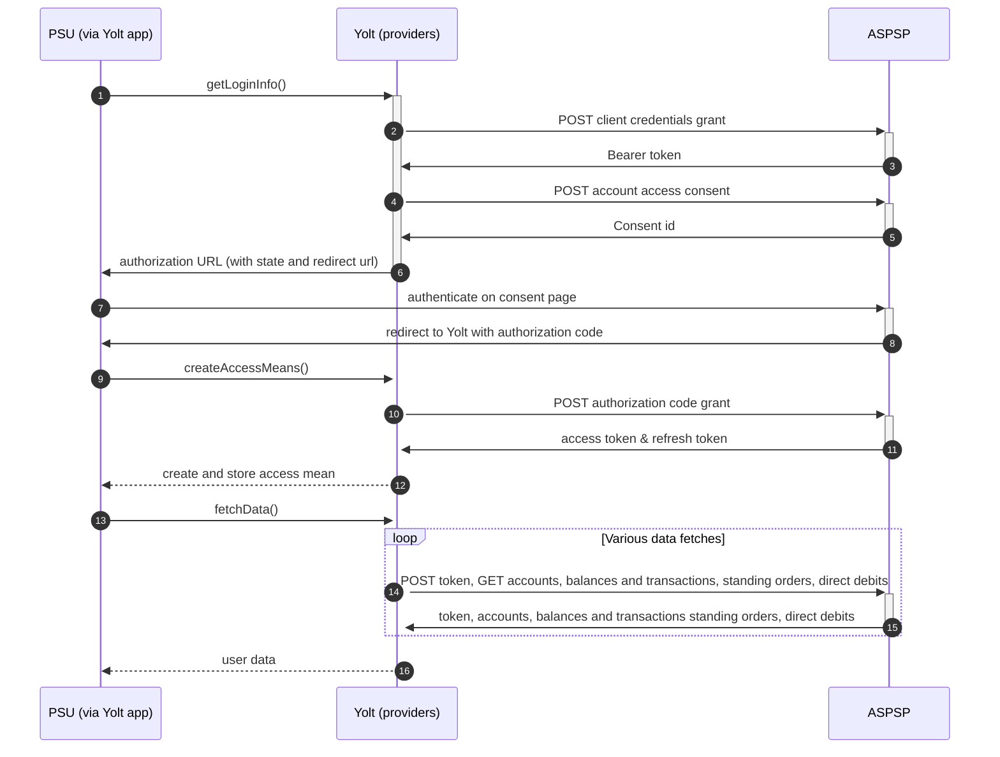

# Newday
[Current open problems on our end][1]

NewDay (established in 2000) is a financial services company specializing in providing credit products to consumers in the United Kingdom.

## BIP overview 

|                                       |                                                                                                                                                                                                                                                                                                                        |
|---------------------------------------|------------------------------------------------------------------------------------------------------------------------------------------------------------------------------------------------------------------------------------------------------------------------------------------------------------------------|
| **Country of origin**                 | United Kingdom                                                                                                                                                                                                                                                                                                         | 
| **Site Id**                           | AQUA c49aeca2-dc1e-45a3-8650-cfafd01f0b89   AMAZON_CREDIT_CARD eefe603d-4a58-499f-8c33-d416aafc8883   MARBLES 11e8c26d-5619-4506-8a89-26cef5f80a1a   ARGOS c04d928c-8529-455a-aa40-9ceb39b165e4   DEBENHAMS f4bf37bc-204b-4f11-9e3c-44215863afc7   HOUSE_OF_FRASER 1e2484d5-8dec-489c-857a-c57cec6a1ec7 |
| **Standard**                          | [Open Banking Standard][2]                                                                                                                                                                                                                                                                                             |
| **Contact**                           | E-mail: openbankingsupport@newday.co.uk Ticketing system: https://openbanking.atlassian.net/servicedesk/customer/portal/1                                                                                                                                          |
| **Developer Portal**                  | [Developer Portal][3]                                                                                                                                                                                                                                                                                                  |
| **Account SubTypes**                  | Credit Cards                                                                                                                                                                                                                                                                                                           |
| **IP Whitelisting**                   | No                                                                                                                                                                                                                                                                                                                     |
| **AIS Standard version**              | 3.1.0                                                                                                                                                                                                                                                                                                                  |
| **Auto-onboarding**                   | Yes                                                                                                                                                                                                                                                                                                                    |
| **Requires PSU IP address**           | No                                                                                                                                                                                                                                                                                                                     |
| **Types of certificates**             | OBWAC, OBSEAL certificates required                                                                                                                                                                                                                                                                                    |
| **Signing algorithms used**           | PS256                                                                                                                                                                                                                                                                                                                  |
| **Mutual TLS Authentication Support** | Yes                                                                                                                                                                                                                                                                                                                    |

## Links - sandbox

|                         |                                                                                                                                                                                                                                                                                                                                                                                                                                                                                                                                                                                                                                                                                 |
|-------------------------|---------------------------------------------------------------------------------------------------------------------------------------------------------------------------------------------------------------------------------------------------------------------------------------------------------------------------------------------------------------------------------------------------------------------------------------------------------------------------------------------------------------------------------------------------------------------------------------------------------------------------------------------------------------------------------|
| **Well-known Endpoint** | AMAZON_CREDIT_CARD: https://api.newdaycards.com/sandbox/identity/v1.0/amazon/.well-known/openid-configuration    AQUA: https://api.newdaycards.com/sandbox/identity/v1.0/aqua/.well-known/openid-configuration    MARBLES: https://api.newdaycards.com/sandbox/identity/v1.0/marbles/.well-known/openid-configuration   ARGOS: https://api.newdaycards.com/sandbox/identity/v1.0/argos/.well-known/openid-configuration   DEBENHAMS: https://api.newdaycards.com/sandbox/identity/v1.0/debenhams/.well-known/openid-configuration   HOUSE_OF_FRASER: https://api.newdaycards.com/sandbox/identity/v1.0/houseoffraser/.well-known/openid-configuration   |
| **Base URL**            | https://api.newdaycards.com/sandbox/open-banking                                                                                                                                                                                                                                                                                                                                                                                                                                                                                                                                                                                                                                |
| **Authorization URL**   | https://api.newdaycards.com/sandbox/identity/v1.0/amazon/connect/authorize                                                                                                                                                                                                                                                                                                                                                                                                                                                                                                                                                                                                      | 
| **Token Endpoint**      | https://api.newdaycards.com/sandbox/identity/v1.0/amazon/connect/token                                                                                                                                                                                                                                                                                                                                                                                                                                                                                                                                                                                                          |  

## Links - production 

|                         |                                                                                                                                                                                                                                                                                                                                                                                                                                                                                                                                                                                                                                 |
|-------------------------|---------------------------------------------------------------------------------------------------------------------------------------------------------------------------------------------------------------------------------------------------------------------------------------------------------------------------------------------------------------------------------------------------------------------------------------------------------------------------------------------------------------------------------------------------------------------------------------------------------------------------------|
| **Well-known Endpoint** | AMAZON_CREDIT_CARD: https://api.newdaycards.com/identity/v1.0/amazon/.well-known/openid-configuration    AQUA: https://api.newdaycards.com/identity/v1.0/aqua/.well-known/openid-configuration    MARBLES: https://api.newdaycards.com/identity/v1.0/marbles/.well-known/openid-configuration   ARGOS: https://api.newdaycards.com/identity/v1.0/argos/.well-known/openid-configuration   DEBENHAMS: https://api.newdaycards.com/identity/v1.0/debenhams/.well-known/openid-configuration   HOUSE_OF_FRASER: https://api.newdaycards.com/identity/v1.0/houseoffraser/.well-known/openid-configuration   |
| **Base URL**            | https://api.newdaycards.com/open-banking                                                                                                                                                                                                                                                                                                                                                                                                                                                                                                                                                                                        |
| **Authorization URL**   | https://api.newdaycards.com/identity/v1.0/amazon/connect/authorize                                                                                                                                                                                                                                                                                                                                                                                                                                                                                                                                                              | 
| **Token Endpoint**      | https://api.newdaycards.com/identity/v1.0/amazon/connect/token                                                                                                                                                                                                                                                                                                                                                                                                                                                                                                                                                                  |  

## Client configuration overview
|                                   |                                                                         |
|-----------------------------------|-------------------------------------------------------------------------|
| **Institution id**                | Unique identifier of the financial institution assigned by Open Banking |
| **Client id**                     | Unique identifier received during registration process                  | 
| **Client secret**                 | Unique secret received during registration process                      | 
| **Signing key id**                | OBSEAL key id                                                           |
| **Private signing key header id** | OBSEAL key header id                                                    |
| **Transport key id**              | OBWAC key id                                                            |
| **Transport certificate**         | OBWAC certificate                                                       |
| **Organization id**               | TPP organization's identifier                                           |
| **Software id**                   | TPP's Open Banking software version                                     |
| **Software Statement Assertion**  | TPP's SSA generated by Open Banking                                     |

### Registration details
NewDay Group banks require TPP to be dynamically registered in order to perform any calls to their PSD2 API. It can be done on _POST /register_ endpoint.
Since 01.07.2021 OBWAC and OBSEAL certificates are required. OB Legacy certificates can't be used.

## Multiple Registration

We don't know about any registration limits. There was no situation, when such knowledge would be needed, so we will have to
ask about that if such need comes.

## Connection Overview
* It supports only credit cards
* The registration is common for all the providers in the group (should be invoked once)
* **Consent validity rules** are implemented for AIS of each bank in New Day group 

Simplified sequence diagram:

## Business decisions
* changed longevity of token to 300 as it lives shorter than they send in expires_in (they send 600 but it's not true)
* AmazonCreditCard data provider is enhanced with keep-alive setting according to C4PO-8963 (socket timeout exception issue)

## Sandbox overview
Sandbox served static data and used to be accessible with static credentials. It's hosted on similar domain as production.
  
## External links

[1]: <https://yolt.atlassian.net/browse/C4PO-6189?jql=project%20%3D%20%22C4PO%22%20AND%20component%20%3D%20%22NewDay%22%20AND%20status%20!%3D%20Done%20AND%20Resolution%20%3D%20Unresolved%20ORDER%20BY%20status>
[2]: <https://standards.openbanking.org.uk/>
[3]: <https://developer.newdaycards.com/>