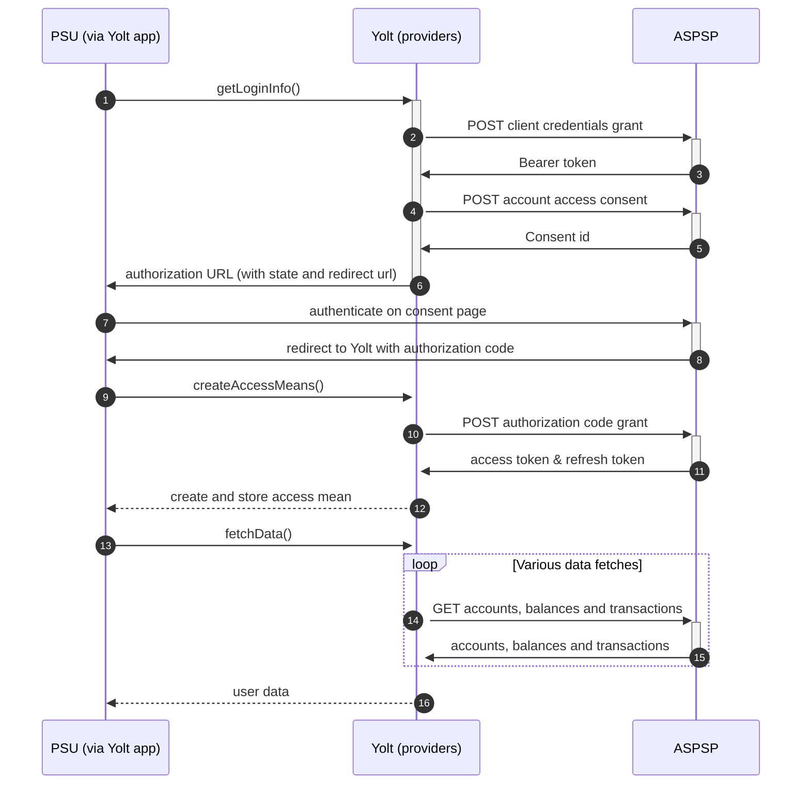

## Permanent TSB (AIS)
[Current open problems on our end][1]

Permanent TSB Group Holdings plc, formerly Irish Life and Permanent plc is a provider of personal financial services in 
Ireland. The bank has over one million customers in Ireland.

## BIP overview 

|                                       |                                                                                                                          |
|---------------------------------------|--------------------------------------------------------------------------------------------------------------------------|
| **Country of origin**                 | Ireland                                                                                                                  | 
| **Site Id**                           | c42fe841-be20-4aee-8c79-10919958b0b4                                                                                     |
| **Standard**                          | Open Banking                                                                                                             |
| **Contact**                           | E-mail: Technical Queries : TPPTechnicalQueries@permanenttsb.ie Administration Support :PSD2TPPEnrolment@permanenttsb.ie |
| **Developer Portal**                  | https://www.permanenttsb.ie/developer-portal/tpp-developer-portal/                                                       | 
| **Account SubTypes**                  | Current, Savings, Credit Cards                                                                                           |
| **IP Whitelisting**                   | No                                                                                                                       |
| **AIS Standard version**              | OB 3.1                                                                                                                   |
| **PISP Standard version**             | OB 3.1                                                                                                                   |
| **Auto-onboarding**                   | Yes                                                                                                                      |
| **Requires PSU IP address**           | No                                                                                                                       |
| **Type of certificate**               | eIDAS (QWAC, QSEAL) certificates required                                                                                |
| **Signing algorithms used**           | PS256                                                                                                                    |
| **Mutual TLS Authentication Support** | Yes                                                                                                                      |
| **Repository**                        | https://git.yolt.io/providers/open-banking                                                                               |

## Links - sandbox

|                            |                                                               |
|----------------------------|---------------------------------------------------------------|
| **Well-known endpoint**    | https://auth.permanenttsb.ie/.well-known/openid-configuration | 
| **API Endpoint**           | https://developer.permanenttsb.ie/psd2api/                    | 
| **Authorization Endpoint** | https://auth.permanenttsb.ie/authorize                        |
| **Token endpoint**         | https://developer.permanettsb.ie/psd2api/as/token.oauth2      |

## Links - production 

|                            |                                                               |
|----------------------------|---------------------------------------------------------------|
| **Well-known endpoint**    | https://auth.permanenttsb.ie/.well-known/openid-configuration | 
| **API Endpoint**           | https://api.permanenttsb.ie/                                  | 
| **Authorization Endpoint** | https://auth.permanenttsb.ie/authorize                        |
| **Token endpoint**         | https://api.permanenttsb.ie/as/token.oauth2                   |

Additional information about endpoint can be found in proper [section][2] of developer portal.

## Client configuration overview

|                             |                                                                                              |
|-----------------------------|----------------------------------------------------------------------------------------------|
| **Client id**               | Unique identifier received during registration process                                       |
| **Client secret**           | Unique secret received during registration process                                           |
| **Institution id**          | Unique identifier of the bank assigned by Open Banking                                       |
| **Signing key header id**   | Signing certificate key id (QSEAL)                                                           |
| **Signing certificate**     | QSEAL certificate                                                                            |
| **Signing key id**          | QSEAL key id from HSM                                                                        |
| **Transport key id**        | QWAC key id from HSM                                                                         |
| **Transport certificate**   | QWAC certificate                                                                             |
| **Organization name**       | Name of the TPP, which has to be used during onboarding process                              |
| **Application name**        | Name of the application, which will be created on bank's side during onboarding process      |
| **Business contact name**   | Name of the business contact person, which has to be used during onboarding process          |
| **Business contact email**  | Email of the business contact person, which has to be used during onboarding process         |
| **Business contact phone**  | Phone number of the business contact person, which has to be used during onboarding process  |
| **Technical contact name**  | Name of the technical contact person, which has to be used during onboarding process         |
| **Technical contact email** | Email of the technical contact person, which has to be used during onboarding process        |
| **Technical contact phone** | Phone number of the technical contact person, which has to be used during onboarding process |

## Registration details

Permanent TSB requires dynamic registration to be performed before TPP will be able to use their PSD2 API. It can be done
by calling proper _/register_ endpoint. As a result we receive `clientId` and `clientSecret`, which are required to 
perform further steps. This process was implemented as auto-onboarding mechanism based on [documentation][3] available
on bank's developer portal.
We have to remember that Ireland is not in the United Kingdom, so eIDAS certificates are required to perform registration.
The bank supports `client_secret_basic` and `client_secret_post` as authentication method. First one was chosen during registration.
During registration process we are not subscribed to any particular API version. It means that we have access to all _v3.1_ versions,
so it depends on bank, which version is used right now. Thanks to this we don't have to remember to switch when new version
is released.
Most important thing is that registration endpoint in this bank has different specification than other open-banking providers.

## Multiple Registration

We don't know about any registration limits. There was no situation, when such knowledge was needed, so we will have to
ask about that when there will be such case.

## Connection Overview

Permanent TSB follows Open Banking standard. It means that flow is similar to other banks. Due to that fact,
Open Banking DTOs are used in implementation, and code relay mostly on our generic Open Banking implementation.

The _getLoginInfo_ method is used to generate login consent for user. At the beginning we call _token_ endpoint to get Bearer
token. Next _account-access-consents_ endpoint is called to create consent on bank side. Received `consentId` is used to 
prepare authorization URL based on authorize endpoint by filling it with necessary parameters. Using this URL, user is 
redirected to login domain to fill his credentials.

In _createAccessMeans_ method `code` is used to call for token. This token will be used to authenticate user
in next calls. In response there is no `refresh_token` returned, because both consent access token are valid for 90 days. 
It means that refresh token flow is not supported and doesn't have to be implemented. On _refreshAccessMeans_
step only `TokenInvalidException` is thrown to force user to perform authorization process from the beginning.

As in other Open Banking banks, Permanent TSB also allows for consent removal. It is done by generic code in _onUserSiteDelete_
method. Stored earlier `consentId` is used to perform this operation.

The most complex step is data fetching. Permanent TSB allows for getting information not only about accounts, balances and
transactions, but also for direct debits and standing orders, however due to SCA forwarding issues with
_/direct-debits_ and _/standing-orders_ endpoints we have decided not to use them.
Consent window is not implemented. There is also no limit on maximum transaction fetch data time, however periods longer 
than 90 days require additional authentication and therefore we will not exceed the 90 days threshold.
Important information is that this bank support pagination for transactions. It returns both `BOOKED` and
`PENDING` transactions.

**Consent validity rules** are not implemented for AIS Permanent TSB bank due to the fact that as a result we receive
response with 302 status code and instant redirection to proper consent page is made. There is no chance to
collect any useful keywords.

Simplified sequence diagram:

## Sandbox overview

The Sandbox contains mock data for the purpose of testing API connectivity. The Sandbox interface and authentication
flows are created to represent the production environment to allow users to progress the development and testing of
application.
Everyone can access the sandbox using eIDAS certificates. What is more during enrollment the bank sends POSTMAN configuration
file, which can be imported to the program. Thanks that all required steps are prepared and sandbox is easy to be used.
Important information is that based on emails message we found that there can be some differences between sandbox and
production environments and returned data.
Sandbox wasn't used during implementation process, so we don't have any further information about it.

## User Site deletion
There's `onUserSiteDelete` method implemented by this provider, however, only in a best effort manner.

## Business and technical decisions

During implementation process we made following business decisions:

Permanent TSB returns only `CLOSINGBOOKED` and `INFORMATION` balances. First one is mapped for Current balance, second
one for Available balance for all accounts types.

**2021-10-18** Upon receiving following message from the bank:
_"In order to view transactions greater than 90 days from today's date, SCA needs to be performed before the transactions
will be retrieved. Also, in relation to the other endpoints \direct-debits and \standing-orders etc. SCA 
would be required also before the response will be returned"_
we have decided that we will not be fetching data from the mentioned endpoints and to narrow transactions fetching 
period to last 89 days. We have decided to persist the stubs for those endpoints to avoid recreating them once the bank 
decides to lift the SCA constrictions.
  
## External links
* [Current open problems on our end][1]
* [Open Banking Standard][4]

[1]: <https://yolt.atlassian.net/issues/?jql=project%20%3D%20%22C4PO%22%20AND%20component%20%3D%20PERMANENT_TSB%20AND%20status%20!%3D%20Done%20AND%20Resolution%20%3D%20Unresolved%20ORDER%20BY%20status>
[2]: <https://www.permanenttsb.ie/developer-portal/production/>
[3]: <https://www.permanenttsb.ie/globalassets/pdf-documents/tpp/dynamic-client-registration-api.pdf>
[4]: <https://standards.openbanking.org.uk/>