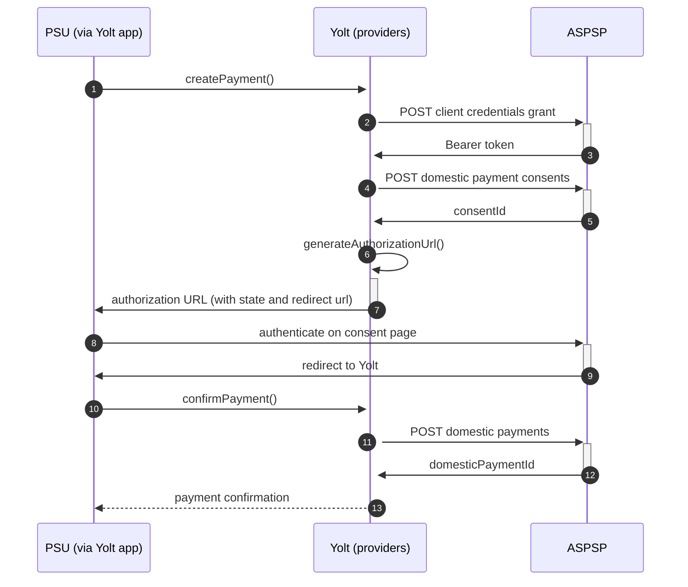

## Natwest (PIS)
[Current open problems on our end][1]

## BIP overview

|                                       |                                                                                                 |
|---------------------------------------|-------------------------------------------------------------------------------------------------|
| **Country of origin**                 | United Kingdom                                                                                  | 
| **Site Id**                           | 71b4ad6b-d620-4049-9f09-f9fd9110bd15                                                            |
| **Contact**                           | Through helpdesk https://rbsgroupapiservicedesk.spectrumhosting.net/plugins/servlet/desk        |
| **Standard**                          | [Open Banking Standard][2]                                                                      |
| **Developer portal**                  | https://www.bankofapis.com/                                                                     |
| **Documentation**                     | https://www.bankofapis.com/products/natwest-group-open-banking/payments/documentation/nwb/3.1.5 |
| **Mutual TLS Authentication support** | Yes                                                                                             |
| **Signing algorithms used**           | PS256                                                                                           |
| **PIS Standard version**              | 3.1                                                                                             |
| **Auto-Onboarding**                   | Yes                                                                                             |
| **Requires PSU IP address**           | No                                                                                              |
| **IP Whitelisting**                   | Yes                                                                                             |
| **Type of certificate**               | OB signing                                                                                      |
| **Token endpoint auth metod**         | private_key_jwt                                                                                 |
| **Repository**                        | https://git.yolt.io/providers/open-banking                                                      |

## Links - production 

|                           |                                                                       |
|---------------------------|-----------------------------------------------------------------------|
| **Well-known enpoint**    | https://personal.secure1.natwest.com/.well-known/openid-configuration |
| **Base URL**              | https://api.natwest.com/open-banking                                  |
| **Token Endpoint**        | https://secure1t.natwest.com/as/token.oauth2                          |
| **Authorization URL**     | https://personal.secure1.natwest.com/as/authorization.oauth2          |
| **Registration Endpoint** | https://api.natwest.com/register/v1.0                                 |

## Client configuration overview
|                                 |                                      |
|---------------------------------|--------------------------------------|
| **Signing key id**              | Signing key header id from OB        | 
| **Signing certificate**         | OBSEAL                               |
| **Transport certificate**       | OBWAC                                |
| **Transport certificate chain** | Full chain of transport certificate  |
| **Client id**                   | Received after registration          |
| **SSA**                         | SSA used during registration process |
| **Institution id**              | Bank's ASPSP institution id          |
| **Organization id**             | Client's TPP institution id          |
| **Software id**                 | Client's app software id             |
 
## Registration details

Bank requires dynamic registration to be performed before TPP will be able to use their PSD2 API. It can be done by proper _/clients.oauth_ endpoint. 
During this call we have to use the same values as for future authentication means (including certificates) and as a result we receive `clientId`, which is required to perform further steps. 
This process was implemented as auto-onboarding mechanism based on [documentation][3].
For banks registered in United Kingdom Open Banking certificates are required, but for other TPPs also eIDAS certificates are allowed.
Bank supports `private_key_jwt` as authentication method.
Additionally there we are not subscribed to any particular API version. It means that we have access to all versions and it depends on bank, which version is used right now. Thanks that we don't have to remember to switch when new version is released.

## Multiple Registration

We don't know about any registration limits. There was no situation, when such knowledge was needed, so we will have to
ask about that when there will be such case.

## Connection Overview

Bank follows Open Banking standard. It means that flow is similar to other banks. Due to that fact,
Open Banking DTOs are used in implementation, and code relay mostly on our generic Open Banking implementation.

The _createPayment_ method is used to create payment on bank's side. Thanks that we are sure that payment data are compliant
with requirements and standards. First of all we call _token_ endpoint with `payments` scope to get required Bearer token.
Next, payment is created (as request body) based on user's data and all information is sent to the bank to create payment.
As a result we receive `consentId` which is required in next step.

The _generateAuthorizationUrl_ method is used to generate login consent for user. Using `consentId` authorization URL is
prepared based on _authorize_ endpoint by filling it with necessary parameters. Using this URL, user is redirected to 
login domain to fill his credentials and confirm payment.

In _confirmPayment_ method allows to confirm payment. Using the `consentId` with the same token and values at during first 
call request body is prepared. After the call, from the bank `domesticPaymentId` is returned.

Simplified sequence diagram:

**Consent validity rules**

NatWest requires sending fully valid sort codes & account numbers for payment requests - due to that we have to 
blacklist it from PIS consent testing.

## Business and technical decisions

* Remittance Information reversed:
  Bank supports only Reference type of RemittanceInformation and since description of a payment that user types in is
  sent as RemittanceUnstructured we had to reverse it. (Source: https://yolt.atlassian.net/browse/C4PO-1244)
* Domestic Payments Scheme - The only supported payment scheme is UK.OBIE.SortCodeAccountNumber. (
  Source: https://www.bankofapis.com/products/natwest-group-open-banking/payments/documentation/nwb/3.1.4#domestic-payments)
* Limit of EndToEndIdentification:
  According to model described in RBS
  doc (https://www.bankofapis.com/products/natwest-group-open-banking/payments/documentation/nwb/3.1.4#domestic_payment_consents__post )
  , Faster Payments Scheme (which is used as default when LocalInstrument is not provided) can have
  EndToEndIdentification field length max 31 (30 according to response to ticket on their service
  desk: https://rbsgroupapiservicedesk.spectrumhosting.net/plugins/servlet/desk/portal/1/RSD-1959). We throw error when
  endToEndIdentification is too long
* Limit of Reference:
  According to model described in RBS
  doc (https://www.bankofapis.com/products/natwest-group-open-banking/payments/documentation/nwb/3.1.4#domestic_payment_consents__post )
  , Faster Payments Scheme (which is used as default when LocalInstrument is not provided) can have Reference field
  length max 140(According to C4PO-9361). We throw error when Reference is too long. From C4PO-9361 we know also, that
  reference field is only optional.

According to documentation Natwest is using only AcceptedSettlementCompleted, AcceptedSettlementInProcess, Pending,
Rejected payment statuses. It was decided to map AcceptedSettlementCompleted into Completed, even that OB standard
documentation specifies AcceptedCreditSettlementCompleted as a final one.

02.03.2022 Due to agreements with yts-core it was decided that we want to treat payment as completed once money has been
deducted from debtor account. According to OB documentation `AcceptedSettlementCompleted` is proper status. For
reference see https://yolt.atlassian.net/browse/C4PO-9754

**Payment Flow Additional Information**

|                                                                                                        |                             |
|--------------------------------------------------------------------------------------------------------|-----------------------------|
| **When exactly is the payment executed ( executed-on-submit/executed-on-consent)?**                    | execute-on-submit           |
| **it is possible to initiate a payment having no debtor account**                                      | YES                         |
| **At which payment status we can be sure that the money was transferred from the debtor to creditor?** | AcceptedSettlementCompleted |

## Sandbox overview

Sandbox was not used during the implementation

### Credentials
In order to log in to the helpdesk of bank you should use standard credential which can be found on our KeyBase team files.
  
## External links
 * [Current open problems on our end][1]
 * [Open Banking Standard][2]
 * [documentation][3]
 
 [1]: <https://yolt.atlassian.net/issues/?jql=project%20%3D%20%22C4PO%22%20AND%20component%20%3D%20%22NATWEST%22%20AND%20status%20!%3D%20Done%20AND%20Resolution%20%3D%20Unresolved%20ORDER%20BY%20status>
 [2]: <https://standards.openbanking.org.uk/>
 [3]: <https://openbankinguk.github.io/dcr-docs-pub/v3.2/dynamic-client-registration.html>