## Natwest Corporate (AIS)
[Current open problems on our end][1]

## BIP overview

|                                       |                                                                                                 |
|---------------------------------------|-------------------------------------------------------------------------------------------------|
| **Country of origin**                 | United Kingdom                                                                                  | 
| **Site Id**                           | 94bd7d3c-a4d5-4b64-815e-00082b172630                                                            |
| **Contact**                           | Through helpdesk https://rbsgroupapiservicedesk.spectrumhosting.net/plugins/servlet/desk        |
| **Standard**                          | [Open Banking Standard][2]                                                                      |
| **Developer portal**                  | https://www.bankofapis.com/                                                                     |
| **Documentation**                     | https://www.bankofapis.com/products/natwest-group-open-banking/accounts/documentation/nwb/3.1.4 |
| **Mutual TLS Authentication support** | Yes                                                                                             |
| **Signing algorithms used**           | PS256                                                                                           |
| **AIS Standard version**              | 3.1                                                                                             |
| **Account SubTypes**                  | Current, Credit, Savings                                                                        | 
| **Auto-Onboarding**                   | Yes                                                                                             |
| **Requires PSU IP address**           | No                                                                                              |
| **IP Whitelisting**                   | Yes                                                                                             |
| **Type of certificate**               | OB signing                                                                                      |
| **Token endpoint auth metod**         | private_key_jwt                                                                                 |
| **Repository**                        | https://git.yolt.io/providers/open-banking                                                      |

## Links - production 

|                           |                                                                        |
|---------------------------|------------------------------------------------------------------------|
| **Well-known enpoint**    | https://corporate.secure1.natwest.com/.well-known/openid-configuration |
| **Base URL**              | https://api.natwest.com/open-banking                                   |
| **Token Endpoint**        | https://secure1t.natwest.com/as/token.oauth2                           |
| **Authorization URL**     | https://corporate.secure1.natwest.com/as/authorization.oauth2          |
| **Registration Endpoint** | https://api.natwest.com/register/v1.0                                  |

## Client configuration overview
|                                 |                                      |
|---------------------------------|--------------------------------------|
| **Signing key id**              | Signing key header id from OB        | 
| **Signing certificate**         | OBSEAL                               |
| **Transport certificate**       | OBWAC                                |
| **Transport certificate chain** | Full chain of transport certificate  |
| **Client id**                   | Received after registration          |
| **SSA**                         | SSA used during registration process |
| **Institution id**              | Bank's ASPSP institution id          |
| **Organization id**             | Client's TPP institution id          |
| **Software id**                 | Client's app software id             |
 
## Registration details

Bank requires dynamic registration to be performed before TPP will be able to use their PSD2 API. It can be done by proper _/clients.oauth_ endpoint. 
During this call we have to use the same values as for future authentication means (including certificates) and as a result we receive `clientId`, which is required to perform further steps. 
This process was implemented as auto-onboarding mechanism based on [documentation][3].
For banks registered in United Kingdom Open Banking certificates are required, but for other TPPs also eIDAS certificates are allowed.
Bank supports `private_key_jwt` as authentication method.
Additionally there we are not subscribed to any particular API version. It means that we have access to all versions and it depends on bank, which version is used right now. Thanks that we don't have to remember to switch when new version is released.

## Multiple Registration

We don't know about any registration limits. There was no situation, when such knowledge was needed, so we will have to
ask about that when there will be such case.

## Connection Overview

Bank follows Open Banking standard. It means that flow is similar to other banks. Due to that fact,
Open Banking DTOs are used in implementation, and code relay mostly on our generic Open Banking implementation.

The _getLoginInfo_ method is used to generate login consent for user. First of all we call _token_ endpoint to get Bearer
token. Next _account-access-consents_ endpoint is called to create consent on bank side. Received `consentId` is used to
prepare authorization URL based on _authorize_ endpoint by filling it with necessary parameters, please note about well known
issue during checking consent validity - it returns 404,400,500 codes depending on situation (_getloginInfo_, _onUserSiteDelete_) so should not be checked. Using this URL, user 
is redirected to login domain to fill his credentials.

In _createAccessMeans_ method `code` is taken and used to call for token. This token will be used to authenticate user
in next calls. In response there is also `refresh_token` returned, because consent is valid for 90 days, and `access_token` 
only for 5 minutes. It means that refresh token flow is supported and has to be implemented too. _refreshAccessMeans_
allows to perform this operation. For a given consent, the refresh token is the same, but we always map both tokens to
access means value.

As in other Open Banking banks, here consent removal is allowed. It is done by generic code in _onUserSiteDelete_
method. Stored earlier `consentId` is used to perform this operation.

The most complex step is data fetching. Bank allows to collect information not only about accounts, balances and 
transactions, but also for direct debits and standing orders. The most important thing is that for Credit 
Important information is that this bank support pagination for transactions. It returns both `BOOKED` and `PENDING` transactions.

**Consent validity rules**
Natwest Corpo AIS uses dynamic flow, thus we are unable to determine consent validity rules for AIS.

Simplified sequence diagram:

```mermaid
sequenceDiagram
  autonumber
  participant PSU (via Yolt app);
  participant Yolt (providers);
  participant ASPSP;
  PSU (via Yolt app)->>+Yolt (providers): getLoginInfo()
  Yolt (providers)->>+ASPSP: POST client credentials grant 
  ASPSP->>-Yolt (providers): Bearer token
  Yolt (providers)->>+ASPSP: POST account access consent 
  ASPSP->>-Yolt (providers): Consent id
  Yolt (providers)->>-PSU (via Yolt app): authorization URL (with state and redirect url)
  PSU (via Yolt app)->>+ASPSP: authenticate on consent page
  ASPSP->>-PSU (via Yolt app): redirect to Yolt with authorization code
  PSU (via Yolt app)->>+Yolt (providers): createAccessMeans()
  Yolt (providers)->>+ASPSP: POST authorization code grant
  ASPSP->>-Yolt (providers): access token & refresh token
  Yolt (providers)-->>PSU (via Yolt app): create and store access mean
  PSU (via Yolt app)->>+Yolt (providers): fetchData()
  loop Various data fetches
  Yolt (providers)->>+ASPSP: GET accounts, balances and transactions, standing orders, direct debits
  ASPSP->>-Yolt (providers): accounts, balances and transactions standing orders, direct debits
  end
  Yolt (providers)-->>PSU (via Yolt app): user data

```

## Business and technical decisions

## Sandbox overview

Sandbox was not used during the implementation

## User Site deletion
There's `onUserSiteDelete` method implemented by this provider, however, only in a best effort manner.

### Credentials
In order to log in to the helpdesk of bank you should use standard credential which can be found on our KeyBase team files.
  
## External links
 * [Current open problems on our end][1]
 * [Open Banking Standard][2]
 * [documentation][3]
 
 [1]: <https://yolt.atlassian.net/issues/?jql=project%20%3D%20%22C4PO%22%20AND%20component%20%3D%20%22NATWEST_CORPO%22%20AND%20status%20!%3D%20Done%20AND%20Resolution%20%3D%20Unresolved%20ORDER%20BY%20status>
 [2]: <https://standards.openbanking.org.uk/>
 [3]: <https://openbankinguk.github.io/dcr-docs-pub/v3.2/dynamic-client-registration.html>