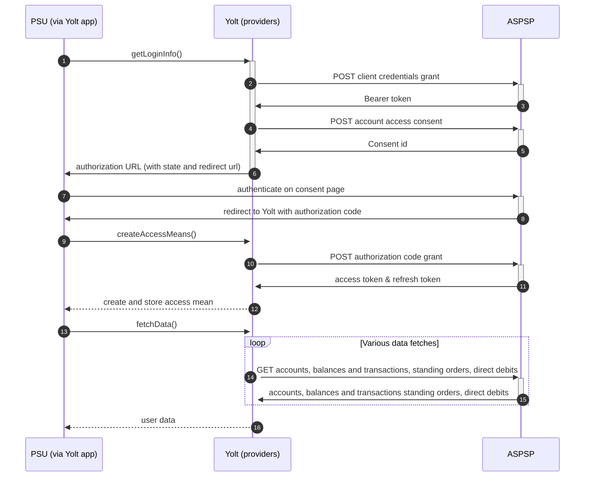

## Revolut (AIS)

Revolut Ltd is a British financial technology company headquartered in London, 
United Kingdom that offers banking services. It was founded in 2015.
Revolut has over 12 million customers worldwide.

## BIP overview 

|                                       |                                                                                 |
|---------------------------------------|---------------------------------------------------------------------------------|
| **Country of origin**                 | Headquarter UK / app available worldwide                                        | 
| **Site Id**                           | 3673486a-2ff0-4508-8de1-b8b1fbf213f4	                                           |
| **Standard**                          | [Open Banking Standard][4]                                                      |
| **Contact**                           | E-mail: openbanking-support@revolut.com, Service Desk: api-requests@revolut.com |
| **Developer Portal**                  | [https://developer.revolut.com/portal/signin][2]                                | 
| **Documentation**                     | [https://developer.revolut.com/docs/open-banking-api/][3]                       | 
| **Account SubTypes**                  | Current, Savings                                                                |
| **IP Whitelisting**                   | No                                                                              |
| **AIS Standard version**              | v3.1.0                                                                          |
| **Auto-onboarding**                   | Yes                                                                             |
| **Requires PSU IP address**           | No                                                                              |
| **Type of certificate**               | OBSEAL / OBWAC                                                                  |
| **Signing algorithms used**           | PS256                                                                           |
| **Mutual TLS Authentication Support** | Yes                                                                             |
| **Repository**                        | https://git.yolt.io/providers/open-banking                                      |

## Links - sandbox

|                            |                                               |
|----------------------------|-----------------------------------------------|
| **Base URL**               | https://sandbox-oba.revolut.com               | 
| **Registration Endpoint**  | https://sandbox-oba.revolut.com/register      |
| **Authorization Endpoint** | https://sandbox-oba.revolut.com/ui/index.html |
| **Token Endpoint**         | https://sandbox-oba-auth.revolut.com/token    |

## Links - production 

|                            |                                       |
|----------------------------|---------------------------------------|
| **Login domains**          | [oba.revolut.com](oba.revolut.com)    | 
| **Base URL**               | https://oba.revolut.com               | 
| **Registration Endpoint**  | https://oba.revolut.com/register      |
| **Authorization Endpoint** | https://oba.revolut.com/ui/index.html |
| **Token Endpoint**         | https://oba-auth.revolut.com/token    | 

## Client configuration overview

|                                        |                                                                         |
|----------------------------------------|-------------------------------------------------------------------------|
| **Institution id**                     | Unique identifier of the financial institution assigned by Open Banking | 
| **Client id**                          | Unique identifier received during registration process                  |
| **Signing key id**                     | OBSEAL key id                                                           | 
| **Signing key header id**              | OBSEAL key id                                                           | 
| **Transport key id**                   | OBWAC key id                                                            |
| **Transport certificate**              | OBWAC certificate                                                       |
| **Transport certificate subject name** | OBWAC certificate subject obtained using openssl tool                   |
| **Software Id**                        | Id of Software Statement Assertion                                      |
| **Software Statement Assertion**       | SSA required during dynamic registration - tls_client_auth method       |
| **Organization Id**                    | TPP's organization id                                                   |

## Registration details

Revolut allows to [add][5] new app with dynamic registration, [update][6] it details and [delete][7] it.
All the above is well described in theirs [documentation][3].

Important note regarding Transport certificate subject name - this authentication mean is used as a value for
jwt claim tls_client_auth_dn in registration payload. Revolut expects this value to be in specific format.
Current implementation of BouncyCastle doesn't produce correct results for eIDAS certificates.
Even though we do not use eIDAS certificates in Revolut GB, we decided to unify the way of retrieving this value
across Revolut group. To obtain correct value we need to use following command on transport certificate:
```shell
openssl x509 -in /path/to/your/cert.pem -inform pem -noout -subject -nameopt RFC2253
```
Result of this command is prefixed with `subject=` which needs to be removed before saving as authentication mean.
For more details please consult this section of [documentation][8]

## Connection Overview

Revolut follows Open Banking 3.1.0 standard. It means that flow is similar to other banks. Due to that fact,
Open Banking DTOs are used in implementation, and code relay mostly on our generic Open Banking implementation.

The _getLoginInfo_ method is used to generate login consent for user. First of all we call _token_ endpoint to get Bearer
token. Next _account-access-consents_ endpoint is called to create consent on bank side. Received `consentId` is used to
prepare authorization URL based on _authorize_ endpoint by filling it with necessary parameters. Using this URL, user 
is redirected to login domain to fill his credentials.

In _createAccessMeans_ method `code` is used to call for token. This token will be used to authenticate user
in next calls. In response there is no `refresh_token` returned. Both consent and `access_token` are valid for 90 days. 
It means that refresh token flow is not supported and default _refreshAccessMeans_ method is overridden and is just
throwing `TokenInvalidException` to led user into re-consent flow.

As in other Open Banking banks, Revolut also allows for consent removal. It is done by generic code in _onUserSiteDelete_
method. Stored earlier `consentId` is used to perform this operation.

The most complex step is data fetching. Revolut allows to collect information about accounts balances and 
transactions. The direct debits and standing orders are not supported in Revolut hence `getDirectDebits` and 
`getStandingOrders` methods are returning empty list.

The consent window is implemented for Revolut. Due to that fact we limit max transaction fetch data time to 89 days when
endpoint is called after 5 minutes from consent step.
**Consent validity rules** are not implemented for Revolut AIS as both correct & incorrect consent pages shares same HTML code.

Important information is that this bank support pagination for transactions. It returns both `BOOKED` and
`PENDING` transactions.

As CASY's request we enabled fetching Savings Accounts for Revolut. Such an account is used by the Revolut account 
holder only for the saving purposes. It doesn’t have account details nor it can be used to make transactions.

Simplified sequence diagram:



## Sandbox overview

Sandbox is described in [documentation][3] but was never actively used by us when working with this bank connection.

## User Site deletion
There's `onUserSiteDelete` method implemented by this provider, however, only in a best effort manner.

## Business and technical decisions

Refresh access means operation is not supported by Revolut, 
hence except refreshing access means user is led into re-consent flow.

Revolut's `INTERIMAVAILABLE` balance is mapped to both `Current Balance` & `Available Balance`.

It happens that we receive `null` value of `OBAccount2` field. Please find message from the Revolut explaining this case:

> This could happen with different currency accounts. In EUR pocket you can have 2 addresses, one for SWIFT and one for SEPA.
> In GBP, you can have local details (account number and sort code) and IBAN for SWIFT transfers.
> Some information may be missing from specific pocket if the account is not eligible to receive local GBP details or if the currency pocket was just created.
> It may take few hours (and for local GBP around 24 hours) for details to be generated.

Above is alreade reflected in implementation,  see `RevolutAccountMapperV2.getNotNullAccountReferences`.
  
28 JAN 2021:
- Business decision was made not to process cryptocurrency accounts. Bank tends to send such accounts in accounts list.
  We filter they out following currencies:
  ```
  Bitcoin (BTC)
  Litecoin (LTC)
  Ethereum (ETH)
  Bitcoin Cash (BCH)
  Ripple (XRP)
  Stellar Lumens (XLM)
  04 NOV 2021:
  OmiseGo (OMG)
  Origin Protocol (OGN)
  ```
  Please check C4PO-6855 for details.
  
- The client credentials grant flow can behave randomly when we make request about token using client_id which is not first
for the certificate used during mtls.
  For instance when we have at least two registrations reg1(client_id1), req2(client_id2), ...
  for the same certificate, only the first one reg1(client_id1) is correctly handled during 
  client credentials grant flow. To use next registrations (client ids) we need to add client_id to body 
  during client credentials grant flow.
  For the non licensed clients (e312ee16-b580-47c5-9985-f75183ed1886,28d0b528-ae51-4224-8dbd-8603bbc09c20) and app-prd registration
  it works perfectly fine. There is an edge case for ING France (a5154eb9-9f47-43b4-81b1-fce67813c002) where it caused errors because 
  internal implementation in Revolut were incorrectly checking the 'O' record from 'dn' in certificate 
  - one space character caused problem, so the decision in such cases was to join registrations to have only one for such problematic certificate 
    and add redirect URLs under that one joined registration. More details and linked tasks can be found in https://yolt.atlassian.net/browse/C4PO-8990.
- non licensed clients (e312ee16-b580-47c5-9985-f75183ed1886,28d0b528-ae51-4224-8dbd-8603bbc09c20) contain wrong value of the 'transport-certificate-subject-2' auth mean,
it is not used by logic in revolut provider and left after previous wrong registration.

27 May 2022
Problem: Yolt is sending multiple account identifiers usually two IBANs and we provide one downstream as the identifier.

- Business decision was made to provide all IBANs in bankSpecific fields and stabilize the IBAN identifiers by sorting them.

## External links
* [Current open problems on our end][1]
* [Developer portal][2]
* [Documentation][3]
* [Open Banking Standard][4]


[1]: <https://yolt.atlassian.net/issues/?jql=project%20%3D%20%22C4PO%22%20AND%20component%20%3D%20REVOLUT%20AND%20status%20!%3D%20Done%20AND%20Resolution%20%3D%20Unresolved%20ORDER%20BY%20status>
[2]: <https://developer.revolut.com/portal/signin>
[3]: <https://developer.revolut.com/docs/open-banking-api/>
[4]: <https://standards.openbanking.org.uk/>
[5]: <https://developer.revolut.com/docs/build-banking-apps/#identification-and-authentication-identification-and-authentication-dynamic-client-registration-registration-request>
[6]: <https://developer.revolut.com/docs/build-banking-apps/#identification-and-authentication-identification-and-authentication-dynamic-client-registration-updating-a-client>
[7]: <https://developer.revolut.com/docs/build-banking-apps/#identification-and-authentication-identification-and-authentication-dynamic-client-registration-deleting-a-client>
